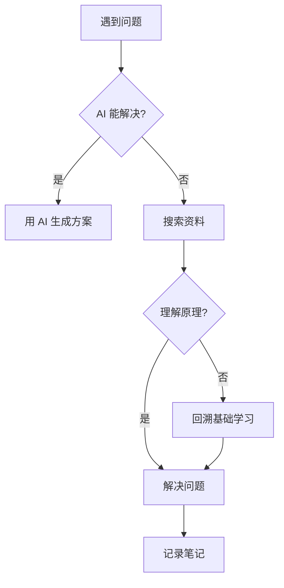

# 深度学习（DL/ML）学习路径（2025 现代版）

> **现代化学习理念：先实践，后理论；用完再学，按需深入**

---

## 🎯 为什么要这个仓库？

在 AI 编码助手（如 GitHub Copilot、Cursor、v0.dev 等）普及的今天，传统的"先学完所有基础再动手"已经过时了。

**本仓库的学习理念：**
- 🚀 **快速上手**：用工具做出东西，获得即时反馈
- 🧠 **理解本质**：只学核心原理，不死抠推导
- 🔧 **按需回溯**：遇到问题再回头查原理
- 📈 **持续迭代**：在实践中逐步深入

**为什么这样学？**
1. 快速成就感 → 坚持下去的动力
2. 有实际问题导向 → 学习更高效
3. 记忆更深刻 → 用过才忘不掉
4. 时间投入比传统方式减少 **40-60%**

---

## 🎯 从哪开始学？

### 新人路径（60-70 小时）

> 适合：从零开始，想快速进入 AI/ML 领域

| 阶段 | 内容 | 时间 | 学习方式 |
|------|------|------|----------|
| **数学** | 核心概念（向量化、梯度、概率） | 5h | 🎯 概念理解，不深钻推导 |
| **Python** | NumPy/Pandas 快速上手 | 8h | 🚀 调库实践，手写代码用 AI 生成 |
| **机器学习** | 分类、回归、聚类实战 | 15h | 🚀 scikit-learn 调库 + 理解输出 |
| **深度学习** | CNN/RNN/PyTorch 实战 | 15h | 🚀 PyTorch 快速上手 |
| **LLM 入门** | HuggingFace + Prompting | 20h | 🚀 立刻用 API 调用模型 |
| **补课** | 按需回溯数学/原理 | 按需 | 💡 遇到问题再查 |

**总时间：** ~60-70 小时（vs 传统 150h）

---

### 进阶路径（80+ 小时）

> 适合：有基础，想深入理解和研究

| 阶段 | 内容 | 时间 | 重点 |
|------|------|------|------|
| **Transformer** | 架构深入、Attention 机制 | 15h | 📖 数学 + 代码 |
| **LLM 原理** | 微调、RAG、Prompt Engineering | 30h | 🚀 实战 + 原理 |
| **多模态** | CLIP、BLIP、LLaVA 等 | 20h | 🚀 最新模型跟进 |
| **Agent** | ReAct、AutoGPT、LangChain | 15h | 🚀 体系化学习 |

---

### 实践路径（100+ 小时）

> 适合：想快速建立项目作品集

| 阶段 | 内容 | 时间 |
|------|------|------|
| **Kaggle 比赛** | 完成 3-5 个竞赛 | 40h |
| **项目实践** | 端到端项目（推荐系统、NLP、CV） | 30h |
| **论文阅读** | 跟进最新研究 | 30h |

---

## 📖 学习指南

### 每个章节的结构

每个主题都分为两种学习模式：

#### 🚀 快速模式（15-30 分钟）
**目标：** 知道它是什么、怎么用、什么时候用

- ✅ 跑一个示例代码
- ✅ 看懂输出结果
- ✅ 了解应用场景
- ✅ 能用 AI 工具生成类似代码

#### 📖 深度模式（1-2 小时）
**目标：** 理解原理，能独立优化和创新

- ✅ 理解数学原理
- ✅ 手写核心算法（用 AI 辅助）
- ✅ 调优参数并理解影响
- ✅ 能诊断和解决复杂问题

**建议：** 先快速模式上手，感兴趣再深度模式深入

---

### 基础知识：哪些必须学 vs 哪些会用就行？

#### ⚠️ 必须理解（决定你能走多远）

| 主题 | 为什么重要 |
|------|------------|
| **向量化运算** | 深度学习的核心运算方式 |
| **梯度下降** | 所有优化算法的基础 |
| **过拟合/欠拟合** | 诊断模型问题的核心能力 |
| **Transformer 架构** | 现代 LLM 的基石 |
| **损失函数** | 评估模型的关键 |

#### 💡 会用就行（快速浏览）

| 主题 | 建议 |
|------|------|
| **微积分推导** | 知道概念，用 AI 生成推导 |
| **线性代数证明** | 理解应用场景，不钻牛角尖 |
| **手写算法完整实现** | 调库 + AI 生成，看懂代码即可 |

---

## 🗂️ 目录结构

### 📊 难度标记
- ⭐ 新人友好
- ⭐⭐ 需要一定基础
- ⭐⭐⭐ 进阶内容

---

### 数学基础 ⭐

> 只学核心概念，按需回溯

- [Calculus 微积分](math/calculus.md) ⭐
- [Linear Algebra 线性代数](math/linear-algebra.md) ⭐
- [PCA 主成分分析](math/pca.md) ⭐⭐
- 概率论 (TBD - 不急需)

---

### Python ⭐

> 快速上手，重点是理解数据操作

- [Python 基础](python/python-basic) ⭐
- [Pandas](python/pandas) ⭐
- [NumPy](python/numpy) ⭐
- [Matplotlib](python/Matplotlib) ⭐
- [Scikit-Learn](python/Sklearn) ⭐

---

### 机器学习算法 ⭐⭐

> 调库实践，理解原理

- [机器学习绪论](machine-learning/machine-learning-intro.md) ⭐
- [线性回归](machine-learning/linear-regression.md) ⭐
- [逻辑回归](machine-learning/logistic-regression.md) ⭐
- [神经网络](machine-learning/neural-networks.md) ⭐⭐
- [支持向量机 SVM](machine-learning/svm.md) ⭐⭐
- [聚类算法](machine-learning/clustering.md) ⭐
- [数据降维](machine-learning/dimension-reduction.md) ⭐⭐
- [推荐系统](machine-learning/recommender-system.md) ⭐⭐
- [打造实用的机器学习系统](machine-learning/advice-for-appying-and-system-design.md) ⭐⭐⭐

---

### 深度学习 ⭐⭐

> PyTorch 快速上手，理解核心架构

- [Deep Learning 专题课程](deep-learning/deep-learning-specialization.md) ⭐⭐
- [深度学习框架：PyTorch](deep-learning/pytorch.md) ⭐⭐
- [分布式训练](deep-learning/distributed-training.md) ⭐⭐⭐

---

### 大语言模型 (LLM) ⭐⭐⭐

> 重点！现代 AI 的核心

- [LLM 入门](llm/intro.md) ⭐⭐
- [Transformer 架构详解](llm/transformer.md) ⭐⭐⭐
- [GPT 系列](llm/gpt-series.md) ⭐⭐
- [BERT 系列](llm/bert-series.md) ⭐⭐
- [微调方法](llm/fine-tuning.md) ⭐⭐⭐
- [RAG（检索增强生成）](llm/rag.md) ⭐⭐⭐
- [AI Agent](llm/agent.md) ⭐⭐⭐

---

### 多模态 (Multimodal) ⭐⭐⭐

> 跨越图文边界

- [多模态模型综述](multimodal/README.md) ⭐⭐⭐
- [CLIP](multimodal/clip.md) ⭐⭐⭐
- [BLIP 系列](multimodal/blip.md) ⭐⭐⭐
- [LLaVA](multimodal/llava.md) ⭐⭐⭐

---

### 实践

> 理论结合实践

- [Kaggle 竞赛](competitions/kaggle.md) ⭐⭐
- [天池竞赛](https://tianchi.aliyun.com) ⭐⭐
- [项目实战](projects/README.md) ⭐⭐⭐

---

## 🛠️ 推荐工具和环境

### AI 编码助手（必用！）

| 工具 | 特点 | 适用场景 |
|------|------|----------|
| **GitHub Copilot** | IDE 集成，代码补全 | 日常开发 |
| **Cursor** | AI 驱动的编辑器 | 快速原型 |
| **Claude Code / ChatGPT** | 代码生成和调试 | 解决问题 |
| **v0.dev** | UI 生成 | 快速界面 |

**建议：** 至少熟悉一个 AI 编码助手，能节省 50%+ 时间。

---

### 实践环境

| 工具 | 用途 |
|------|------|
| **Google Colab** | 免费算力，适合学习 |
| **Kaggle Kernels** | 竞赛环境 |
| **Hugging Face Spaces** | 模型部署 |
| **JupyterLab / VS Code** | 本地开发 |

---

## 📚 推荐资源

### 必读书籍

| 书名 | 特点 | 难度 |
|------|------|------|
| 《机器学习》（西瓜书）周志华 | 系统性强 | ⭐⭐ |
| 《Deep Learning》（花书）Ian Goodfellow | 理论深度 | ⭐⭐⭐ |
| 《Hands-on Machine Learning》Aurélien Géron | 实战导向 | ⭐⭐ |

**建议：** 《Hands-on Machine Learning》最适合新人，其他按需阅读。

---

### 在线课程

- **Andrew Ng 系列课程**（Coursera）：经典入门
- **Fast.ai**：自顶向下，实用导向
- **李沐《动手学深度学习》**：中英文，代码丰富

---

## 💡 学习技巧

### 1. 用 AI 辅助学习

**AI 能帮你：**
- ✅ 生成代码示例
- ✅ 解释复杂概念
- ✅ 调试错误
- ✅ 总结长文档

**AI 帮不了你：**
- ❌ 理解问题本质
- ❌ 判断模型选择
- ❌ 诊断训练问题
- ❌ 创新和改进

**原则：** 用 AI 节省重复劳动，用脑力做判断和决策。

---

### 2. 遇到问题的处理流程



---

### 3. 记笔记的方法

**不要：** ❌ 抄公式、抄代码

**应该：** ✅ 记理解、记坑、记灵感

**笔记模板：**
```
## [主题]

### 理解（用自己的话）
...

### 代码片段（关键点）
...

### 遇到的坑
...

### 相关链接
...
```

---

## 🔥 2025 年热门方向

如果想深入，推荐关注：

| 方向 | 说明 |
|------|------|
| **RAG** | 检索增强生成，企业级应用 |
| **Agent** | AI 智能体，自动化任务 |
| **多模态** | 图文理解和生成 |
| **小模型优化** | 本地部署，隐私保护 |
| **MLOps** | 模型部署和运维 |

---

## 🤝 贡献和反馈

- 发现错误？欢迎提交 Issue 或 PR
- 有想法？欢迎一起完善内容
- 觉得有用？点个 ⭐ Star

---

## 📝 更新日志

- **2025-02**：重构学习路径，采用现代化学习理念
- **2023**：添加 LLM 和多模态内容
- **2016**：初始版本

---

## 📄 License

MIT License

---

## 💬 联系方式

有疑问欢迎交流！
- GitHub Issues
- [相关书籍合集](https://github.com/loveunk/Deep-learning-books)

---

**最后说一句：** 在这个 AI 时代，最重要的不是记住所有知识，而是学会如何快速学习和解决问题。本仓库的目标是帮你构建这个能力。

**Happy Learning! 🚀**
