# 工欲善其事必先利器-写给AI实践者的实验环境指南：Google Colab+Cloudriser

**本文由公众号[凯恩博](https://mp.weixin.qq.com/s?__biz=MzU4NDczNjI0NA==&mid=2247483673&idx=1&sn=c325e1d3fcdffdb09f635124e226c84c&chksm=fd940d82cae384947008aceaa764586865b5c023b08089181f5daa051048f926c1907a2038e7&scene=0&xtrack=1#rd)原创，转载请注明出处**

> 本文面向使用Jupyter Notebook作为Python环境的实践AI项目的朋友们。
如果你已经是AI大拿，对环境配置非常熟悉，请略过正文，直接转发分享给周围的初学者们吧。

---
在上一篇[《分享你的Jupyter Notebook，在AI时代脱颖而出》](https://zhuanlan.zhihu.com/p/56701064)中我介绍了如何分享Notebook为你进入AI行业并取得成功助一臂之力。
那对于初学者们，除了自己花费大量时间搭建Jupyter Notebook、安装各种框架工具包之外，是否有更简单的办法，甚至在Jupyter里用GPU/TPU加速训练？

这里向你介绍Google的一款产品——[Google Colab](https://colab.research.google.com/)（也叫做Colaboratory）可以很好的解决这个问题。
完全在浏览器在线使用，提供GPU/TPU，关键是免费的Jupter环境。
此外，还介绍和与其搭配使用的[Clouderizer](https://clouderizer.com/)，让Google Colab使用更便捷。

## Google Colab

> 官方地址： https://colab.research.google.com/ （Google的产品，需要翻墙，我想这点对搞技术的朋友应该不是事！）

Google Colab可以理解为 Jupyter + Google Cloud + Google Drive的组合。

Colab是基于Goolge Cloud和Google Drive两个产品的Jupyter环境，且说Google这两个产品单独拿出来，在各自领域都是实力雄厚的top产品。看看这几款产品融合在一起后是如何工作的。

## Colab是一个Jupyter环境
除了样子和传统的Jupyter长得有点不同外，其他功能差不多。 可以在上面轻松地运行Keras、Tensorflow、Pytorch等框架。 基本的Linux命令都支持，对于语言不限于Python。

<p align="center">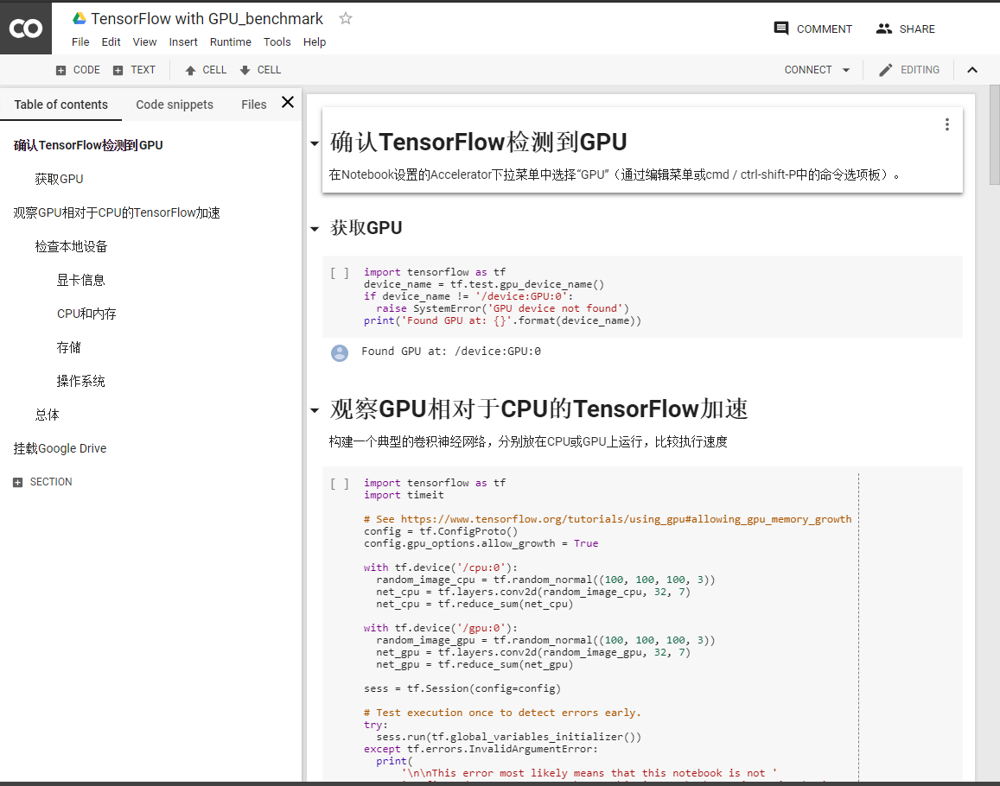</p>

## 基于Google Drive的存储
基于Google Drive的好处是，如果你在本地安装了Google Drive的同步盘，可以很方便的管理（包括分享）项目和数据集，然后配合Colab做训练或联系。下面看看具体的功能。

**可以直接在Google Drive中创建ipynb文件**
<p align="center">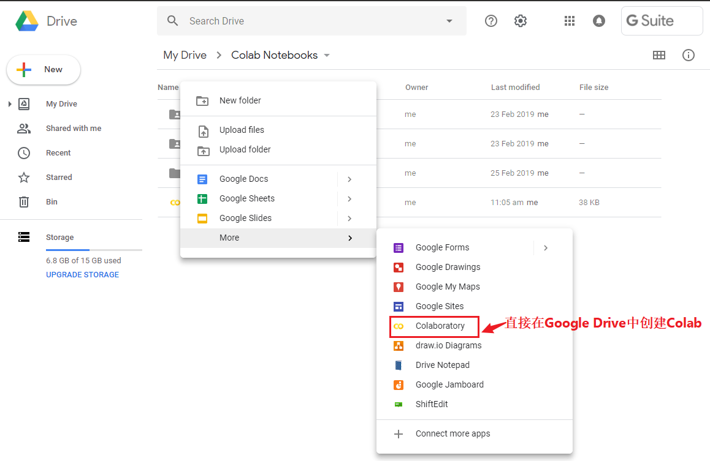</p>

**也可以像传普通文件一样，从本地上传到Google Drive中的ipynb文件直接打开运行**

**在已运行的ipynb环境中加载Google Drive里的数据**

当做训练时，需要训练集，但从Google Drive里打开的ipynb不能直接加载Drive里的数据，有两个办法：
1. 打开一个ipynb，然后在“Files”的tab下，上传数据集，但不推荐，因为麻烦，而且慢！
<p align="center">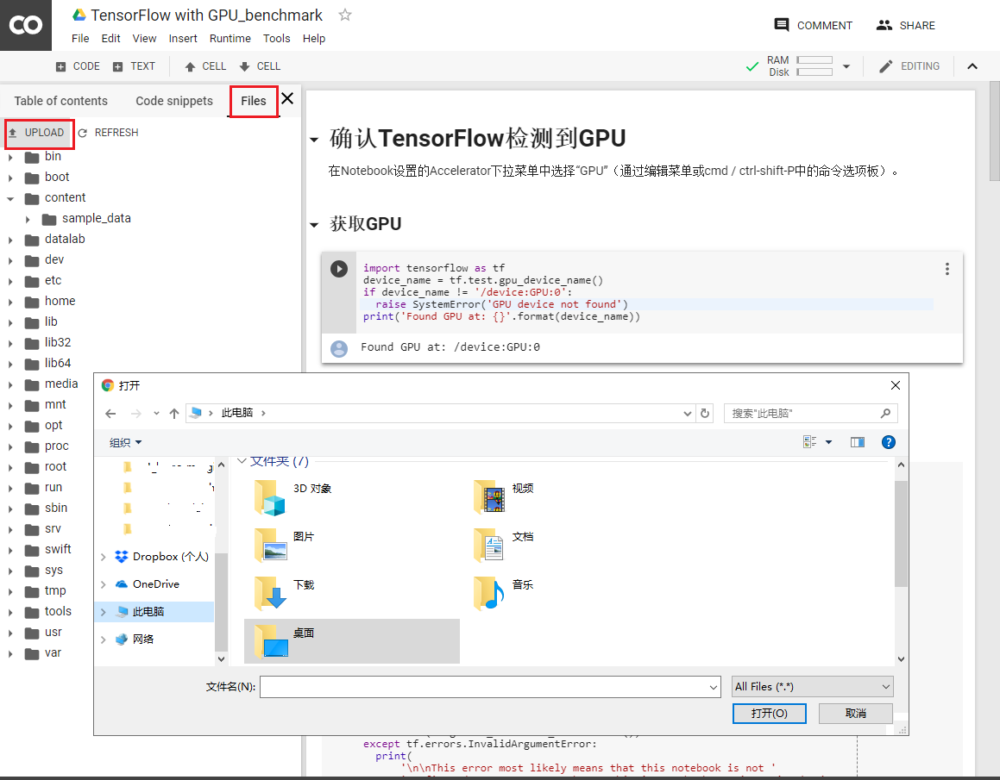</p>

2. 直接在ipynb里加载(mount) 你的Google Drive：
``` python
from google.colab import drive
drive.mount('/content/drive')
```
然后点开Google Drive链接的授权，填入Token即可。注意挂在后的Drive在```/content/drive```目录下。

看看效果，是可以列出文件的：
``` python
!ls /content/drive/
```

直接上图看效果：
<p align="center">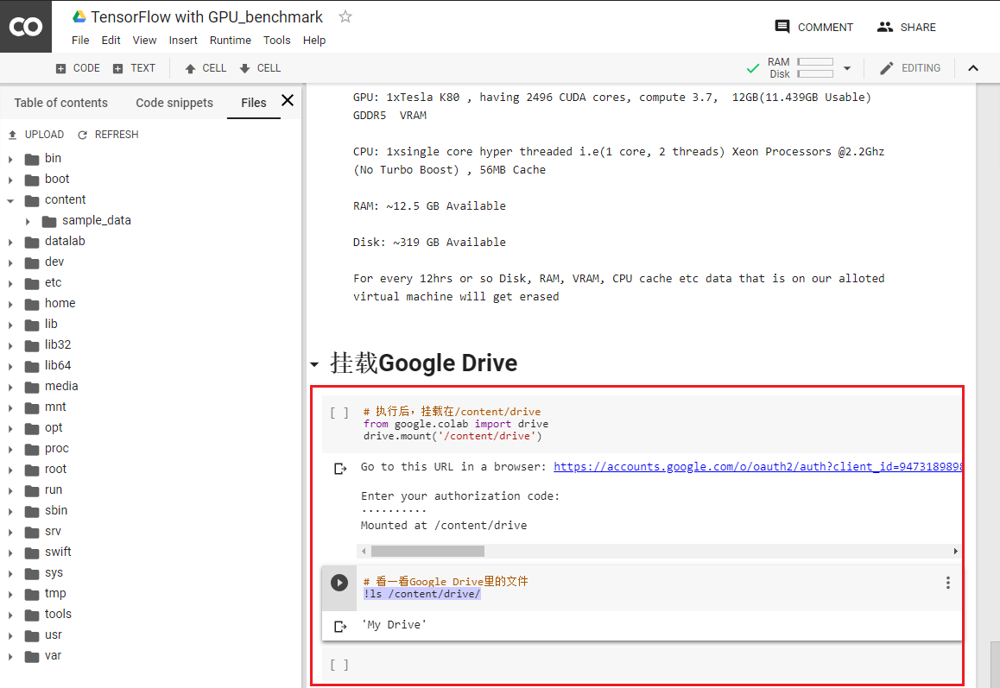</p>


**超级方便的共享功能**
* 因为是基于Google Drive的，所以共享一个Jupyter notebook，可以直接分享链接。收到链接的朋友打开链接后直接运行，还可以一键存到自己的Google Drive。

例如，这里推荐一个关于Google Cola加载外部数据的ipynb：
* https://colab.research.google.com/notebooks/io.ipynb

两个使用Google Colab TPU的ipynb：
* https://colab.research.google.com/notebooks/tpu.ipynb
* https://colab.research.google.com/github/tensorflow/tpu/blob/master/tools/colab/fashion_mnist.ipynb

还有一个如何使用深度学习以另一个图像的风格组合图像（Neural Style Transfer）的ipynb：
* https://colab.research.google.com/github/tensorflow/models/blob/master/research/nst_blogpost/4_Neural_Style_Transfer_with_Eager_Execution.ipynb

打开直接运行，就是这么简单！

### 性能评测：CPU、内存和GPU
先上总结：
```
System: Linux a8e930d01458 4.14.79+ #1 SMP Wed Dec 19 21:19:13 PST 2018 x86_64 x86_64 x86_64 GNU/Linux

GPU: 1xTesla K80 , 2496 CUDA 核心,  12GB(11.439GB Usable) GDDR5  VRAM
* 一个官方TensorFlow的例子是CPU跑的速度8.8秒，GPU跑需要2秒；
* 节省77%的时间，当然还有人试了试Colab的TPU，据测评比这个K80 快了3倍左右；

CPU: 1x核心(双线程) Xeon Processors @2.2Ghz (No Turbo Boost) , 56MB L3 Cache

RAM: ~12.5 GB

Disk: ~319 GB

每12小时左右分配的虚拟机上的磁盘，RAM，VRAM，CPU缓存等数据将被删除
```

再看具体实验截图：
<p align="center">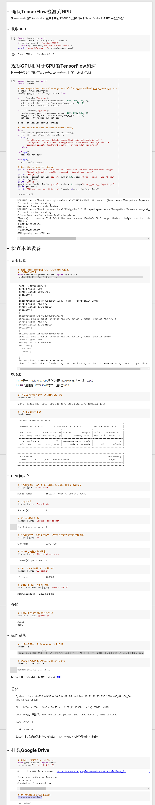</p>


但是你发现没有，上面没有提到很大型的数据的安装，比如几十上百G的数据。
> 例如参加一个Kaggle竞赛，需要下载它提供的训练集。

再比如，Google Colab过一段时间没操作的话会经常断开连接，如和解决中断的问题？甚至对于可能需要运行超过12小时以上的任务了？

这个时候怎么办，可以考虑用Clouderizer。

## Clouderizer是啥
Clouderizer内置项目模板，包括Tensorflow，Keras，Anaconda，Python，Torch等深度学习的工具。只需点击几下，就可以一次性选择机器类型，设置环境，上传深度学习模型，下载数据集和启动培训，全部自动化。

一句话，就是让深度学习工具用起来更简单，尤其是可以搭配Google Colab使用，超级方便！

* 生成的项目配置文件可以在本地，云端或两者上运行项目
* 他们的口号是：忘记DevOps，专注于机器学习。

我非常认同他们的观点，尤其是初学者，需要专注于学习算法的模型和算法本身。

看个例子来了解一下它是怎么工作的：
## 实例 - 用Clouderizer实现Colab和Google Drive双向同步和加载Kaggle数据集
1. 绑定Google Drive
<p align="center">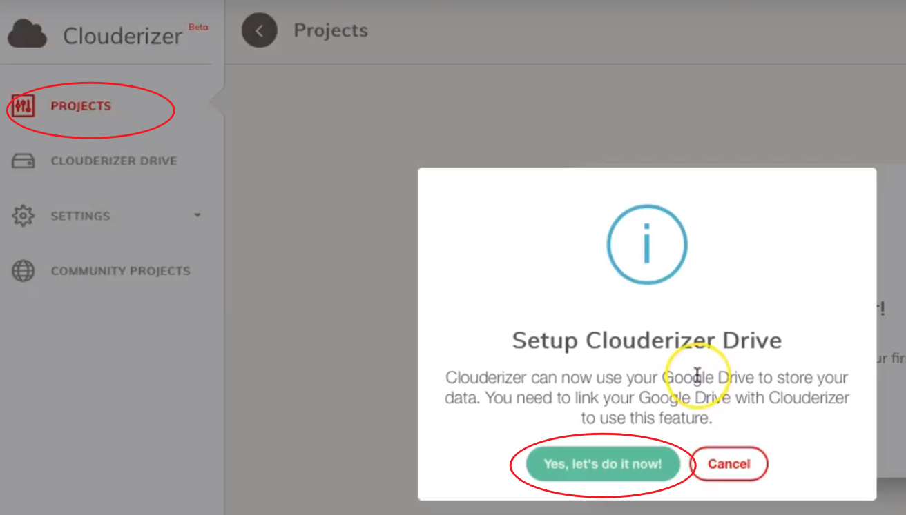</p>
下一步授权即可。

### 创建一个实例
1. 填入名字
<p align="center">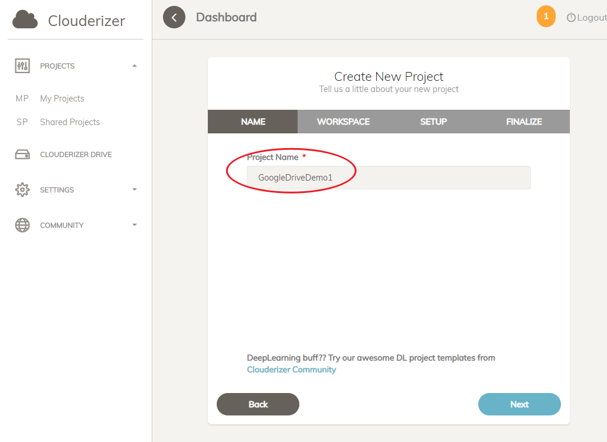</p>

2. 填入导入的Git
3. [可选] 导入Kaggle的数据集
<p align="center">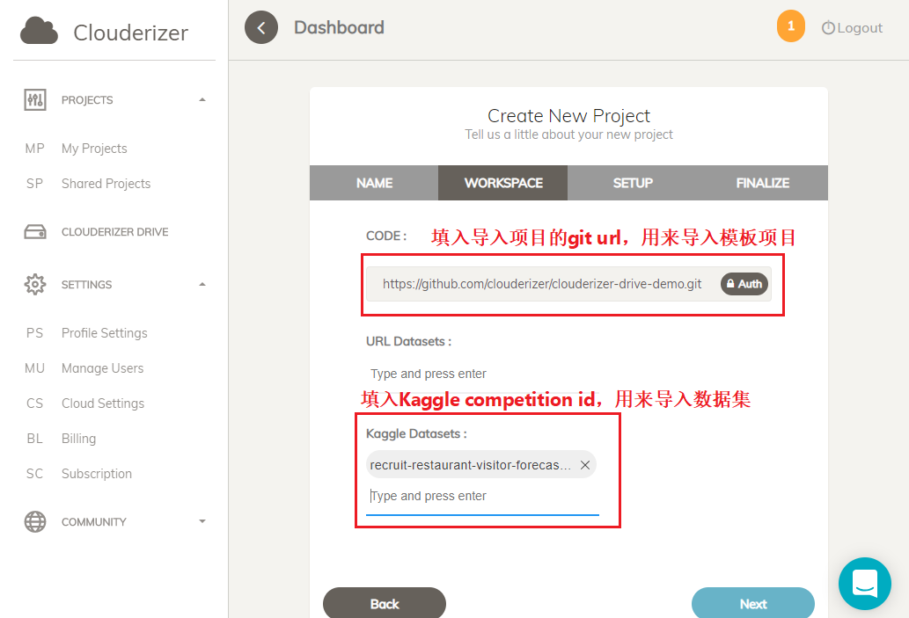</p>

如果已经绑定了Kaggle的账户，可以在这一步填入需要导数的Kaggle数据集
（具体导入Kaggle API Token的办法是在Kaggle网站 -> My Account -> API -> Creae New API Token，然后回到Clouderizer，在Settings-> Cloud Settings -> Kaggle Credentials直接导入刚刚下载的Token文件即可）

<p align="center">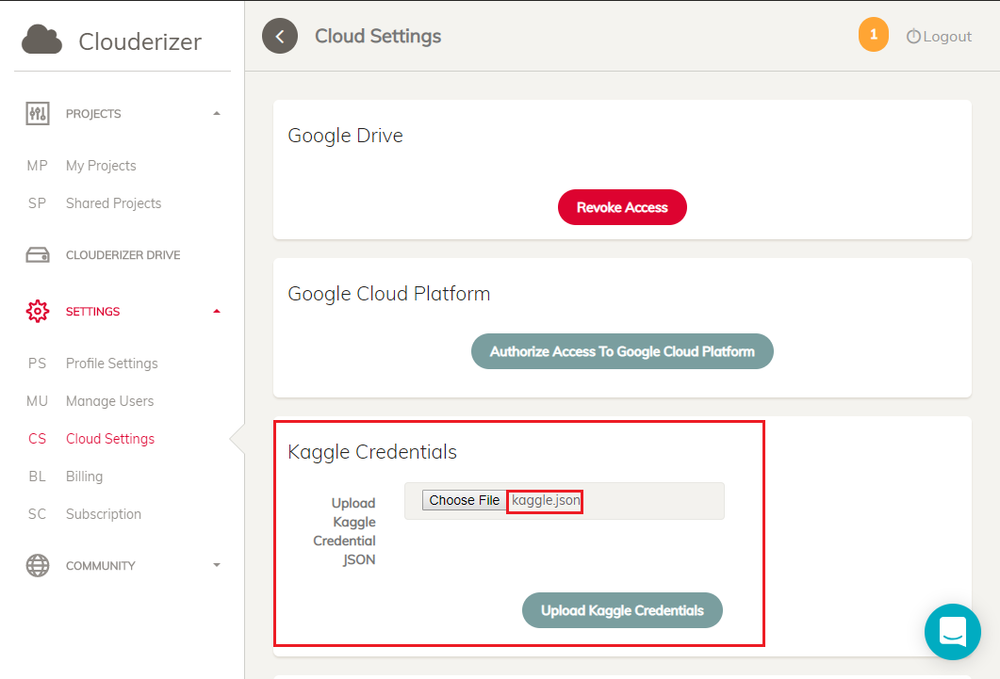</p>

上面Kaggle数据集的ID可以从Kaggle的competition页获取
<p align="center">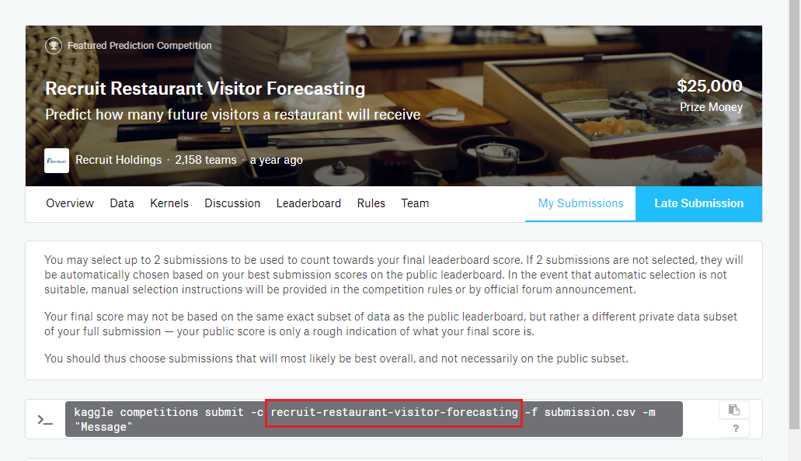</p>

4. [可选]安装依赖的APT或者PIP包，还有其脚本都可以在这里填，我这里就不填了
<p align="center">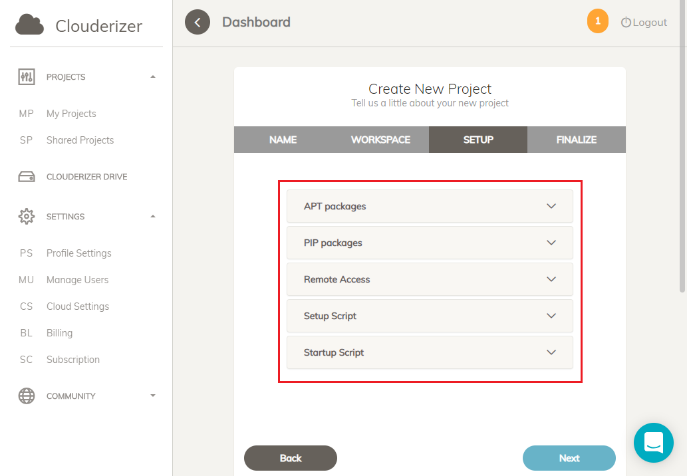</p>

5. 项目到此创建完毕
<p align="center">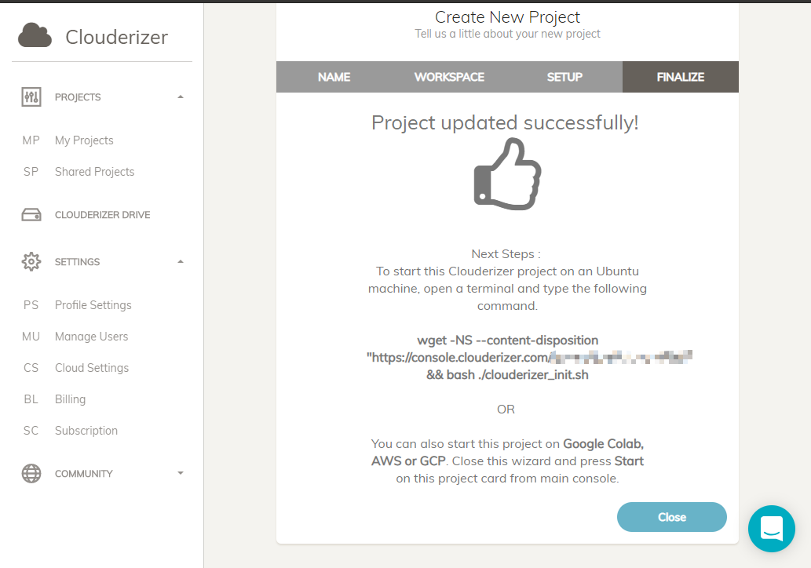</p>

6. 返回Clouderiser主面板，就看到刚刚创建的项目，直接点击Start，在弹出的云平台环境里选Google Colab即可。当然也可以选Kaggle、AWS等等，然后“Launch Colab Notebook”。
<p align="center">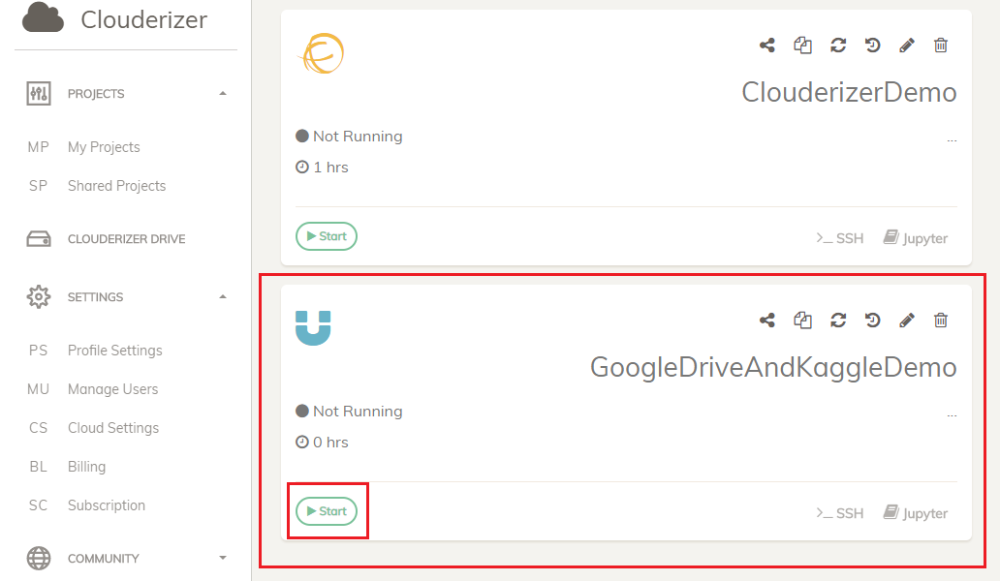</p>

7. 会自动打开Google Colab的页面，执行里面的命令。注意需要等到出现下下图红框的文字后才算准备好。
<p align="center">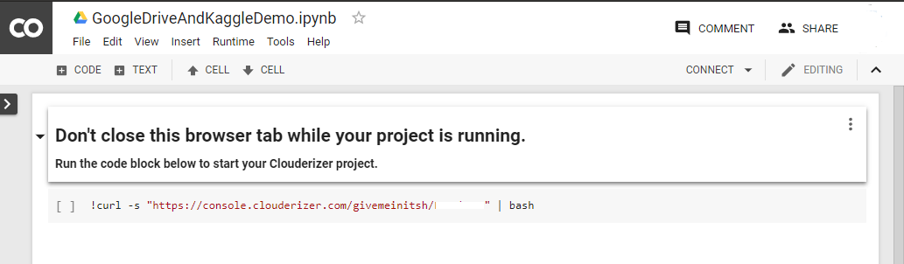</p>

<p align="center">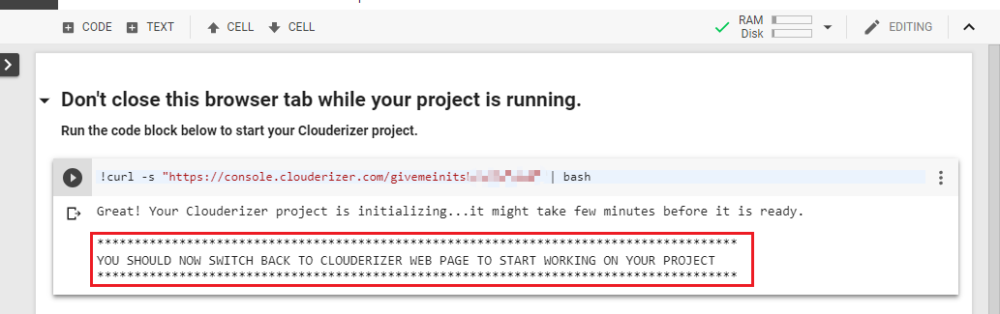</p>

6. 此时可以返回Clouderiser了，刷新项目列表，看到刚刚创建的项目已经在运行了。

<p align="center">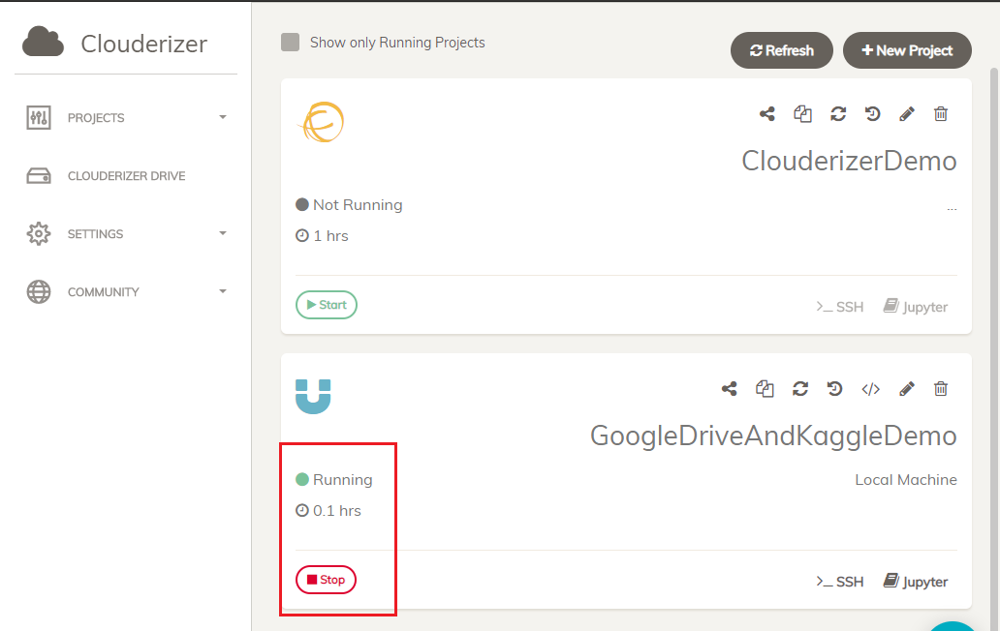</p>

可以点击右边的Jupter来启动或者SSh方式启动。如果是Jupter的方式可以看到一个熟悉的Jupter环境了。

其中文件目录结构分为code、data、out
<p align="center">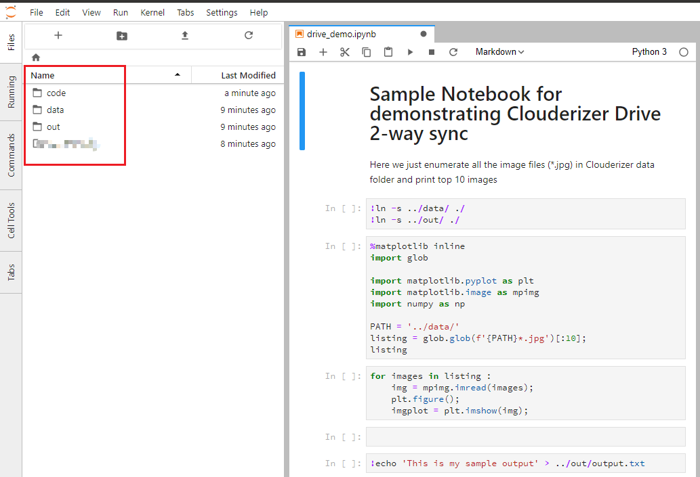</p>

发现Kaggle的数据已经准备好
<p align="center">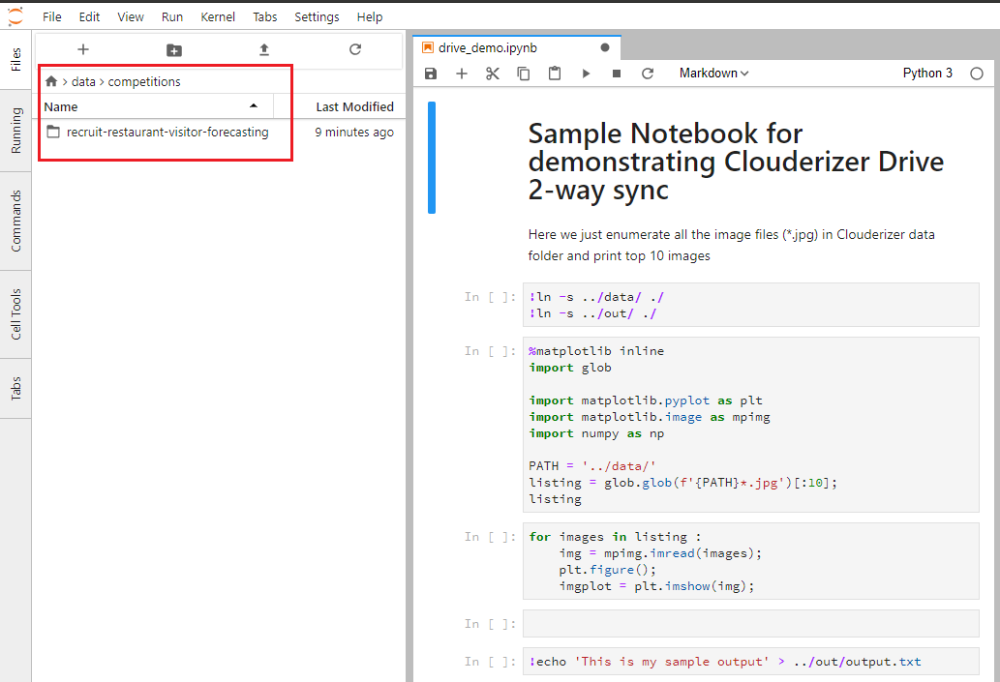</p>

回到Google Drive，发现里面有一个clouderizer的目录，再里面有刚刚创建的GoogleDriveAndKaggleDemo这个项目的所有数据：
<p align="center">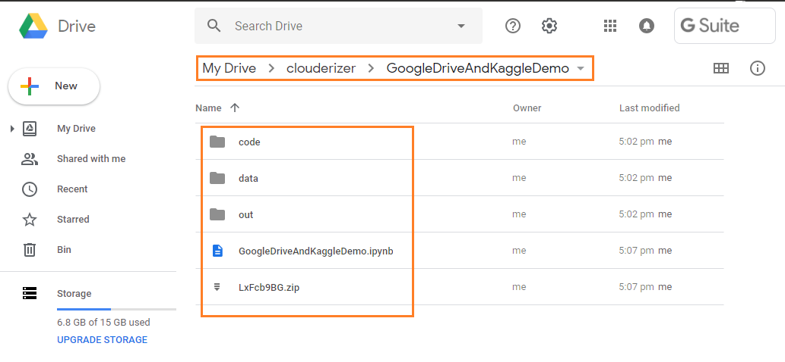</p>

**到此就OK了。开始你的AI实践之旅吧！**

> Clouderizer开始收费了，但有免费的试用期，而且不贵5刀每月每人，仍然值得推荐。

## 最后，为了客观公正，写一点一些负面的评论吧
当然没有东西是完美的，何况免费的东西。虽然我们不能要求太苛刻，但为了客观，摘录一些网上的负面评价：

1. GPU 是K80型号，这款GPU在2014年末推出，属于2012发布的开普勒Kepler架构，是几代以前的架构。（defence：虽然如此，比仅仅CPU运行，仍然快很多）
2. Colab只能提供一个用户一个GPU，并且但个任务最多连续运行12小时，然后会被重置（defence：12小时对于初学研究或学习的项目足够了吧，如果真的是很大的训练任务，最好还是要在自己的机器或虚拟机上跑吧）
3. Colab相对于单独的服务器或虚拟机来说灵活性较低（defence：那样的成本可以想一想很高的哦）

## 最后的最后，附上Google Colab 官方Q&A
https://research.google.com/colaboratory/faq.html

**什么是Google Colab？**
Google Colab是机器学习教育和研究的研究工具。这是一个Jupyter笔记本环境，无需设置，直接使用。

**支持哪些浏览器？**
推荐配合Chrome和Firefox使用。

**可以免费使用吗？**
是。Google Colab是一个可以免费使用的研究项目。

**Jupyter和Google Colab有什么区别？**
Jupyter是Google Colab所依据的开源项目。Google Colab允许您与其他人一起使用和共享Jupyter笔记本电脑，而无需在浏览器以外的任何计算机上下载，安装或运行任何东西。

**我的笔记本存放在哪里，我可以分享吗？**
所有Google Colab笔记本都存储在Google Drive中。可以像使用Google Docs或Sheets一样共享Google Colab笔记本。只需点击任何Google Colab笔记本电脑右上角的“分享”按钮，或按照这些Google云端硬盘文件共享说明操作即可。

**如果我分享我的笔记本，会分享什么？**
如果您选择共享笔记本，则将共享笔记本的全部内容（文本，代码和输出）。保存此笔记本时，可以通过选择“ 编辑”>“笔记本设置”>“忽略代码单元格输出”来省略保存或共享的代码单元输出。您正在使用的虚拟机，包括您已设置的任何自定义文件和库，将不会被共享。因此，包含安装和加载笔记本所需的任何自定义库或文件的单元格是个好主意。

**我可以将现有的Jupyter / IPython笔记本导入Google Colab吗？**
是。从文件菜单中选择“上传笔记本”。

**那么Python3呢？（或R，Scala，...）**
Google Colab支持Python 2.7和Python 3.6。知道用户有兴趣支持其他Jupyter内核（例如R或Scala）。我们想支持这些，但还没有任何ETA。

**我的代码在哪里执行？如果我关闭浏览器窗口，我的执行状态会发生什么？**
代码在专用于您帐户的虚拟机中执行。闲置一段时间后，虚拟机会被回收，并且系统会强制执行最长生命周期。

**如何获取数据？**
您可以按照这些说明或从Google Colab的文件菜单中下载您从Google云端硬盘创建的任何Google Colab笔记本。所有Google Colab笔记本都以开源Jupyter笔记本格式（.ipynb）存储。

**我如何使用GPU，为什么它们有时不可用？**
Google Colab旨在用于交互式使用。可以停止长时间运行的后台计算，特别是在GPU上。请不要使用Google Colab挖矿（比如比特币）。可能导致服务不可用。鼓励希望连续或长时间运行计算的用户使用本地运行时。

**如何重置我的代码运行的虚拟机，为什么这有时不可用？**
“运行时”（Runtime）菜单中的“重置所有运行时”（Reset all runtimes）条目将返回分配给您原始状态的所有托管虚拟机。这在虚拟机变得不健康的情况下会有所帮助，例如由于意外覆盖系统文件或安装不兼容的软件。实验室限制了这样做的频率，以防止不必要的资源消耗。如果尝试失败，请稍后再试。

**为什么drive.mount()有时会失败说“超时”，为什么drive.mount()挂载文件夹中的I / O操作有时会失败？**
当文件夹中的文件或子文件夹数量变得过大时，Google云端硬盘操作可能会超时。如果数千个项目直接包含在顶级“我的云端硬盘”文件夹中，则安装驱动器可能会超时。重复尝试最终可能成功，因为失败尝试在超时之前在本地缓存部分状态。如果遇到此问题，请尝试将“我的云端硬盘”中直接包含的文件和文件夹移动到子文件夹中。成功后从其他文件夹中读取时可能会出现类似问题drive.mount()。访问包含许多项目的任何文件夹中的项目都可能导致错误，如OSError: [Errno 5] Input/output error（python 3）或IOError: [Errno 5] Input/output error（python 2）。同样，您可以通过将直接包含的项目移动到子文件夹中来解决此问题。

**我发现了一个错误或有问题，我该联系谁？**
打开任何Google Colab笔记本。然后转到“帮助”菜单并选择“发送反馈...”。


由公众号“凯恩博”原创，转载请注明出处
