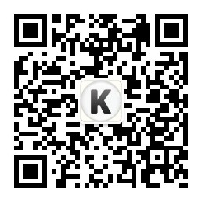

# 如何在Kaggle排行榜取得好成绩——以Digit Recognition为例

> 由公众号“[凯恩博](https://mp.weixin.qq.com/s?__biz=MzU4NDczNjI0NA==&mid=2247483673&idx=1&sn=c325e1d3fcdffdb09f635124e226c84c)”原创，转载请注明出处

数据挖掘、机器学习领域的朋友对Kaggle一定有所耳闻。
准确来讲，Kaggle在这个圈子是声名赫赫。

作为计算机行业从业者，我也是很早便听说Kaggle。
但由于种种原因，直到近日才开始真正了解它。
其中，练习赛Digit Recognition是我第一个参与的项目。
经过几次方法的变更和模型优化，最终取得了Accuracy Score 1.0的成绩。

本文将以我参见这个练习赛的过程为例，介绍模型和算法优化的一些方法和思路。希望对你有帮助，欢迎一起探讨。
> 当然如果你已经是Kaggle专家，请略过正文，直接分享给有需要的朋友吧 :)

## 什么是Kaggle
Kaggle是一个数据建模和数据分析竞赛平台。
它允许企业和研究者可在其上发布数据创建比赛（部分有丰厚的奖金），并邀请数据挖掘/分析的专家、研究者加入竞赛。

此前作为创业公司的平台独立运行，在2017年，Kaggle被Google收购，并入Google Cloud部门。

有了Google Cloud的加持，在竞赛平台的基础上，它对外提供了带NVIDIA K80 GPU的Kernel环境（支持Jupyter Notebook和Script）运行环境，可以支持包括Python、R、Markdown语言。让参赛更简单、高效。

（我在解题过程中，同时使用到了Kaggle Kernel和Google Colab两个平台）。

其中，关于Google Colab的介绍，可以请参考这篇的文章：
[工欲善其事必先利器-写给AI实践者的实验环境指南：Google Colab+Cloudriser](https://zhuanlan.zhihu.com/p/57759598)

## 为什么要参加Kaggle
首先，每个Kaggle的用户都有一个Kaggle主页（类似于GitHub的Profile）。
它会显示你参与过的比赛和排名，以及你公开的Kernel（就是源码和说明）。
Kaggle主页是证明你实力的很好方式。

比如，这是[我的Kaggle主页](https://www.kaggle.com/loveunk)，欢迎来up :)

> 当然，如果你实力超群，参加由奖金的比赛，并最终Top5，拿到奖金！Wow..! Niubility极了~

其次，通过Kaggle里看别人的code也是一种很好的学习交流方式。

## 进入正题
[Digit Recognizer](https://www.kaggle.com/c/digit-recognizer)是一个手写数字的题目。
Dataset也是一共0-9十种类别，所以是一个多分类问题。

### 传统的机器学习方法
对于多分类问题，最简单的方式是尝试使用KNN、SVM、Gaussian Naive Bayes等等。

也的确是这么做的，有两个优点：
1. 实现速度快（利用Sklearn）
2. 运行速度相对CNN也快一些。

``` python
from sklearn.neighbors import KNeighborsClassifier
def knnClassify(trainData,trainLabel,testData):
    knnClf=KNeighborsClassifier()#default:k = 5,defined by yourself:KNeighborsClassifier(n_neighbors=10)
    knnClf.fit(trainData, np.ravel(trainLabel))
    testLabel=knnClf.predict(testData)
    return testLabel

#调用scikit的SVM算法包
from sklearn import svm
def svc_train_model(trainData, trainLabel, c):
    #default:C=1.0,kernel = 'rbf'. you can try kernel:‘linear’, ‘poly’, ‘rbf’, ‘sigmoid’, ‘precomputed’
    svcClf = svm.SVC(C = c, kernel = 'rbf', gamma='scale')
    svcClf.fit(trainData, np.ravel(trainLabel))
    return svcClf

#调用scikit的朴素贝叶斯算法包,GaussianNB和MultinomialNB
from sklearn.naive_bayes import GaussianNB      #nb for 高斯分布的数据
def GaussianNBClassify(trainData, trainLabel, testData):
    nbClf=GaussianNB()
    nbClf.fit(trainData, np.ravel(trainLabel))
    testLabel=nbClf.predict(testData)
    return testLabel
```

当然，**缺点也很明显：Test Accuracy不理想。**

在上面尝试的几个方法里，相对来讲SVM相对是最好，当然对于每一种方法涉及参数优化，比如SVM里的参数C。
在此略过不讲了。还是尽快进入CNN的方法吧。

### 深度学习之CNN方法
说几个关键地方：

#### 模型
采用典型的CNN模型，使用Kera + TensorFlow作为深度学习框架。
其中使用到Conv2D、BachNormalization、Dropout、Dense等等CNN中典型的用法。

> 声明一点，这个模型是在前人的基础上改进而来，感谢在kaggle和其他网站分享notebook和接题思路的朋友

``` python
"""
  [[Conv2D->relu]*2 -> BatchNormalization -> MaxPool2D -> Dropout]*2 ->
  [Conv2D->relu]*2 -> BatchNormalization -> Dropout ->
  Flatten -> Dense -> BatchNormalization -> Dropout -> Out
"""
model = Sequential()

model.add(Conv2D(filters = 64, kernel_size = (5,5),padding = 'Same', activation ='relu', input_shape = (28,28,1)))
model.add(BatchNormalization())

model.add(Conv2D(filters = 64, kernel_size = (5,5),padding = 'Same', activation ='relu'))
model.add(BatchNormalization())

model.add(MaxPool2D(pool_size=(2,2)))
model.add(Dropout(0.25))

model.add(Conv2D(filters = 64, kernel_size = (3,3),padding = 'Same', activation ='relu'))
model.add(BatchNormalization())

model.add(Conv2D(filters = 64, kernel_size = (3,3),padding = 'Same', activation ='relu'))
model.add(BatchNormalization())
model.add(MaxPool2D(pool_size=(2,2), strides=(2,2)))
model.add(Dropout(0.25))

model.add(Conv2D(filters = 64, kernel_size = (3,3), padding = 'Same',  activation ='relu'))
model.add(BatchNormalization())
model.add(Dropout(0.25))

model.add(Flatten())
model.add(Dense(256, activation = "relu"))
model.add(BatchNormalization())
model.add(Dropout(0.25))

model.add(Dense(10, activation = "softmax"))
```

#### 数据增强
通过数据增强来防止过度拟合，包括图像数据的Rotation、缩放（0.1内）、图像Shift这几种操作：

``` python
datagen = ImageDataGenerator(
        featurewise_center=False, # set input mean to 0 over the dataset
        samplewise_center=False,  # set each sample mean to 0
        featurewise_std_normalization=False,  # divide inputs by std of the dataset
        samplewise_std_normalization=False,  # divide each input by its std
        zca_whitening=False,  # apply ZCA whitening
        rotation_range=10,  # randomly rotate images in the range (degrees, 0 to 180)
        zoom_range = 0.1, # Randomly zoom image
        width_shift_range=0.1,  # randomly shift images horizontally (fraction of total width)
        height_shift_range=0.1,  # randomly shift images vertically (fraction of total height)
        horizontal_flip=False,  # randomly flip images
        vertical_flip=False)  # randomly flip images
datagen.fit(X_train)
```

#### 扩充训练集
因为这是典型的MNIST的数字集合，而可以从`keras.datasets` 中导入minist。

针对是否从`keras.datasets.minist`中导入这批数据，做过对比试验：
* 如果没这批数据，`validation accuracy = 0.9964`
* 有这批数据后，`validation accuracy` 可以到达 `0.9985`

``` python
(x_train1, y_train1), (x_test1, y_test1) = mnist.load_data()
```

#### 参数调优
当然还有一些调优和调参过程，比如Layer size、batch_size，dropout rate等等这里就不多写了，你懂的。也比较痛苦。因为即使在有GPU加持的情况下，跑一次50 epochs需要半个小时以上 :(

## 完整的Notebook

最后，如你想研究一下完整的Code，完整的Notebook请看这里：
https://www.kaggle.com/loveunk/kaggle-digit-recognizer-keras-cnn-100-accuracy

<p align="center">

</p>
