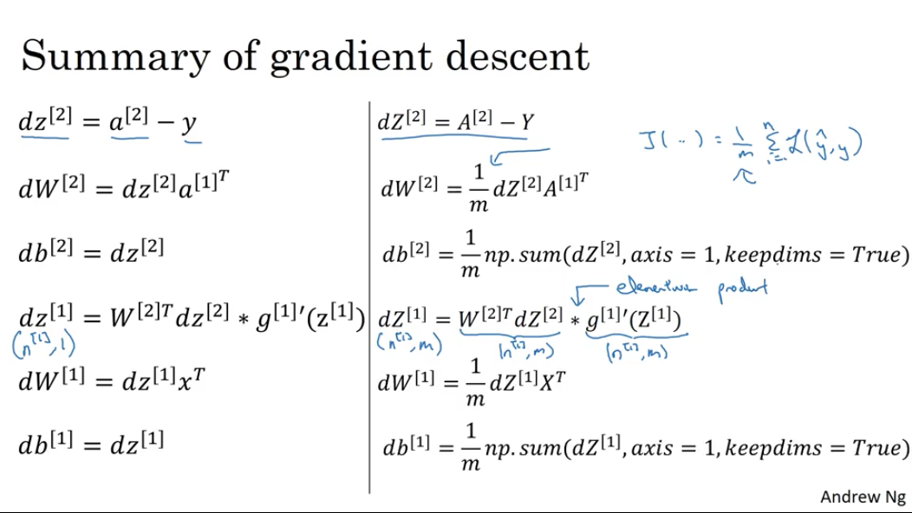

# 深度学习基础

<!-- TOC depthFrom:1 depthTo:6 withLinks:1 updateOnSave:1 orderedList:0 -->

- [深度学习基础](#深度学习基础)
	- [前言](#前言)
		- [为什么深度学习在近几年流行起来](#为什么深度学习在近几年流行起来)
		- [深度学习先驱：Jeff Hinton访谈](#深度学习先驱jeff-hinton访谈)
	- [神经网络的编程基础](#神经网络的编程基础)
		- [二分类问题](#二分类问题)
		- [符号定义](#符号定义)
		- [逻辑回归](#逻辑回归)
		- [向量化 Vectorization](#向量化-vectorization)
		- [向量化的更多例子](#向量化的更多例子)
		- [Python 中的广播](#python-中的广播)
		- [关于 Python Numpy 向量的说明](#关于-python-numpy-向量的说明)
		- [Jupyter/iPython Notebooks快速入门](#jupyteripython-notebooks快速入门)
		- [深度学习先驱：Pieter Abbeel访谈](#深度学习先驱pieter-abbeel访谈)
	- [浅层神经网络](#浅层神经网络)
		- [神经网络概述](#神经网络概述)
		- [神经网络的表示](#神经网络的表示)
		- [计算神经网络的输出](#计算神经网络的输出)
			- [神经网络的计算](#神经网络的计算)
			- [向量化计算](#向量化计算)
		- [多样本向量化](#多样本向量化)
		- [向量化实现的解释](#向量化实现的解释)
		- [激活函数](#激活函数)
		- [为什么需要非线性激活函数？](#为什么需要非线性激活函数)
		- [激活函数的导数](#激活函数的导数)
		- [神经网络的梯度下降](#神经网络的梯度下降)
		- [直观理解反向传播](#直观理解反向传播)
		- [随机初始化](#随机初始化)
		- [深度学习先驱：Ian Goodfellow访谈](#深度学习先驱ian-goodfellow访谈)
	- [深层神经网络](#深层神经网络)
		- [深层神经网络](#深层神经网络)
		- [前向传播和反向传播](#前向传播和反向传播)
		- [深层网络中的前向传播](#深层网络中的前向传播)
		- [核对矩阵的维数](#核对矩阵的维数)
		- [为什么使用深层表示？](#为什么使用深层表示)
		- [搭建神经网络块](#搭建神经网络块)
		- [参数VS超参数](#参数vs超参数)
		- [深度学习和大脑的关联性](#深度学习和大脑的关联性)
  - [项目练习](#项目练习)

<!-- /TOC -->

## 前言
> 如果还不是很熟悉神经网络，请先去看机器学习里[神经网络](../machine-learning/neural-networks.md)的章节。

### 为什么深度学习在近几年流行起来

深度学习所使用的神经网络基础技术理念已经存在几十年了，为什么最近这些年才流行起来？通过一个图来了解一下。

下图的水平轴是任务的数据量，垂直轴上是机器学习算法的性能。比如准确率体现在垃圾邮件过滤或者广告点击预测，或者是神经网络在自动驾驶汽车时判断位置的准确性。

如果把一个传统机器学习算法的性能画出来，作为数据量的一个函数，可能得到一个弯曲的线，就像图中红色的线。它的性能一开始随着更多数据时会上升，但是一段变化后它的性能就会像一个天花板一样。假设水平轴拉的很长很长，它们不知道如何处理规模巨大的数据，而过去十年的社会里，遇到的很多问题只有相对较少的数据量。

<p align="center">

</p>

随着数字化社会的发展，需要解决的问题中数据量都非常巨大。比如在电脑网站上、在手机软件上以及其它数字化的服务，它们都能创建数据，同时便宜的相机被配置到移动电话，还有加速仪及各类各样的传感器，同时在物联网领域也收集到了越来越多的数据。仅仅在过去的20年里对于很多应用，便收集到了大量的数据，远超过机器学习算法能够高效发挥它们优势的规模。

神经网络展现出的是，如果训练一个小型的神经网络，那么性能可能会像图中黄色曲线表示那样；如果训练一个中等规模的神经网络（蓝色曲线），它在某些数据上面的性能会更好一些；如果训练一个非常大的神经网络，就会变成下图绿色曲线那样，并且保持变得越来越好。

因此如果想要获得较高的性能体现，有两个条件要完成：
* **需要训练一个规模足够大的神经网络，以发挥数据规模量巨大的优点；**
* **需要很多的数据，以便把算法的性能提升到图中 _x_ 轴右边位置。**

大家经常说规模一直在推动深度学习的进步，这里的“规模”同时指神经网络的规模。需要带有许多隐藏单元的神经网络，也有许多的参数及关联性，就如同需要大规模的数据一样。

**如今在神经网络上获得更好性能的最可靠方法，是训练一个更大的神经网络，投入更多的数据。** 但这只能在一定程度上起作用，因为最终你将耗尽数据，或者最终你的网络是如此大规模导致将要用太久的时间去训练。仅仅提升规模这一步的的确确地让科学界在深度学习的世界中摸索了很多时间。

**当在面临小的训练集时，各种算法的优先级事实上定义的不是很明确。** 所以如果你没有大量的训练集，算法的效果非常取决于特征工程能力。假设有些人训练出了一个SVM（支持向量机）表现的更接近正确特征，然而有些人训练的规模大一些，可能在这个小的训练集中SVM算法可以做的更好。因此知道在上图区域的左边，各种算法之间的优先级并不是定义的很明确，最终的性能更取决于你在用工程选择特征方面的能力以及算法处理的细节，只是在某些大数据规模非常庞大的训练集，即在右边这个 _m_ 非常大时，我们能更加持续地看到更大的由神经网络控制的其它方法。因此如果你的朋友问为什么神经网络这么流行，我会鼓励你也替他们画这样一个图形。

**在深度学习技术发展的初期，数据规模以及计算量都局限了训练一个特别大的神经网络的能力。** 近年无论CPU还是GPU的发展，都使深度学习取得了巨大的进步。但是渐渐地，尤其是在最近这几年，我们也见证了算法方面的极大创新。许多算法方面的创新，一直在尝试着使得神经网络运行的更快。

作为一个具体的例子，神经网络方面的一个巨大突破是从sigmoid函数转换到一个ReLU函数。

<p align="center">

</p>
使用Sigmoid函数的一个已知问题是，在函数的两端，Sigmoid函数的梯度会接近零，所以学习的速度会变得非常缓慢。
因为当实现梯度下降以及梯度接近零的时候，参数会更新的很慢，所以学习的速率也会变的很慢。
因而可以改变激活函数，比如现在常用的ReLU的函数（修正线性单元）。ReLU它的梯度对于所有输入的负值都是零，仅仅通过将Sigmod函数转换成ReLU函数，便能够使得梯度下降算法运行更快，这就是一个或许相对比较简单的算法创新的例子。

**但是根本上算法创新所带来的影响，实际上是对计算带来的优化。** 有很多这样的例子，通过改变算法，使得代码运行的更快，这也使得我们能够训练规模更大的神经网络，或者是多端口的网络。

即使我们从所有的数据中拥有了大规模的神经网络，快速计算显得更加重要的另一个原因是，训练神经网络的过程很多时候是凭借直觉的。往往你对神经网络架构有了一个想法，于是你尝试写代码实现你的想法，然后运行一个试验环境来看看这个神经网络效果有多好，通过参考这个结果再去修改神经网络里面的细节，然后不断的重复上面的操作。（如下右图）

<p align="center">

</p>
当神经网络需要很长时间去训练（需要长时间重复上述循环），在这就有很大的区别了。当你有一个想法，动手试试效果如何，你的神经网络可能花10分钟，或花一整天时间，也可能需要一个月的时间去训练。如果可以在10分钟内或者一天内执行完，你有机会尝试更多的想法，那极有可能使得神经网络工作的更好更快。

提高速度会非常有帮助，那样你就能更快地得到实验结果。同时帮助了神经网络的实验人员在深度学习的工作中迭代的更快，也能够更快的改进想法，所有这些都使得整个深度学习的研究社群变的如此繁荣，包括令人难以置信地发明新的算法和取得不间断的进步，这些都是开拓者在做的事情，这些力量使得深度学习不断壮大。

这些力量目前不断的奏效，使得深度学习越来越好。研究表明社会仍然正在抛出越来越多的数字化数据，或者用一些特殊的硬件来进行计算，比如说GPU、TPU，以及更快的网络连接各种硬件。非常有信心，未来可以实现一个超级大规模的神经网络，而计算的能力也会进一步的得到改善，还有算法相对的学习研究社区连续不断的在算法前沿产生非凡的创新。

### 深度学习先驱：Jeff Hinton访谈

<p align="center">
  <a href="https://www.youtube.com/watch?v=CId2ivZ6JZ8" target="_blank">
    
  </a>
</p>


## 神经网络的编程基础
### 二分类问题
这一节将介绍神经网络的基础知识。在神经网络的计算中，通常包括一个前向传播(Forward Propagation)和一个反向传播(Backward Propagation)的步骤。这里会使用逻辑回归(logistic regression)来解释这些想法，以便能够更加容易地理解这些概念。

逻辑回归是一个用于二分类(Binary Classification)问题的算法。看一个二分类问题的例子，假如你有一张图片作为输入，比如这只猫，如果识别这张图片为猫，则输出标签1作为结果；如果识别出不是猫，那么输出标签0作为结果。用字母 _y_ 来表示输出的结果标签，如下图所示：

<p align="center">

</p>

先看看一张图片在计算机中是如何表示的：
* 程序中为保存一张图片，需要三个矩阵，分别对应图片中的红、绿、蓝三种颜色通道
* 如果图片大小为64x64像素，那么就有三个64x64的矩阵，分别对应图片中红、绿、蓝三种像素的强度值

为了便于表示，下图画了3个很小的矩阵，注意它们的规模为`5 * 4 `而不是`64 * 64`，如下图所示：
<p align="center">

</p>

为了把这些像素值放到一个特征向量中，需要把这些像素值提取出来，放入一个特征向量 _x_ 。

首先把所有的像素都取出来，如果图片的大小为64x64像素，那么向量 _x_ 的总维度，将是64乘以64乘以3，这是三个像素矩阵中像素的总量。在这个例子中它为12,288。现在我们用 _n<sub>x</sub>=12,288_ ，来表示输入特征向量的维度。有时候为了简洁，会直接用小写的 _n_ 来表示输入特征向量 _x_ 的维度。

所以在二分类问题中，目标就是得到一个分类器，以图片的特征向量作为输入，然后预测输出结果 _y_ 为1还是0，也就是预测图片中是否有猫。

### 符号定义
在这个系列课程里使用到的一些定义如下：
* _x_ ：表示一个 _n<sub>x</sub>_ 维数据，为输入数据，维度为 _(n<sub>x</sub>, 1)_ ；
* _y​_ ：表示输出结果，取值为 _(0, 1)​_ ；
* _(x<sup>(i)</sup>, y<sup>(i)</sup>)_ ：表示第 _i_ 组数据，可能是训练数据，也可能是测试数据，此处默认为训练数据；
* _X = [x<sup>(1)</sup>, x<sup>(2)</sup>, ..., x<sup>(m)</sup>]_ ：表示所有的训练数据集的输入值，放在一个 _n<sub>x</sub> × m_ 的矩阵中，其中 _m_ 表示样本数目;
* _Y = [y<sup>(1)</sup>, y<sup>(2)</sup>, ..., y<sup>(m)</sup>]_ ：对应表示所有训练数据集的输出值，维度为 _1 × m_ 。
* 一对_(x, y)_ 来表示一个单独的样本， _x_ 代表 _n<sub>x</sub>_ 维的特征向量， _y_ 表示标签(输出结果)只能为0或1。

定义训练集由 _m_ 个训练样本组成时，有：
* _(x<sup>(1)</sup>,y<sup>(1)</sup>)_ 表示第一个样本的输入和输出
* _(x<sup>(m)</sup>,y<sup>(m)</sup>)_ 表示最后一个样本
* 有时为了强调这是训练样本的个数，会写作 _M<sub>train</sub>_
* 当涉及到测试集的时候，我们会使用 _M<sub>test</sub>_ 来表示测试集的样本数

定义一个矩阵用大写 _X_ 表示，有：

* 它由输入向量 _x<sup>(1)</sup>_ 、 _x<sup>(2)</sup>_ 、...、_x<sup>(m)</sup>_ 等组成
* 如下图放在矩阵的列中，所以现在把 _x<sup>(1)</sup>_ 作为第一列放在矩阵中， _x<sup>(2)</sup>_ 作为第二列， _x<sup>(m)</sup>_ 放到第 _m_ 列，得到了训练集矩阵 _X_ 。
* 这个矩阵有 _m_ 列， _m_ 是训练集的样本数量，矩阵的高度记为 _n<sub>x</sub>_ 。

<p align="center">

</p>

一个好的符号定义能够将不同训练样本的数据很好地组织起来。所说的数据不仅包括 _x_ 或者 _y_ 还包括之后你会看到的其他的量。将不同的训练样本的数据提取出来，将他们堆叠在矩阵的列中，形成之后会在逻辑回归和神经网络上要用到的符号表示。如果之后忘了这些符号的意思，比如什么是 _m_ ，或者什么是 _n_ ，或者其他的，可以随时查阅这里。

### 逻辑回归
[略]。这部分请参考机器学习中[逻辑回归](../machine-learning/logistic-regression.md)的章节。

### 向量化 Vectorization
向量化是非常基础的去除代码中`for`循环的艺术，在深度学习实践中，会经常发现训练大数据集，因为深度学习算法处理大数据集效果很棒，所以代码运行速度非常重要，否则如果在大数据集上，代码可能花费很长时间去运行，你将要等待非常长的时间去得到结果。

在深度学习领域，运行向量化是一个关键的技巧，举个例子说明什么是向量化。

在逻辑回归中你需要去计算 _z = w<sup>T</sup>x+b_ ， _w_ 、 _x_ 都是列向量。如果你有很多的特征那么就会有一个非常大的向量，所以 _w ∈ R<sup>n<sub>x</sub></sup>_ , _x ∈ R<sup>n<sub>x</sub></sup>_ ，所以如果你想使用非向量化方法去计算 _w<sup>T</sup>x_ ，你需要用如下方式（Python）：
``` python
z = 0
for i in range(n_x):
    z += w[i]*x[i]
z += b
```

这是一个非向量化的实现，你会发现相对运行的很慢，作为一个对比，向量化实现将会非常直接计算 _w<sup>T</sup>x_ ，代码如下：

``` python
z = np.dot(w, x) + b
```

上面是向量化计算 _w<sup>T</sup>x_ 的方法，你将会发现向量化的写法运行速度相对会非常快。

让我们用一个小例子说明一下：
``` python
import numpy as np
import time

""" 通过round随机得到两个一百万维度的数组 """
a = np.random.rand(1000000)
b = np.random.rand(1000000)

"""现在测量一下当前时间"""
tic = time.time()

""" 向量化的版本 """
c = np.dot(a,b)
toc = time.time()
print("向量化的版本：" + str(1000*(toc-tic)) + "毫秒")

""" 非向量化的版本 """
c = 0
tic = time.time()
for i in range(1000000):
    c += a[i]*b[i]
toc = time.time()
print(c)
print("非向量化的版本：" + str(1000*(toc-tic)) + "毫秒")
```

输入为：

```
向量化的版本：0.9706020355224609毫秒
非向量化的版本：305.0830364227295毫秒
```

在两个方法中，向量化和非向量化计算了相同的值，如你所见，向量化版本花费了0.97毫秒，非向量化版本的for循环花费了大约几乎305毫秒，非向量化版本多花费了300倍时间。在这个例子中，仅仅是向量化代码，就会运行快300倍。

此外，你可能听过很多类似如下的话，“大规模的深度学习使用了GPU（图像处理单元）实现”，而上面的例子实际上只用到了CPU。CPU和GPU都有并行化的指令，有时会叫做SIMD指令，这代表了一个单独指令多维数据。如果你使用了built-in函数，np.function或其他不要求实现循环的函数，可以让Python充分利用并行化计算。在GPU和CPU上面计算，GPU更加擅长SIMD计算，但是CPU也不差，只是没有GPU那么擅长。

### 向量化的更多例子
经验告诉我们，当写神经网络程序时，或者逻辑回归等等程序时，应该避免写循环(loop)语句。
虽然有时写循环(loop)是不可避免的，但是我们可以使用比如`Numpy`的内置函数或者其他办法去计算。
当你这样使用后，程序效率总是快于循环(loop)。

**举一个例子**，如果你想计算向量 _u = A v_ ，矩阵乘法的定义是：_u<sub>i</sub> = Σ<sub>j</sub>A<sub>ij</sub>v<sub>i</sub>_ 。

* 使用非向量化实现， _u = np.zeros(n,1)_ ，并且通过两层循环 _for(i), for(j):_ ，得到 _u[i] = u[i] + A[i] [j] * v[j]_ 。现在就有了 _i_ 和 _j_ 的两层循环，这就是非向量化。（如下图）
* 向量化方式就可以用 _u = np.dot(A,v)_ ，右边这种向量化实现方式，消除了两层循环使得代码运行速度更快。
<p align="center">

</p>

**另一个例子**：如果你已经有一个向量 _v_ ，并且想要对向量 _v_ 的每个元素做指数操作，得到向量 _u_ 等于 _e_ 的 _v<sub>1</sub>_ ， _e_ 的 _v<sub>2</sub>_ ，一直到 _e_ 的 _v<sub>n</sub>_ 次方。

* 非向量化的实现方式（如下图）
	* 首先你初始化了向量 _u = np.zeros(n,1)_
	* 通过循环依次计算每个元素
* 向量化的方式可以通过Python的`Numpy`内置函数，帮助计算：
	* 首先引入`import numpy as np`
	* 执行 `u = np.exp(v)` 命令
	* 这里仅用了一行代码，向量 _v_ 作为输入， _u_ 作为输出。

通过下图右边代码实现，效率会明显的快于循环方式。
<p align="center">

</p>

事实上，`Numpy`库有很多向量函数。比如：
* `u = np.log`是计算对数函数(_log_)
* `np.abs()`是计算数据的绝对值
* `np.maximum(v, 0)`按元素计算 _v_ 中每个元素和和0相比的最大值
* `v**2` 代表获得元素 _v_ 每个值的平方
* `1/v` 获取 _v_ 中每个元素的倒数，等等

所以当你想写循环时候，检查`Numpy`是否存在类似的内置函数，从而避免使用循环方式。

下面将刚才所学到的内容，运用在逻辑回归的梯度下降上，看看是否能简化两个计算过程中的某一步。

这是逻辑回归的求导代码，有两层循环。在这例子我们有 _n_ 个特征。
<p align="center">

</p>
如果有超过两个特征时，需要循环 _dw<sub>1</sub>_ 、 _dw<sub>2</sub>_ 、...、 _dw<sub>n</sub>_ 等等。所以 _j_ 的实际值是1、2和...、 _n<sub>x</sub>_ ，就是你想要更新的值。

如果你想消除第二个循环，可以考虑：

* 首先定义 _dw_ 为一个向量，设置 `u = np.zeros(n(x), 1)` 。这行代码定义了一个 _x_ 行的一维向量，从而替代循环。
* 其次使用了一个向量操作 _dw += x<sup>(i)</sup>dz<sup>(i)</sup>_ 。
* 最后，采用 _dw = dw / m_ 。

现在通过将两层循环转成一层循环，仍然还有这个循环训练样本。
<p align="center">

</p>

### Python 中的广播
举一个例子来讲解Python中的广播机制。
<p align="center">

</p>

这是不同食物(每100g)中营养成分的卡路里含量表格，列表示不同的食物种类，行表示不同的营养成分。现在想要计算不同食物中不同营养成分中的卡路里百分比。计算苹果中的碳水化合物卡路里百分比含量，首先计算苹果（100g）中三种营养成分卡路里总和 56 + 1.2 + 1.8 = 59，然后用56/59 = 94.9%算出结果。可以看出苹果中的卡路里大部分来自于碳水化合物，而牛肉则不同。

对于其他食物，计算方法类似。
* 首先，按列求和，计算每种食物中（100g）三种营养成分总和；
* 然后，分别用不同营养成分的卡路里数量除以总和，计算百分比。

那么，能否不使用`for`循环完成这样的一个计算过程呢？

假设上图的表格是一个4行3列的矩阵 _A_ ，记为 _A<sub>3×4</sub>_ ，接下来要使用Python的`Numpy`库完成这样的计算。打算使用两行代码完成，第一行代码对每一列进行求和，第二行代码分别计算每种食物每种营养成分的百分比。在`Jupyter Notebook`中输入如下代码，按`Shift+Enter`运行。

<p align="center">

</p>

下面使用如下代码计算每列的和，可以看到输出是每种食物(100g)的卡路里总和。

<p align="center">

</p>

其中`sum`的参数 `axis=0` 表示求和运算按列执行，之后会详细解释。

接下来计算百分比，这条指令将 _3×4_ 的矩阵 _A_ 除以一个 _1×4_ 的矩阵，得到了一个 _3×4_ 的结果矩阵，这个结果矩阵就是要计算的百分比含量。

<p align="center">

</p>
`A.sum(axis = 0)`中的参数`axis`指明将要进行的运算是沿着哪个轴执行。在`Numpy`中：

* 0轴是垂直的，也就是列；
* 1轴是水平的，也就是行。

而第二个`A / cal.reshape(1,4)`指令则调用了`Numpy`中的广播机制。这里使用 _3×4_ 的矩阵 _A_ 除以 _1×4_ 的矩阵 _cal_ 。技术上来讲，其实并不需要再将矩阵 _cal_ 重塑(reshape) 成 _1×4_ ，因为矩阵 _cal_ 本身已经是 _1×4_ 了。但是当我们写代码时不确定矩阵维度的时候，通常会对矩阵进行重塑来确保得到我们想要的列向量或行向量。重塑操作reshape是一个常量时间的操作，时间复杂度是 _O(1)_ ，它的调用代价极低。

那么一个 _3×4_ 的矩阵是怎么和 _1×4_ 的矩阵做除法的呢？让我们来看一些更多的广播的例子。
<p align="center">

</p>
在`Numpy`中，当一个 _4×1_ 的列向量与一个常数做加法时，实际上会将常数扩展为一个 _4×1_ 的列向量，然后两者做逐元素加法。结果就是右边的这个向量。这种广播机制对于行向量和列向量均可以使用。

再看下一个例子。

<p align="center">

</p>

用一个 _2×3_ 的矩阵和一个 _1×3_ 的矩阵相加，其泛化形式是 _m×n_ 的矩阵和 _1×n_ 的矩阵相加。在执行加法操作时，其实是将 _1×n_ 的矩阵复制成为 _m×n_ 的矩阵，然后两者做逐元素加法得到结果。针对这个具体例子，相当于在矩阵的第一列加100，第二列加200，第三列加300。这就是在前面计算卡路里百分比的广播机制，只不过这里是除法操作（广播机制与执行的运算种类无关）。

最后一个例子：
<p align="center">

</p>

这里相当于是一个 _m×n_ 的矩阵加上一个 _m×1_ 的矩阵。在进行运算时，会先将 _m×1_ 矩阵水平复制 _n_ 次，变成一个 _m×n_ 的矩阵，然后再执行逐元素加法。

广播机制的一般原则如下：
<p align="center">

</p>

更多关于广播的介绍可以参考：[广播Broadcasting](https://github.com/loveunk/machine-learning-deep-learning-notes/tree/master/python/numpy#%E5%B9%BF%E6%92%AD-broadcasting)。

### 关于 Python Numpy 向量的说明
Python的特性允许你使用广播（Broadcasting）特性，这是Python的`Numpy`程序语言库中最灵活的地方。但这是优点，也是缺点。

优点在于它们创造出语言的表达性，Python语言巨大的灵活性使得你仅仅通过一行代码就能做很多事情。

但是这也是缺点，由于广播的灵活性，有时候你对于广播的特点以及广播的工作原理这些细节不熟悉的话，可能会产生很细微或者看起来很奇怪的bug。例如，如果你将一个列向量添加到一个行向量中，你会以为它报出维度不匹配或类型错误之类的错误，但是实际上你会得到一个行向量和列向量的求和。

在Python的这些奇怪的影响之中，其实是有一个内在的逻辑关系的。我就曾经见过一些对Python不熟悉的话学生非常生硬、艰难地找Bug。所以在这里我想分享给你一些技巧，这些技巧对我非常有用，它们能消除或者简化我的代码中所有看起来很奇怪的bug。同时我也希望通过这些技巧，你也能更容易地写没有Bug的Python和`Numpy`代码。

为了演示Python `Numpy`的一个容易被忽略的效果，特别是怎样在Python `Numpy`中构造向量，让我来做一个快速示范。
首先设置 _a = np.random.randn(5)_ ，这样会生成存储在数组 _a_ 中的5个高斯随机数变量。之后输出 _a_ ，从屏幕上可以得知，此时 _a_ 的shape（形状）是一个 _(5,)_ 的结构。这在Python中被称作一个一维数组。它既不是一个行向量也不是一个列向量，这也导致它有一些不是很直观的效果。举个例子，如果输出一个转置阵，最终结果它会和 _a_ 看起来一样，所以 _a_ 和 _a_ 的转置阵最终结果看起来一样。而如果输出 _a_ 和 _a_ 的转置阵的内积，你可能会想： _a_ 乘以 _a_ 的转置返回给你的可能会是一个矩阵。但是如果我这样做，你只会得到一个数。

<p align="center">

</p>
所以建议你编写神经网络时，不要使用shape为 _(5,)_、_(n,)_ 或者其他一维数组的数据结构。相反，如果你设置 _a_ 为 _(5,1)_ ，那么这就将置于5行1列向量中。在先前的操作里 _a_ 和 _a_ 的转置看起来一样，而现在这样的 _a_ 变成一个新的 _a_ 的转置，并且它是一个行向量。请注意这个细微的差别，在这种数据结构中，当我们输出 _a_ 的转置时有两对方括号，而之前只有一对方括号，所以这就是1行5列的矩阵和一维数组的差别。

<p align="center">

</p>
如果你输出 _a_ 和 _a_ 的转置的乘积，然后会返回给你一个向量的外积，是吧？所以这两个向量的外积返回给你的是一个矩阵。

<p align="center">

</p>
再进一步说明。刚刚运行的命令是这个 _a = np.random.randn(5)_ ，而且它生成了一个数据结构 _a.shape_ 是 _(5,)_ 。这被称作 _a_ 的一维数组，同时这也是一个非常有趣的数据结构。它不像行向量和列向量那样表现的很一致，这也让带来一些不直观的影响。所以我建议，当你在编程练习或者在执行逻辑回归和神经网络时，你不需要使用这些一维数组。

相反，如果你每次创建一个数组，都是创建 _(5,1)_ 向量或者你让它成为一个行向量，那么向量的行为可能会更容易被理解。
* `a = np.random.randn(5, 1)`中 _a.shape_ 等同于 _(5,1)_ ，是一个列向量
* `a = np.random.randn(1, 5)`中 _a.shape_ 等同于 _(1,5)_ ，是一个行向量

所以当你需要一个向量时(column vector or row vector)，绝不会是一维数组。

此外，如果我不完全确定一个向量的维度(dimension)，我经常会扔进一个断言语句(assertion statement)。
<p align="center">

</p>

像这样，去确保在这种情况下是一个 _(5,1)_ 向量，或者说是一个列向量。这些断言语句实际上是要去执行的，并且它们也会有助于为你的代码提供信息。所以不论你要做什么，不要犹豫直接插入断言语句。如果你不小心以一维数组来执行，你也能够重新改变数组维数 _a = reshape_ ，表明一个 _(5,1)_ 数组或者一个 _(1,5)_ 数组，以致于它表现更像列向量或行向量。

有时候看见学生因为一维数组不直观的影响，难以定位Bug而告终。通过在原先的代码里清除一维数组，代码变得更加简洁。而且实际上就在代码中表现的事情而言，我从来不使用一维数组。因此，要去简化你的代码，而且不要使用一维数组。总是使用 _n×1_ 维矩阵（基本上是列向量），或者 _1×n_ 维矩阵（基本上是行向量），这样你可以减少很多assert语句来节省核矩阵和数组的维数的时间。另外，为了确保你的矩阵或向量所需要的维数时，不要羞于reshape操作。

### Jupyter/iPython Notebooks快速入门
Jupyter 的使用比较简单，略过

### 深度学习先驱：Pieter Abbeel访谈

<p align="center">
  <a href="https://www.youtube.com/watch?v=dmkPJpWCVcI" target="_blank">
    
  </a>
</p>

## 浅层神经网络
### 神经网络概述

现在我们开始快速浏览一下如何实现神经网络。
<p align="center">

</p>

此前我们讨论了逻辑回归，了解了上图的模型如何与下面公式建立联系。
<p align="center">

</p>

如上所示，首先需要输入特征 _x_，参数 _w_ 和 _b_，通过这些你就可以计算出 _z_：
<p align="center">

</p>
接下来使用 _z_ 就可以计算出 _a_ 。我们定义符号：

* **输出**： _ŷ = a = σ(z)_ 
* **代价函数(loss function)**： _L(a,y)_


一个简单神经网络看起来如下图：

<p align="center">

</p>
如之前提到，可以把许多Sigmoid单元堆叠起来形成一个神经网络。对于图中的节点，它包含了之前讲的两个步骤：

- 计算 _z_
- 通过 _σ(z)_ 计算 _a_

上图的神经网络对应的3个节点，首先计算第一层网络中的各个节点相关的数 _z<sup>[1]</sup>_ ，接着计算 _α<sup>[1]</sup>_ ，再计算下一层网络。

定义符号：

-  _<sup>[m]</sup>_ 表示第 _m_ 层网络中节点相关的数

这些节点的集合被称为第 _m_ 层网络。这样可以保证 _<sup>[m]</sup>_ 不会和我们之前用来表示单个的训练样本的 _<sup>(i)</sup>_ (即我们使用表示第 _i_ 个训练样本)混淆。


计算过程如下:

<p align="center">

</p>

接下来你需要使用另外一个线性方程对应的参数计算 _z<sup>[2]</sup>_ ，计算 _a<sup>[2]</sup>_ ，此时 _a<sup>[2]</sup>_ 就是整个神经网络最终的输出，用 _ŷ_ 表示网络的输出。
<p align="center">

</p>


在逻辑回归中，通过直接计算 _z_ 得到结果 _a_ 。而神经网络中，需要反复的计算 _z_ 和 _a_ ，计算 _a_ 和 _z_ ，最后得到了最终的输出**loss function**。

此外，在逻辑回归中，有一些从后向前的计算用来计算导数 _da_ 、 _dz_ 。同样在神经网络中也有从后向前的计算，对于这个例子会先计算 _da<sup>[2]</sup>_ 、 _dz<sup>[2]</sup>_ ，计算出来之后，然后计算 _dW<sup>[2]</sup>_ 、 _db<sup>[2]</sup>_ ，然后是_da<sup>[1]</sup>_ 、_dW<sup>[1]</sup>_ 、 _db<sup>[1]</sup>_ ，从右到左反向计算，如下图所示：

<p align="center">

</p>

### 神经网络的表示

首先看一个例子（见下图），本例中的神经网络只包含一个隐藏层。让我们先给此图的不同部分取一些名字。
<p align="center">

</p>

* **输入层**：输入特征包括 _x<sub>1</sub>_ 、 _x<sub>2</sub>_ 、 _x<sub>3</sub>_ ，它们被竖直地堆叠起来，叫做神经网络的**输入层**。
* **隐藏层**：它包含了神经网络的输入；然后有另外一层我们称之为**隐藏层**（图中中间的四个结点）。
* **输出层**：最后一层只由一个结点构成，只有一个结点的层被称为**输出层**，它负责产生预测值。


**隐藏层的含义**：在一个神经网络中，当使用监督学习训练它的时候，训练集包含了输入 _x_ 也包含了目标输出 _y_ 。在训练过程中，隐藏层这些中间结点的准确值我们是不知道到的，也就是说你看不见它们在训练集中应具有的值。所以这也解释了词语隐藏层，只是表示你无法在训练中看到他们。

这里，也可**用符号 _a<sup>[0]</sup>_ 来表示输入层的值**。_a_ 是activation的首字母，表示激活的意思，它意味着网络中不同层的值会传递到它们后面的层中。输入层将 _x_ 传递给隐藏层，所以我们将输入层的激活值称为 _a<sup>[0]</sup>_ 。下一层即隐藏层也同样会产生一些激活值，我将其记作 _a<sup>[1]</sup>_。

具体地，这里的第一个单元我们将其表示为 _a<sup>[1]</sup><sub>1</sub>_ ，第二个结点的值我们记为 _a<sup>[1]</sup><sub>2</sub>_，以此类推。所以 _a<sup>[1]</sup>_ 是个四维的向量，在Python中是一个4x1的矩阵或一个大小为4的列向量：

<p align="center">

</p>
最后输出层将产生某个数值 _a_ ，它只是一个单独的实数，所以的 _ŷ_ 将取为 _a<sup>[2]</sup>_ 。这与逻辑回归很相似，在逻辑回归中，_ŷ_ 直接等于 _a_ ，逻辑回归中只有一个输出层，所以没有用带方括号的上标。

<p align="center">

</p>

在神经网络中，将使用这种带上标的形式来明确地指出这些值来自于哪一层。

* 有趣的是，在约定俗成的符号传统中，上面这个神经网络被认为是两层网络。原因是当我们计算网络的层数时，输入层是不算入总层数内。所以隐藏层是第一层，输出层是第二层。
* 第二个惯例是我们将输入层称为第0层，所以在技术上，这仍然是一个三层的神经网络，因为这里有输入层、隐藏层，还有输出层。但是在传统的符号使用中，如果你阅读研究论文或者在这门课中，你会看到人们将这个神经网络称为一个两层的神经网络，因为我们也不把输入层看作一个标准的层。
* 最后，我们看到的隐藏层以及最后的输出层是带参数的，这里的隐藏层将拥有两个参数 _W_ 和 _b_ ，将给它们加上上标 _<sup>[1]</sup>_ ( _W<sup>[1]</sup>_ , _b<sup>[1]</sup>_ )，表示这些参数是和第一层这个隐藏层有关系的。之后在这个例子中会看到 _W_ 是一个4x3的矩阵，而 _b_ 是一个4x1的向量，第一个数字4源自于我们有四个结点或隐藏层单元，然后数字3源自于这里有三个输入特征，我们之后会更加详细地讨论这些矩阵的维数。相似的输出层也有一些与之关联的参数 _W<sup>[2]</sup>_ 以及 _b<sup>[2]</sup>_ 。从维数上来看，它们的规模分别是1x4以及1x1。1x4是因为隐藏层有四个隐藏层单元而输出层只有一个单元。

现在你已经知道一个两层的神经网络什么样的了，即它是一个只有一个隐藏层的神经网络。

### 计算神经网络的输出

上一节中，我们介绍只有一个隐藏层的神经网络的结构与符号表示。在这节中我们了解神经网络的输出究竟是如何计算出来的。

首先，回顾下只有一个隐藏层的**简单两层神经网络结构**（如上节的图）。
- _x_ 表示输入特征

- _a_ 表示每个神经元的输出

-  _W_ 表示特征的权重

- 上标表示神经网络的层数（隐藏层为1），下标表示该层的第几个神经元。

这是神经网络的符号惯例。

#### 神经网络的计算
从之前提及的逻辑回归开始，如下图所示。用圆圈表示神经网络的计算单元，逻辑回归的计算有两个步骤，首先你按步骤计算出 _z_ ，然后在第二步中你以**Sigmoid**函数为激活函数计算 _z_ （得出 _a_ ），一个神经网络只是多次重复计算。
<p align="center">

</p>
回到两层的神经网络，我们从隐藏层的第一个神经元开始计算，如上图第一个最上面的箭头所指。
从上图可以看出，输入与逻辑回归相似，这个神经元的计算与逻辑回归一样分为两步，小圆圈代表了计算的两个步骤。

* 第一步：计算 _z<sup>[1]</sup><sub>1</sub>, z<sup>[1]</sup><sub>1</sub> = w<sup>[1]T</sup><sub>1</sub>x + b<sup>[1]</sup><sub>1</sub>_ 。
* 第二步：通过激活函数计算 _a<sup>[1]</sup><sub>1</sub>, a<sup>[1]</sup><sub>1</sub> = σ(z<sup>[1]</sup><sub>1</sub>)_ 。

隐藏层的第二个以及后面两个神经元的计算过程一样，只是符号表不同，最终分别得到 _a<sup>[1]</sup><sub>2</sub>、a<sup>[1]</sup><sub>3</sub>、a<sup>[1]</sup><sub>4</sub>_ :
* _z<sup>[1]</sup><sub>1</sub> = w<sup>[1]T</sup><sub>1</sub> x + b<sup>[1]</sup><sub>1</sub>, a<sup>[1]</sup><sub>1</sub> = σ(z<sup>[1]</sup><sub>1</sub>)_
* _z<sup>[1]</sup><sub>2</sub> = w<sup>[1]T</sup><sub>2</sub> x + b<sup>[1]</sup><sub>2</sub>, a<sup>[1]</sup><sub>2</sub> = σ(z<sup>[1]</sup><sub>2</sub>)_
* _z<sup>[1]</sup><sub>3</sub> = w<sup>[1]T</sup><sub>3</sub> x + b<sup>[1]</sup><sub>3</sub>, a<sup>[1]</sup><sub>3</sub> = σ(z<sup>[1]</sup><sub>3</sub>)_
* _z<sup>[1]</sup><sub>4</sub> = w<sup>[1]T</sup><sub>4</sub> x + b<sup>[1]</sup><sub>4</sub>, a<sup>[1]</sup><sub>4</sub> = σ(z<sup>[1]</sup><sub>4</sub>)_

#### 向量化计算
如果你执行神经网络的程序，可以选择用for循环来做上述的计算，但是会很低效。

接下来我会介绍上述四个等式向量化。向量化的过程是将神经网络中的一层神经元参数纵向堆积起来，例如隐藏层中的 _w_ 纵向堆积起来变成一个 _(4, 3)_ 的矩阵，用符号 _W<sup>[1]</sup>_ 表示。

另一个看待这个的方法是我们有四个逻辑回归单元，且每一个逻辑回归单元都有相对应的参数——向量 _w_ ，把这四个向量堆积在一起，你会得出这4×3的矩阵。

因此，
* _z<sup>[n]</sup> = w<sup>[n]</sup>x + b<sup>[n]</sup>_
* _a<sup>[n]</sup> = σ(z<sup>[n]</sup>)_


详细过程见下:
<p align="center">

</p>

<p align="center">

</p>
对于第一层，给予输入 _x_ ，得到 _a<sup>[1]</sup>_ ， _x_ 可以表示为 _a<sup>[0]</sup>_ 。后一层可以写成类似的形式，得到 _a<sup>[2]</sup>_ ， _ŷ = a<sup>[2]</sup>_。

<p align="center">

</p>
如上图左半部分所示为神经网络，把网络左边部分盖住先忽略，那么最后的输出单元就相当于一个逻辑回归的计算单元。当有一个包含一层隐藏层的神经网络，你需要去实现以计算得到输出的是右边的四个等式，并且可以看成是一个向量化的计算过程，计算出隐藏层的四个逻辑回归单元和整个隐藏层的输出结果，如果编程实现需要的也只是这四行代码（上图右侧）。

### 多样本向量化
逻辑回归是将各个训练样本组合成矩阵，对矩阵的各列进行计算。神经网络是通过对逻辑回归中的等式简单的变形，让神经网络计算出输出值。这种计算是所有的训练样本同时进行的，以下是实现它具体的步骤：

<p align="center">

</p>

上一节中得到的四个等式，它们给出如何计算出 _z<sup>[1]</sup>_ ， _a<sup>[1]</sup>_ ， _z<sup>[2]</sup>_ ， _a<sup>[2]</sup>_ 。

对于一个给定的输入特征向量 _X_ ，这四个等式可以计算出 _a<sup>[2]</sup>_ 等于 _ŷ_ 。但是这是针对于单一的训练样本。

如果有 _m_ 个训练样本，就需要重复这个过程：

* 用第一个训练样本 _x<sup>(1)</sup>_ 来计算出预测值 _ŷ<sup>(1)</sup>_ ，得到第一个训练样本上的结果。
* 用 _x<sup>(2)</sup>_ 来计算出预测值 _ŷ<sup>(2)</sup>_ ，循环往复，直至用 _x<sup>(m)</sup>_ 计算出 _ŷ<sup>(m)</sup>_ 。
* 用激活函数表示法，如上图左下所示，它写成 _a<sup>[2] (1)</sup>_ 、 _a<sup>[2] (2)</sup>_ 和 _a<sup>[2] (m)</sup>_ 。

**对于_a<sup>[2] (i)</sup>_ ， _(i)_ 是指第 _i_ 个训练样本，_[2]_ 是指第二层。**

如果有一个非向量化形式的实现，要计算出它的预测值，对于所有训练样本，需要让 _i_ 从1到 _m_ 实现这四个等式：

* _z<sup>[1] (i)</sup> = W<sup>[1] (i)</sup> x<sup>(i)</sup> + b<sup>[1] (i)</sup>_
* _a<sup>[1] (i)</sup> = σ(z<sup>[1] (i)</sup>)_
* _z<sup>[2] (i)</sup> = W<sup>[2] (i)</sup> a<sup>[1] (i)</sup> + b<sup>[2] (i)</sup>_
* _a<sup>[2] (i)</sup> = σ(z<sup>[2] (i)</sup>)_

对于上面的这个方程中的 _<sup>(i)</sup>_ ，是所有依赖于训练样本的变量，即将 _(i)_ 添加到 _x_ ，_z_ 和 _a_ 。如果想计算 _m_ 个训练样本上的所有输出，就应该向量化整个计算，以简化这列。

接下来讲讲如何向量化这些：

<p align="center">

</p>

<p align="center">

</p>

<p align="center">

</p>

<p align="center">

</p>

前一张幻灯片中的 `for` 循环是来遍历所有个训练样本。定义矩阵 _X_ 等于训练样本，将它们组合成矩阵的各列，形成一个 _n_ 维或 _n_ 乘以 _m_ 维矩阵。

以此类推，从小写的向量 _x_ 到这个大写的矩阵 _X_ ，只是通过组合 _x_ 向量在矩阵的各列中。

* _z<sup>[1] (1)</sup>_ ， _z<sup>[1] (2)</sup>_ 等等都是 _z<sup>[1] (m)</sup>_ 的列向量，将所有 _m_ 都组合在各列中，就的到矩阵 _Z<sup>[1]</sup>_ 。
* _a<sup>[1] (1)</sup>_ ， _a<sup>[1] (2)</sup>_ ，……， _a<sup>[1] (m)</sup>_ 将其组合在矩阵各列中，如同从向量 _x_ 到矩阵 _X_ ，以及从向量 _z_ 到矩阵 _Z_ 一样，就能得到矩阵 _A<sup>[1]</sup>_ 。
* 对于 _Z<sup>[2]</sup>_ 和 _A<sup>[2]</sup>_ ，也是这样得到。

这种符号其中一个作用就是，可以通过训练样本来进行索引。

* 在垂直方向，这个垂直索引对应于神经网络中的不同节点。
  * 例如，一个节点位于矩阵的最左上角对应于激活单元，它是位于第一个训练样本上的第一个隐藏单元。它的下一个值对应于第二个隐藏单元的激活值。它是位于第一个训练样本上的，以及第一个训练示例中第三个隐藏单元，等等。
  * 从竖直上看，矩阵 _A_ 的不同的索引对应于不同的隐藏单元。

* 当水平扫描，将从第一个训练示例中从第一个隐藏的单元到第二个训练样本，第三个训练样本……直到节点对应于第一个隐藏单元的激活值，且这个隐藏单元是位于这 _m_ 个训练样本中的最终训练样本。
  * 从水平上看，矩阵 _A​_ 代表了各个训练样本。

对于矩阵 _Z，X_ 情况也类似。神经网络上通过在多样本情况下的向量化来使用这些等式。

### 向量化实现的解释
在上一节中，学习到如何将多个训练样本横向堆叠成一个矩阵 _X_ ，然后就可以推导出神经网络中前向传播（**Forward propagation**）部分的向量化实现。

这一节继续介绍为什么上一节的公式就是将多个样本向量化的正确实现。

我们先手动对几个样本计算一下前向传播，看看有什么规律：
* _z<sup>[1] (1)</sup> = W<sup>[1]</sup> x<sup>(1)</sup> + b<sup>[1]</sup>_
* _z<sup>[1] (2)</sup> = W<sup>[1]</sup> x<sup>(2)</sup> + b<sup>[1]</sup>_
* _z<sup>[1] (3)</sup> = W<sup>[1]</sup> x<sup>(3)</sup> + b<sup>[1]</sup>_

这里，为了描述的简便，我们先忽略掉 _b<sup>[1]</sup>_ ，后面你将会看到利用Python的广播机制，可以很容易的将 _b<sup>[1]</sup>_ 加进来。

现在 _W<sup>[1]</sup>_ 是一个矩阵， _x<sup>(1)</sup>, x<sup>(2)</sup>, x<sup>(3)</sup>_ 都是列向量，矩阵乘以列向量得到列向量，下面将它们用图形直观的表示出来:
<p align="center">

</p>


从这里我们也可以明白，为什么之前我们对单个样本的计算要写成 _z<sup>[1] (i)</sup> = W<sup>[1]</sup> x<sup>(i)</sup> + b<sup>[1]</sup>_ 。这种形式表示时，当有不同的训练样本时，将它们堆到矩阵 _X_ 的各列中，那么它们的输出也就会相应的堆叠到矩阵 _Z<sup>[1]</sup>_ 的各列中。

现在可以直接计算矩阵 _Z<sup>[1]</sup>_ 加上 _b<sup>[1]</sup>_ ，因为列向量 _b<sup>[1]</sup>_ 和矩阵 _Z<sup>[1]</sup>_ 的列向量有着相同的尺寸，而Python的广播机制对于这种矩阵与向量直接相加的处理方式是，将向量与矩阵的每一列相加。

这一节只是说明了为什么公式 _Z<sup>[1]</sup> = W<sup>[1]</sup>X + b<sup>[1]</sup>_ 是前向传播的第一步计算的正确向量化实现。类似的分析可以发现，前向传播的其它步也可以使用非常相似的逻辑，即如果将输入按列向量横向堆叠进矩阵，那么通过公式计算之后，也能得到成列堆叠的输出。

总结：由上述公式可以看出，使用向量化的方法，可以不需要显示循环，而直接通过矩阵运算从 _X​_ 就可以计算出 _A<sup>[1]</sup>​_ ，实际上 _X_ 可以记为 _A<sup>[0]</sup>_ 。使用同样的方法就可以由神经网络中的每一层的输入 _A<sup>[i-1]</sup>​_ 计算输出 _A<sup>[i]</sup>_ 。这些方程有一定对称性，其中第一个方程也可以写成 _Z<sup>[1]</sup> = W<sup>[1]</sup>A<sup>[0]</sup> + b<sup>[1]</sup>_ ，还有这对方程形式其实很类似，只不过这里所有指标加了1。所以这样就显示出神经网络的不同层次，你知道大概每一步做的都是一样的，或者只不过同样的计算不断重复而已。这里的例子只是一个双层神经网络，在之后会讲更深层的神经网络，会看到随着网络的深度变大，基本上也还是重复这两步运算，只不过是比这里你看到的重复次数更多。

### 激活函数

使用一个神经网络时，需要决定使用哪种激活函数用隐藏层上，哪种用在输出节点上。到目前为止，只介绍过`sigmoid`激活函数，但很多情况下其他激活函数效果会更好。

在神经网路前向传播的 _a<sup>[1]</sup> = σ(z<sup>[1]</sup>)_ 和 _a<sup>[2]</sup> = σ(z<sup>[2]</sup>)_ 这两步会使用到`sigmoid`函数。`sigmoid`函数在这被称为激活函数。其表达式写作：

<p align="center">

</p>
不同的情况下，会使用不同的函数 _g(z<sup>[1]</sup>)_ 。 _g_ 可以是除了`sigmoid`函数以外的非线性函数。

`tanh`函数或者双曲正切函数是总体上都优于`sigmoid`函数的激活函数。事实上，`tanh`函数是 `sigmoid` 的向下平移和伸缩后的结果。对它进行了变形后，穿过了 _(0,0)_ 点，并且值域介于+1和-1之间。

<p align="center">

</p>
结果表明，如果在隐藏层上使用函数  _g(z<sup>[1]</sup>) = tanh(z<sup>[1]</sup>)_ ，效果总是优于sigmoid函数。因为函数值域在-1和+1的激活函数，其均值是更接近零均值的。在训练一个算法模型时，如果使用tanh函数代替sigmoid函数中心化数据，使得数据的平均值更接近0而不是0.5.

因此，**很多研究者基本已经不用sigmoid激活函数了，tanh函数在几乎所有场合都优于sigmoid函数**。但在特殊的情况下，例如二分类的问题中，对于输出层，因为 _y​_ 的值是0或1，所以想让 _ŷ​_ 的数值介于0和1之间，而不是在-1和+1之间。所以需要使用sigmoid激活函数。这里的 _g(z<sup>[2]</sup>)=σ(z<sup>[2]</sup>)​_ 。在这个例子里看到的是，对隐藏层使用tanh激活函数，输出层使用sigmoid函数。

**所以，在不同的神经网络层中，激活函数可以不同。** 为了表示不同的激活函数，在不同的层中，使用方括号上标来指出 _g_ 上标为 _[1]_ 的激活函数，可能会跟 _g_ 上标为 _[2]_ 不同。方括号上标 _[1]_ 代表隐藏层，方括号上标 _[2]_ 表示输出层。

sigmoid函数和tanh函数两者共同的缺点是：在 _z_ 特别大或者特别小的情况下，导数的梯度或者函数的斜率会变得特别小，最后就会接近于0，导致降低梯度下降的速度。

在机器学习**另一个很流行的函数是：修正线性单元的函数（ReLU）**，ReLU函数为 _a = max(0, z)_。只要 _z_ 是正值的情况下，ReLU的导数恒等于1，当 _z_ 是负值的时候，导数恒等于0。当使用 _z_ 的导数时， _z_ =0的导数是没有定义的。但是当编程实现的时候， _z_ 的取值刚好等于0.00000001，这个值相当小，所以，在实践中，不需要担心这个值， _z_ 是等于0的时候，假设一个导数是1或者0效果都可以。

这有一些**选择激活函数的经验法则**：
* 如果输出是0、1值（二分类问题），则输出层选择sigmoid函数，然后其它的所有单元都选择ReLU函数。
* ReLU是很多激活函数的默认选择，如果在隐藏层上不确定使用哪个激活函数，那么通常会使用ReLU激活函数。
* 有时，也会使用tanh激活函数，但Relu的一个优点是：当 _z_ 是负值的时候，导数等于0。

这里也有另一个版本的ReLU被称为**Leaky ReLU**。

* 当 _z_ 是负值时，这个函数的值不是等于0，而是轻微的倾斜。
* 这个函数通常比ReLU激活函数效果要好，尽管在实际中Leaky ReLU使用的并不多。

<p align="center">

</p>

ReLU和LeakyReLU的优点是：
* 第一，在 _z_ 的区间变动很大的情况下，激活函数的导数或者激活函数的斜率都会远大于0，在程序实现就是一个**if-else**语句，而**sigmoid**函数需要进行浮点四则运算，在实践中，使用**ReLu**激活函数神经网络通常会比使用**sigmoid**或者**tanh**激活函数学习的更快。
* 第二，**sigmoid**和**tanh**函数的导数在正负饱和区的梯度都会接近于0，这会造成梯度弥散，而**Relu**和**Leaky ReLu**函数大于0部分都为常数，不会产生梯度弥散现象。(同时应该注意到的是，**Relu**进入负半区的时候，梯度为0，神经元此时不会被训练（因为对应的W不会再更新），产生所谓的稀疏性，而**Leaky ReLu**不会有这问题)。_z_ 在ReLu的梯度一半都是0，但是，有足够的隐藏层使得z值大于0，所以对大多数的训练数据来说学习过程仍然可以很快。

**概括一下不同激活函数的过程和结论:**

* sigmoid：除了输出层是一个二分类问题基本不会用它。
* tanh：tanh几乎适合所有场合。
* ReLU：最常用的默认函数，如果不确定用哪个激活函数，就使用ReLU或者Leaky ReLU。

对于Leaky Relu，一个例子是_a = max(0.01z, z)_，为什么常数是0.01？当然，可以选择不同的参数。

在编写神经网络的时候，你会有很多选择，例如隐藏层单元的个数、激活函数的选择、初始化权值等等。想得到一个可以适用所有场景的指导原则是挺困难的。你可以提前知道哪一种方法工业界用的多，哪一种用的少。但是，对于特定的神经网络的应用，因为其特殊性，是很难提前知道选择哪些效果更好。所以建议如果不确定哪一个激活函数效果更好，可以把它们都试试，然后在验证集或者开发数据集上进行评价。看哪一种表现的更好，就去使用它。为自己的神经网络的应用测试这些不同的选择，会在以后检验自己的神经网络或者评估算法的时候，看到不同的效果。如果仅仅遵守使用默认的ReLU激活函数，而不要用其他的激励函数，这可能对于你未来的问题不适用。

### 为什么需要非线性激活函数？
要让你的神经网络能够计算出有意义的函数，必须使用非线性激活函数，看如下的证明：

对于神经网络正向传播的方程，如果去掉函数 _g_ ，令 _a<sup>[1]</sup>=z<sup>[1]</sup>_ ，或者令 _g(z)=z_ ，这个有时被叫做线性激活函数（更学术点的名字是恒等激励函数，因为它们就是把输入值输出）。为了说明问题我们把 _a<sup>[2]</sup>=z<sup>[2]</sup>_ ，那么这个模型的输出 _y_ 或仅仅只是输入特征 _x_ 的线性组合。

如果我们改变前面的式子，令：
* _a<sup>[1]</sup> = z<sup>[1]</sup> = W<sup>[1]</sup>x + b<sup>[1]</sup>_
* (2):_a<sup>[2]</sup> = z<sup>[2]</sup> = W<sup>[2]</sup>a<sup>[1]</sup> + b<sup>[2]</sup>_

将式子(1)代入式子(2)中，则：
* _a<sup>[2]</sup> = z<sup>[2]</sup> = W<sup>[2]</sup>W<sup>[1]</sup>x + W<sup>[2]</sup>b<sup>[1]</sup> + b<sup>[2]</sup>_

简化多项式得 _a<sup>[2]</sup> = z<sup>[2]</sup> = W<sup>'</sup>x + b<sup>'</sup>_，如果你是用线性激活函数或者叫恒等激励函数，那么神经网络只是把输入线性组合再输出。

稍后会谈到深度网络，有很多层的神经网络，很多隐藏层。事实证明，如果使用线性激活函数或者没有使用一个激活函数，那么无论你的神经网络有多少层一直在做的只是计算线性函数，所以不如直接去掉全部隐藏层。在简明案例中，事实证明如果你在隐藏层用线性激活函数，在输出层用sigmoid函数，那么这个模型的复杂度和没有任何隐藏层的标准Logistic回归是一样的。

在这里线性隐层一点用也没有，因为这两个线性函数的组合本身就是线性函数，所以除非你引入非线性，否则你无法计算更有意义的函数，即使你的网络层数再多也不行。

只有一个地方可以使用线性激活函数 _g(z) = z_ ，就是你在做机器学习中的线性回归问题，其中_y_ 是一个实数。举个例子，比如你想预测房地产价格， _y_ 就不是二分类任务0或1，而是一个实数，从0到正无穷。如果 _y_ 是个实数，那么在输出层用线性激活函数也许可行，你的输出也是一个实数，从负无穷到正无穷。

**总而言之，不能在隐藏层用线性激活函数**，可以用ReLU或者tanh或者Leaky ReLU或者其他的非线性激活函数，唯一可以用线性激活函数的通常就是输出层；除了这种情况，会在隐层用线性函数的，除了一些特殊情况，比如与压缩有关的，那方面在这里将不深入讨论。在这之外，在隐层使用线性激活函数非常少见。因为房价都是非负数，所以我们也可以在输出层使用ReLU函数这样你的 _ŷ_ 都大于等于0。

### 激活函数的导数

在神经网络中使用反向传播的时候，你真的需要计算激活函数的斜率或者导数。针对以下四种激活，求其导数如下：

**1) Sigmoid activation function**：

<p align="center">

</p>


求导如下：
<p align="center">

</p>
* 当 _z_ =10或 _z  = -10_ ; _(d/dz)g(z) ≈ 0_
* 当 _z_ =0, _(d/dz)g(z) = g(z)(1-g(z)) = 1/4_
* 在神经网络中 _a = g(z)_ ; _g(z)' = (d/dz) g(z) = a(1-a)_

**2) Tanh activation function**

<p align="center">

</p>

求导如下：
<p align="center">

</p>

<p align="center">

</p>
* 当 _z_ = 10 或 _z = -10_，_(d/dz)g(z) ≈ 0_
* 当 _z_ = 0, _(d/dz)g(z) = 1 - 0 = 1_

**3) Rectified Linear Unit (ReLU)**

<p align="center">

</p>

ReLU定义为：_g(z) = max(0,z)_

<p align="center">
&space;0\\&space;undefined&&space;\text{if&space;z&space;=&space;0}&space;\end{matrix}\right." title="g(z)'= \left\{\begin{matrix} 0& \text{if} z < 0\\ 1& \text{if} z > 0\\ undefined& \text{if z = 0} \end{matrix}\right." />
</p>

注：通常在 _z_ =0的时候给定其导数1或0；当然 _z_ =0 的情况很少

**4) Leaky linear unit (Leaky ReLU)**

与ReLU类似：_g(z) = max(0.01z, z)_。
<p align="center">
0\\&space;undefined&&space;\text{if&space;z=0}&space;\end{cases}" title="g(z)^{'}= \begin{cases} 0.01& \text{if} z<0\\ 1& \text{if} z>0\\ undefined& \text{if z=0} \end{cases}" />
</p>

注：通常在 _z=0_ 的时候给定其导数1或0.01；同样 _z=0_ 的情况很少。

### 神经网络的梯度下降
单隐层神经网络会有 _W<sup>[1]</sup>_ ， _b<sup>[1]</sup>_ ， _W<sup>[2]</sup>_ ， _b<sup>[2]</sup>_ 这些参数，还有个 _n<sub>x</sub>_ 表示输入特征的个数， _n<sup>[1]</sup>_ 表示隐藏单元个数， _n<sup>[2]</sup>_ 表示输出单元个数。那么参数：

* 矩阵 _W<sup>[1]</sup>_ 的维度是(_n<sup>[1]</sup>, n<sup>[0]</sup>_)， _b<sup>[1]</sup>_ 就是 _n<sup>[1]</sup>_ 维向量，可以写成 _(n<sup>[1]</sup>,1)_ ，就是一个的列向量。
* 矩阵 _W<sup>[2]</sup>_ 的维度是(_n<sup>[2]</sup>, n<sup>[1]</sup>_)， _b<sup>[2]</sup>_ 的维度就是 _(n<sup>[2]</sup>,1)_ 维度。

还有一个神经网络的成本函数，假设你在做二分类任务，那么你的成本函数等于：
<p align="center">

</p>

成本函数和之前做Logistic回归完全一样。训练参数需要做梯度下降，在训练神经网络的时候，随机初始化参数很重要，而不是初始化成全零。当你参数初始化成某些值后，每次梯度下降都会循环计算以下预测值：

* _ŷ<sup>(i)</sup>, (i=1, 2, …, m)_
* _dW<sup>[1]</sup> = (dJ/dW<sup>[1]</sup>), db<sup>[1]</sup> = (dJ/db<sup>[1]</sup>)_
* _dW<sup>[2]</sup> = (dJ/dW<sup>[2]</sup>), db<sup>[2]</sup> = (dJ/db<sup>[2]</sup>)_

其中

* _W<sup>[1]</sup> = W<sup>[1]</sup> - α dW<sup>[1]</sup>, b<sup>[1]</sup> = b<sup>[1]</sup> - α db<sup>[1]</sup>_
* _W<sup>[2]</sup> = W<sup>[2]</sup> - α dW<sup>[2]</sup>, b<sup>[2]</sup> = b<sup>[2]</sup> - α db<sup>[2]</sup>_

正向传播方程：

* _z<sup>[1]</sup> = W<sup>[1]</sup>x + b<sup>[1]</sup>_
* _a<sup>[1]</sup> = σ(z<sup>[1]</sup>)_
* _z<sup>[2]</sup> = W<sup>[2]</sup>a<sup>[1]</sup> + b<sup>[2]</sup>_
* _a<sup>[2]</sup> = g<sup>[2]</sup>(z<sup>[z]</sup>) = σ(z<sup>[2]</sup>)_

反向传播方程：
* _dZ<sup>[2]</sup> = A<sup>[2]</sup> - Y_, _Y = [y<sup>[1]</sup> y<sup>[2]</sup> ... y<sup>[4]</sup>]_
* _dW<sup>[2]</sup> = dz<sup>[2]</sup> A<sup>[1]</sup> / m_
* _db<sup>[2]</sup> = np.sum(dZ<sup>[2]</sup>, axis=1, keepdims=True) / m_
* _dZ<sup>[1]</sup> = W<sup>[2]T</sup> dZ<sup>[2]</sup> * g<sup>[1]</sup>'(Z<sup>[1]</sup>)_
* _dW<sup>[1]</sup> = dz<sup>[1]</sup> x<sup>T</sup> / m_
* _db<sup>[1]</sup> = np.sum(dZ<sup>[1]</sup>, axis=1, keepdims=True) / m_

上述是反向传播的步骤，这些都是针对所有样本进行的向量化操作，_Y_ 是 _1×m_ 的矩阵；这里`np.sum`是python的Numpy命令，`axis=1`表示水平相加求和，`keepdims`是防止python输出那些古怪的秩数 _(n,)_ ，加上这个确保阵矩阵 _db<sup>[2]</sup>_ 这个向量输出的维度为 _(n,1)_ 这样标准的形式。

目前为止，我们计算的都和Logistic回归十分相似，但当你开始计算反向传播时，你需要计算，是隐藏层函数的导数，输出在使用sigmoid函数进行二元分类。这里是进行逐个元素乘积，因为 _W<sup>[2]T</sup>dz<sup>[2]</sup>_ 和 _(z<sup>[1]</sup>)_ 这两个都为 _(n<sup>[1]</sup>, m)_ 矩阵；

还有一种防止Python输出奇怪的秩数，需要显式地调用`reshape`把`np.sum`输出结果写成矩阵形式。

以上就是正向传播的4个方程和反向传播的6个方程，在下一节中，会讲如何导出反向传播的这6个式子。如果你要实现这些算法，你必须正确执行正向和反向传播运算，能计算所有需要的导数，用梯度下降来学习神经网络的参数。

### 直观理解反向传播

回想一下逻辑回归的公式：

<p align="center">

</p>
当时我们讨论逻辑回归的时候，有这个正向传播步骤，其中我们计算 _z_ ，然后 _a_ ，然后损失函数 _L_ 。

<p align="center">

</p>

神经网络的计算中，与逻辑回归十分类似，但中间会有多层的计算。

下面是一个双层神经网络，有一个输入层，一个隐藏层和一个输出层。

<p align="center">

</p>

**前向传播：**
这个过程比较好理解，先计算 _z<sup>[1]</sup>_ ， _a<sup>[1]</sup>_ ，再计算 _z<sup>[2]</sup>_ ， _a<sup>[2]</sup>_ ，最后得到loss function。

**反向传播：**
向后推算出 _da<sup>[2]</sup>_ ，然后推算出 _dz<sup>[2]</sup>_ ，接着推算出 _da<sup>[1]</sup>_ ，然后推算出 _dz<sup>[1]</sup>_ 。我们不需要对 _x_ 求导，因为 _x_ 是固定的，我们也不是想优化 _x_ 。向后推算出 _da<sup>[2]</sup>_ ，然后推算出 _dz<sup>[2]</sup>_ 的步骤可以合为一步：

* _dz<sup>[2]</sup> = a<sup>[2]</sup> - y_
* _dW<sup>[2]</sup> = dz<sup>[2]</sup>a<sup>[1]</sup><sup>T</sup>_ ，注意：_dw_ 中的 _W_ 是一个列向量，而 _W<sup>[2]</sup>_ 是个行向量，故需要加个转置
* _db<sup>[2]</sup> = dz<sup>[2]</sup>_
* _dz<sup>[1]</sup> = W<sup>[2]T</sup>dz<sup>[2]</sup>*g<sup>[1]'</sup>(z<sup>[1]</sup>)_

注意矩阵：

* _W<sup>[2]</sup>_ 的维度是： _(n<sup>[2]</sup>,n<sup>[1]</sup>)_ 。
*  _z<sup>[2]</sup>_ ， _dz<sup>[2]</sup>_ 的维度都是： _(n<sup>[2]</sup>,1)_ ，如果是二分类，那维度就是 _(1,1)_ 。
*  _z<sup>[1]</sup>_ ， _dz<sup>[1]</sup>_ 的维度都是： _(n<sup>[1]</sup>,1)_ 。

**具体的推导如下（利用求导的链式法则）：**
<p align="center">

</p>

<p align="center">

</p>

<!--
\begin{align*}
L&=-y\log{a^{[2]}}-(1-y)\log(1-a^{[2]})\\
\dfrac{\partial L}{\partial a^{[2]}}&=(-y\log{a^{[2]}}-(1-y)\log(1-a^{[2]}))^{'}=\left(-\frac{y}{a^{[2]}}+\frac{1-y}{1-a^{[2]}}\right)\\
\dfrac{\partial a^{[2]}}{\partial z^{[2]}}&=a^{[2]}(1-a^{[2]})\\
\dfrac{\partial L}{\partial z^{[2]}}&=\dfrac{\partial L}{\partial a^{[2]}}\dfrac{\partial a^{[2]}}{\partial z}=a^{[2]}(1-a^{[2]})\left(-\frac{y}{a^{[2]}}+\frac{1-y}{1-a^{[2]}}\right)=a^{[2]}-y\\
\dfrac{\partial L}{\partial w^{[2]}}&=\dfrac{\partial L}{\partial z^{[2]}}\dfrac{\partial z^{[2]}}{\partial w^{[2]}}=(a^{[2]}-y)a^{[1]}\\
\dfrac{\partial L}{\partial b^{[2]}}&=\dfrac{\partial L}{\partial z^{[2]}}\dfrac{\partial z^{[2]}}{\partial b^{[2]}}=a^{[2]}-y\\
\dfrac{\partial L}{\partial a^{[1]}}&=\dfrac{\partial L}{\partial z^{[2]}}\dfrac{\partial z^{[2]}}{\partial a^{[1]}}={W^{[2]}}^{T}\dfrac{\partial L}{\partial z^{[2]}}\\
\dfrac{\partial L}{\partial z^{[1]}}&=\dfrac{\partial L}{\partial a^{[1]}}\dfrac{\partial a^{[1]}}{\partial z^{[1]}}={W^{[2]}}^{T}\dfrac{\partial L}{\partial z^{[2]}}*g'(z^{[1]})\\
\dfrac{\partial L}{\partial W^{[1]}}&=\dfrac{\partial L}{\partial z^{[1]}}\dfrac{\partial z^{[1]}}{\partial W^{[1]}}=\dfrac{\partial L}{\partial z^{[1]}}x^T\\
\dfrac{\partial L}{\partial b^{[1]}}&=\dfrac{\partial L}{\partial z^{[1]}}\dfrac{\partial z^{[1]}}{\partial b^{[1]}}=\dfrac{\partial L}{\partial z^{[1]}}
\end{align*}
-->

**证明过程：**
其中 _W<sup>[2]T</sup>dz<sup>[2]</sup>_ 维度为： _(n<sup>[1]</sup>,n<sup>[2]</sup>)_ 、 _(n<sup>[2]</sup>,1)_ 相乘得到 _(n<sup>[1]</sup>,1)_ ，和 _z<sup>[1]</sup>_ 维度相同， _g[1]<sup>'</sup>(z<sup>[1]</sup>)_ 的维度为 _(n<sup>[1]</sup>,1)_ ，这就变成了两个都是 _(n<sup>[1]</sup>,1)_ 向量逐元素乘积。

实现后向传播有个技巧，就是要保证矩阵的维度相互匹配。最后得到 _dW<sup>[1]</sup>_ 和 _db<sup>[1]</sup>_ ：_dW<sup>[1]</sup> = dz<sup>[1]</sup>x<sup>T</sup>, db<sup>[1]</sup> = dz<sup>[1]</sup>_ 。

可以看出 _dW<sup>[1]</sup>_ 和 _dW<sup>[2]</sup>_ 非常相似，其中 _x_ 扮演了 _a<sup>[0]</sup>_ 的角色， _x<sup>T</sup>_ 等同于 _a<sup>[0]T</sup>_ 。

由： _Z<sup>[1]</sup> = W<sup>[1]</sup>x + b<sup>[1]</sup>, a<sup>[1]</sup> = g<sup>[1]</sup>(Z<sup>[1]</sup>)_，得到： _Z<sup>[1]</sup>=W<sup>[1]</sup>x+b<sup>[1]</sup>,A<sup>[1]</sup> = g<sup>[1]</sup>(Z<sup>[1]</sup>)_

<p align="center">

</p>

这里大写的 _Z<sup>[1]</sup>_  表示 _z<sup>[1] (1)</sup>,z<sup>[1] (2)</sup>,z<sup>[1] (3)</sup>...z<sup>[1] (m)</sup>_ 的列向量堆叠成的矩阵，以下类同。

以下为一张图总结：



反向传播的推导是机器学习领域最难的数学推导之一，矩阵的导数要用链式法则来求，如果这章内容掌握不了也没大的关系，只要有这种直觉就可以了。还有一点，就是初始化你的神经网络的权重，不要都是0，而是随机初始化，后面将详细介绍原因。

### 随机初始化

当你训练神经网络时，权重随机初始化是很重要的。对于逻辑回归，把权重初始化为0当然也是可以的。但是对于一个神经网络，如果你把权重或者参数都初始化为0，那么梯度下降将不会起作用。

让我们看看这是为什么。有两个输入特征， _n<sup>[0]</sup>=2_ ，2个隐藏层单元 _n<sup>[1]</sup>_ 就等于2。因此与一个隐藏层相关的矩阵，或者说 _W<sup>[1]</sup>_ 是2 * 2的矩阵，假设把它初始化为0的2 * 2矩阵， _b<sup>[1]</sup>_ 也等于 _[0;0]<sup>T</sup>_ ，把偏置项 _b_ 初始化为0是合理的，但是把 _w_ 初始化为0就有问题了。

那这个问题如果按照这样初始化的话，你总是会发现 _a<sub>1</sub><sup>[1]</sup>_ 和 _a<sub>2</sub><sup>[1]</sup>_ 相等，这个激活单元和这个激活单元就会一样。因为两个隐含单元计算同样的函数，当你做反向传播计算时，这会导致 _dz<sub>1</sub><sup>[1]</sup>_ 和 _dz<sub>2</sub><sup>[1]</sup>_ 也会一样，对称这些隐含单元会初始化得一样，这样输出的权值也会一模一样，由此 _W<sup>[2]</sup>_ 等于 _[0;0]_ ；

<p align="center">

</p>
但是如果你这样初始化这个神经网络，那么这两个隐含单元就会完全一样，因此他们完全对称，也就意味着计算同样的函数，并且肯定的是最终经过每次训练的迭代，这两个隐含单元仍然是同一个函数，令人困惑。 _dW_ 会是一个这样的矩阵，每一行有同样的值因此我们做权重更新把权重 _W<sup>[1]</sup> = W<sup>[1]</sup> - α dW_ 每次迭代后的 _W<sup>[1]</sup>_ ，第一行等于第二行。

由此可以推导，如果你把权重都初始化为0，那么由于隐含单元开始计算同一个函数，所有的隐含单元就会对输出单元有同样的影响。一次迭代后同样的表达式结果仍然是相同的，即隐含单元仍是对称的。通过推导，两次、三次、无论多少次迭代，不管你训练网络多长时间，隐含单元仍然计算的是同样的函数。因此这种情况下超过1个隐含单元也没什么意义，因为他们计算同样的东西。当然更大的网络，比如你有3个特征，还有相当多的隐含单元。

如果你要初始化成0，由于所有的隐含单元都是对称的，无论你运行梯度下降多久，他们一直计算同样的函数。没有任何帮助，因为你想要两个不同的隐含单元计算不同的函数，这个问题的解决方法就是随机初始化参数。

应该这么做：把 _W<sup>[1]</sup>_ 设为`np.random.randn(2,2)`(生成高斯分布)，通常再乘上一个小的数，比如0.01，这样把它初始化为很小的随机数。然后 _b_ 没有这个对称的问题（叫做symmetry breaking problem），所以可以把 _b_ 初始化为0，因为只要随机初始化 _W_ 你就有不同的隐含单元计算不同的东西，因此不会有symmetry breaking问题了。相似的，对于 _W<sup>[2]</sup>_ 你可以随机初始化， _b<sup>[2]</sup>_ 可以初始化为0。

* _W<sup>[1]</sup> = np.random.randn(2,2) * 0.01; b<sup>[1]</sup> = np.zeros((2,1))_
* _W<sup>[2]</sup> = np.random.randn(2,2) * 0.01; b<sup>[2]</sup> = 0_

你也许会疑惑，这个常数从哪里来，为什么是0.01，而不是100或者1000。我们通常倾向于初始化为很小的随机数。因为如果你用tanh或者sigmoid激活函数，或者说只在输出层有一个Sigmoid，如果（数值）波动太大，当你计算激活值时 _z<sup>[1]</sup>=W<sup>[1]</sup>x+b<sup>[1]</sup>, a<sup>[1]</sup>=σ(z<sup>[1]</sup>)=g<sup>[1]</sup>(z<sup>[1]</sup>)_ 如果 _W_ 很大， _z_ 就会很大或者很小，因此这种情况下你很可能停在tanh/sigmoid函数的平坦的地方，这些地方梯度很小也就意味着梯度下降会很慢，因此学习也就很慢。

回顾一下：如果 _w_ 很大，那么你很可能最终停在（甚至在训练刚刚开始的时候） _z_ 很大的值，这会造成Tanh/Sigmoid激活函数饱和在龟速的学习上，如果你没有Sigmoid/Tanh激活函数在你整个的神经网络里，就不成问题。但如果做二分类并且输出单元是Sigmoid函数，那么你不会想让初始参数太大，因此这就是为什么乘上0.01或者其他一些小数是合理的尝试。对于 _w<sup>[2]</sup>_ 一样，就是`np.random.randn((1,2))`，我猜会是乘以0.01。

事实上有时有比0.01更好的常数，当你训练一个只有一层隐藏层的网络时（这是相对浅的神经网络，没有太多的隐藏层），设为0.01可能也可以。但当训练一个非常非常深的神经网络，你可能要试试0.01以外的常数。下一节课我们会讨论怎么并且何时去选择一个不同于0.01的常数，但是无论如何它通常都会是个相对小的数。

你现在已经知道如何建立一个一层的神经网络了，初始化参数，用前向传播预测，还有计算导数，结合反向传播用在梯度下降中。

### 深度学习先驱：Ian Goodfellow访谈

<p align="center">
  <a href="https://www.youtube.com/watch?v=pWAc9B2zJS4" target="_blank">
    
  </a>
</p>

## 深层神经网络
### 深层神经网络

目前为止我们学习了只有一个单独隐藏层的神经网络的正向传播和反向传播，还有逻辑回归和向量化，在随机初始化权重时是很重要。这章要做的是把这些理念集合起来，就可以执行你自己的深度神经网络。

复习下前三周的课的内容：

1.逻辑回归，结构如下图左边。一个隐藏层的神经网络，结构如下图右边。

<p align="center">

</p>

注意，神经网络的层数是这么定义的：**从左到右，由0开始定义**，比如上边右图， _x<sub>1</sub>_ 、 _x<sub>2</sub>_ 、 _x<sub>3</sub>_ 这层是第0层，这层左边的隐藏层是第1层，由此类推。

下图左边是两个隐藏层的神经网络，右边是5个隐藏层的神经网络。

<p align="center">

</p>

严格上来说逻辑回归也是一个一层的神经网络，而上边右图一个深得多的模型，浅与深仅仅是指一种程度。

* 有一个隐藏层的神经网络，就是一个两层神经网络。
* 当我们算神经网络的层数时，我们不算输入层，我们只算隐藏层和输出层。

在过去的几年中，研究者们已经意识到有一些函数，只有非常深的神经网络能学会，浅层模型则办不到。尽管对于任何给定的问题很难提前预测到底需要多深的神经网络，所以先去尝试逻辑回归，尝试一层然后两层隐含层，然后把隐含层的数量看做是另一个可以自由选择大小的超参数，然后再保留交叉验证数据上评估，或者用你的开发集来评估。

我们再看下深度学习的符号定义：

<p align="center">

</p>

上图是一个四层的神经网络，有三个隐藏层。我们可以看到，第一层（即左边数过去第二层，因为输入层是第0层）有5个神经元数目，第二层5个，第三层3个。

我们用L表示层数，上图： _L=4_ ，输入层的索引为“0”，第一个隐藏层 _n<sup>[1]</sup>=5_ ,表示有5个隐藏神经元，同理 _n<sup>[2]</sup>=5_ ， _n<sup>[3]</sup>=3_ ， _n<sup>[4]</sup>_ = _n<sup>[L]</sup>=1_ （输出单元为1）。而输入层， _n<sup>[0]</sup>=n<sub>x</sub>=3_ 。

在不同层所拥有的神经元的数目，对于每层*l*都用 _a<sup>[l]</sup>_ 来记作*l*层激活后结果，我们会在后面看到在正向传播时，最终你会计算出 _a<sup>[l]</sup>_ 。

通过用激活函数 _g_ 计算 _z<sup>[l]</sup>_ ，激活函数也被索引为层数 _l_ ，然后我们用 _w<sup>[l]</sup>_ 来记作在*l*层计算 _z<sup>[l]</sup>_ 值的权重。类似的， _z<sup>[l]</sup>_ 里的方程 _b<sup>[l]</sup>_ 也一样。

最后总结下符号约定：

* 输入的特征记作 _x_ ，但是 _x_ 同样也是0层的激活函数，所以 _x=a<sup>[0]</sup>_ 。
* 最后一层的激活函数， _a<sup>[L]</sup>_ 是等于这个神经网络所预测的输出结果。

### 前向传播和反向传播

之前我们学习了构成深度神经网络的基本模块，比如每一层都有前向传播以和反向传播步骤，这里我们讲讲如何实现这些步骤。

先讲前向传播，输入 _a<sup>[l-1]</sup>_ ，输出是 _a<sup>[l]</sup>_ ，缓存为 _z<sup>[l]</sup>_ ；从实现的角度来说我们可以缓存下 _w<sup>[l]</sup>_ 和 _b<sup>[l]</sup>_ ，这样更容易在不同的环节中调用函数。

<p align="center">

</p>

所以**前向传播的步骤可以写成** ：

* _z<sup>[l]</sup> = W<sup>[l]</sup> · a<sup>[l-1]</sup> + b<sup>[l]</sup>_
* _a<sup>[l]</sup> = g<sup>[l]</sup>(z<sup>[l]</sup>)_

向量化实现过程可以写成：

* _Z<sup>[l]</sup> = W<sup>[l]</sup> · A<sup>[l-1]</sup> + b<sup>[l]</sup>_
* _A<sup>[l]</sup> = g<sup>[l]</sup>(Z<sup>[l]</sup>)_

前向传播需要喂入 _A<sup>[0]</sup>_ 也就是 _X_ ，来初始化；初始化的是第一层的输入值。 _a<sup>[0]</sup>_ 对应于一个训练样本的输入特征，而 _A<sup>[0]</sup>_ 对应于一整个训练样本的输入特征，所以这就是这条链的第一个前向函数的输入，重复这个步骤就可以从左到右计算前向传播。

**反向传播的步骤：**

输入为 _da<sup>[l]</sup>_ ，输出为 _da<sup>[l-1]</sup>_ ， _dw<sup>[l]</sup>_ , _db<sup>[l]</sup>_

<p align="center">

</p>

所以反向传播的步骤可以写成：

（1） _dz<sup>[l]</sup> = da<sup>[l]</sup>*g<sup>[l]</sup>'(z<sup>[l]</sup>)_

（2） _dw<sup>[l]</sup> = dz<sup>[l]</sup> · a<sup>[l-1]</sup>_

（3） _db<sup>[l]</sup> = dz<sup>[l]</sup>_

（4） _da<sup>[l-1]</sup> = w<sup>[l]T</sup> · dz<sup>[l]</sup>_

（5） _dz<sup>[l]</sup> = w<sup>[l+1]T</sup>dz<sup>[l+1]</sup> · g<sup>[l]</sup>'(z<sup>[l]</sup>)_

式子（5）由式子（4）带入式子（1）得到，前四个式子就可实现反向函数。

向量化实现过程可以写成：

（6） _dZ<sup>[l]</sup> = dA<sup>[l]</sup>*g<sup>[l]</sup>'(Z<sup>[l]</sup>)_

（7） _dW<sup>[l]</sup> = (1/m)dZ<sup>[l]</sup> · A<sup>[l-1]T</sup>_

（8） _db<sup>[l]</sup> = (1/m)np.sum(dz<sup>[l]</sup>,axis=1,keepdims=True)_

（9） _dA<sup>[l-1]</sup> = W<sup>[l]T</sup>.dZ<sup>[l]</sup>_

总结一下：

<p align="center">

</p>

第一层你可能有一个**ReLU**激活函数，第二层为另一个**ReLU**激活函数，第三层可能是**Sigmoid**函数（如果做二分类的话），输出值为，用来计算损失；这样就可以向后迭代进行反向传播求导来求 _dw<sup>[3]</sup>_ ， _db<sup>[3]</sup>_ ， _dw<sup>[2]</sup>_ ， _db<sup>[2]</sup>_ ， _dw<sup>[1]</sup>_ ， _db<sup>[1]</sup>_ 。在计算的时候，缓存会把 _z<sup>[1]</sup>_  _z<sup>[2]</sup>_  _z<sup>[3]</sup>_ 传递过来，然后回传 _da<sup>[2]</sup>_ ， _da<sup>[1]</sup>_ ，可以用来计算 _da<sup>[0]</sup>_ ，但我们不会使用它，这里讲述了一个三层网络的前向和反向传播，还有一个细节没讲就是前向递归——用输入数据来初始化，那么反向递归（使用**Logistic**回归做二分类）——对 _A<sup>[l]</sup>_ 求导。

### 深层网络中的前向传播

先来看对其中一个训练样本 _x_ 如何应用前向传播，之后讨论向量化的版本。

第一层需要计算 _z<sup>[1]</sup> = w<sup>[1]</sup>x + b<sup>[1]</sup>_ ， _a<sup>[1]</sup> = g<sup>[1]</sup>(z<sup>[1]</sup>)_ （ _x_ 可以看做 _a<sup>[0]</sup>_ ）

第二层需要计算 _z<sup>[2]</sup> = w<sup>[2]</sup>a<sup>[1]</sup> + b<sup>[2]</sup>_ ， _a<sup>[2]</sup> = g<sup>[2]</sup>(z<sup>[2]</sup>)_

以此类推，

第四层为 _z<sup>[4]</sup> = w<sup>[4]</sup>a<sup>[3]</sup> + b<sup>[4]</sup>_ ， _a<sup>[4]</sup> = g<sup>[4]</sup>(z<sup>[4]</sup>)_

前向传播可以归纳为多次迭代 _z<sup>[l]</sup> = w<sup>[l]</sup>a<sup>[l-1]</sup> + b<sup>[l]</sup>_ ， _a<sup>[l]</sup> = g<sup>[l]</sup>(z<sup>[l]</sup>)_ 。

<p align="center">

</p>
向量化实现过程可以写成：

 _Z<sup>[l]</sup> = W<sup>[l]</sup>a<sup>[l-1]</sup> + b<sup>[l]</sup>_ ， _A<sup>[l]</sup> = g<sup>[l]</sup>(Z<sup>[l]</sup>)_ ( _A<sup>[0]</sup>=X)_

这里只能用一个显式**for**循环， _l_ 从1到 _L_ ，然后一层接着一层去计算。

###  核对矩阵的维数

当实现深度神经网络的时候，其中一个常用的检查代码是否有错的方法就是拿出一张纸过一遍算法中矩阵的维数。

_w_ 的维度是（下一层的维数，前一层的维数），即 _w<sup>[l]</sup>_ :( _n<sup>[l]</sup>_ , _n<sup>[l-1]</sup>_ )；

_b_ 的维度是（下一层的维数，1），即:

* _b<sup>[l]</sup>_ : ( _n<sup>[l]</sup>,1)_ ；
* _z<sup>[l]</sup>_ , _a<sup>[l]</sup>_ : _(n<sup>[l]</sup>,1)_ ;

_dw<sup>[l]</sup>_ 和 _w<sup>[l]</sup>_ 维度相同， _db<sup>[l]</sup>_ 和 _b<sup>[l]</sup>_ 维度相同，且 _w_ 和 _b_ 向量化维度不变，但 _z_ , _a_ 以及 _x_ 的维度会向量化后发生变化。

<p align="center">

</p>

向量化后：

_Z<sup>[l]</sup>_ 可以看成由每一个单独的 _Z<sup>[l]</sup>_ 叠加而得到， _Z<sup>[l]</sup>=(z<sup>[l] (1)</sup>，z<sup>[l] (2)</sup>，z<sup>[l] (3)</sup>，…，z<sup>[l] (m)</sup>)_ ，

_m_ 为训练集大小，所以 _Z<sup>[l]</sup>_ 的维度不再是 _(n<sup>[l]</sup>,1)_ ，而是 _(n<sup>[l]</sup>, m)_ 。

_A<sup>[l]</sup>_ ： _(n<sup>[l]</sup>,m)_ ， _A<sup>[0]</sup>=X=(n<sup>[l]</sup>,m)_

<p align="center">

</p>

在你做深度神经网络的反向传播时，一定要确认所有的矩阵维数是前后一致的，可以大大提高代码通过率。下一节我们讲为什么深层的网络在很多问题上比浅层的好。

### 为什么使用深层表示？

我们都知道深度神经网络能解决好多问题，其实并不需要很大的神经网络，但是得有深度，得有比较多的隐藏层，这是为什么呢？我们一起来看几个例子来帮助理解，为什么深度神经网络会很好用。

首先，深度网络在计算什么？

<p align="center">

</p>
首先，深度网络究竟在计算什么？

如果你在建一个人脸识别或是人脸检测系统，深度神经网络所做的事就是，当你输入一张脸部的照片，然后你可以把深度神经网络的第一层，当成一个特征探测器或者边缘探测器。在这个例子里，这里呈现了一个大概有20个隐藏单元的深度神经网络，是怎么针对这张图计算的。隐藏单元就是这些图里这些小方块（第一张大图），举个例子，这个小方块（第一行第一列）就是一个隐藏单元，它会去找这张照片里“\|”边缘的方向。那么这个隐藏单元（第四行第四列），可能是在找（“—”）水平向的边缘在哪里。之后的课程里，我们会讲专门做这种识别的卷积神经网络，到时候会细讲，为什么小单元是这么表示的。你可以先把神经网络的第一层当作看图，然后去找这张照片的各个边缘。我们可以把照片里组成边缘的像素们放在一起看，然后它可以把被探测到的边缘组合成面部的不同部分（第二张大图）。比如说，可能有一个神经元会去找眼睛的部分，另外还有别的在找鼻子的部分，然后把这许多的边缘结合在一起，就可以开始检测人脸的不同部分。最后再把这些部分放在一起，比如鼻子眼睛下巴，就可以识别或是探测不同的人脸（第三张大图）。

你可以直觉上把这种神经网络的前几层当作探测简单的函数，比如边缘，之后把它们跟后几层结合在一起，那么总体上就能学习更多复杂的函数。这些图的意义，我们在学习卷积神经网络的时候再深入了解。还有一个技术性的细节需要理解的是，边缘探测器其实相对来说都是针对照片中非常小块的面积。就像第一行第一列，都是很小的区域。面部探测器就会针对于大一些的区域，但是主要的概念是，一般你会从比较小的细节入手，比如边缘，然后再一步步到更大更复杂的区域，比如一只眼睛或是一个鼻子，再把眼睛鼻子装一块组成更复杂的部分。

这种从简单到复杂的金字塔状表示方法或者组成方法，也可以应用在图像或者人脸识别以外的其他数据上。比如当你想要建一个语音识别系统的时候，需要解决的就是如何可视化语音，比如你输入一个音频片段，那么神经网络的第一层可能就会去先开始试着探测比较低层次的音频波形的一些特征，比如音调是变高了还是低了，分辨白噪音，咝咝咝的声音，或者音调，可以选择这些相对程度比较低的波形特征，然后把这些波形组合在一起就能去探测声音的基本单元。在语言学中有个概念叫做音位，比如说单词ca，c的发音，“嗑”就是一个音位，a的发音“啊”是个音位，t的发音“特”也是个音位，有了基本的声音单元以后，组合起来，你就能识别音频当中的单词，单词再组合起来就能识别词组，再到完整的句子。（如下图）

<p align="center">

</p>

<p align="center">

</p>

所以深度神经网络的这许多隐藏层中，较早的前几层能学习一些低层次的简单特征，等到后几层，就能把简单的特征结合起来，去探测更加复杂的东西。比如你录在音频里的单词、词组或是句子，然后就能运行语音识别了。同时我们所计算的之前的几层，也就是相对简单的输入函数，比如图像单元的边缘什么的。到网络中的深层时，你实际上就能做很多复杂的事，比如探测面部或是探测单词、短语或是句子。

有些人喜欢把深度神经网络和人类大脑做类比，这些神经科学家觉得人的大脑也是先探测简单的东西，比如你眼睛看得到的边缘，然后组合起来才能探测复杂的物体，比如脸。这种深度学习和人类大脑的比较，有时候比较危险。但是不可否认的是，我们对大脑运作机制的认识很有价值，有可能大脑就是先从简单的东西，比如边缘着手，再组合成一个完整的复杂物体，这类简单到复杂的过程，同样也是其他一些深度学习的灵感来源，之后我们也会继续聊聊人类或是生物学理解的大脑。

**Small**：隐藏单元的数量相对较少

**Deep**：隐藏层数目比较多

深层的网络隐藏单元数量相对较少，隐藏层数目较多，如果浅层的网络想要达到同样的计算结果则需要指数级增长的单元数量才能达到。

另外一个，关于神经网络为何有效的理论，来源于电路理论，它和你能够用电路元件计算哪些函数有着分不开的联系。根据不同的基本逻辑门，譬如与门、或门、非门。在非正式的情况下，这些函数都可以用相对较小，但很深的神经网络来计算，小在这里的意思是隐藏单元的数量相对比较小，但是如果你用浅一些的神经网络计算同样的函数，也就是说在我们不能用很多隐藏层时，你会需要成指数增长的单元数量才能达到同样的计算结果。

<p align="center">

</p>
我再来举个例子，用没那么正式的语言介绍这个概念。假设你想要对输入特征计算异或或是奇偶性，你可以算 _x<sub>1</sub> XOR x<sub>2</sub> XOR x<sub>3</sub> XOR …… x<sub>n</sub>_ ，假设你有 _n_ 或者 _n<sub>x</sub>_ 个特征，如果你画一个异或的树图，先要计算 _x<sub>1</sub>_ ， _x<sub>2</sub>_ 的异或，然后是 _x<sub>3</sub>_ 和 _x<sub>4</sub>_ 。技术上来说如果你只用或门，还有非门的话，你可能会需要几层才能计算异或函数，但是用相对小的电路，你应该就可以计算异或了。然后你可以继续建这样的一个异或树图（上图左），那么你最后会得到这样的电路来输出结果 _y_ ， _ŷ=y_ ，也就是输入特征的异或，或是奇偶性，要计算异或关系。这种树图对应网络的深度应该是 _O(log(n))_ ，那么节点的数量和电路部件，或是门的数量并不会很大，你也不需要太多门去计算异或。

但是如果你不能使用多隐层的神经网络的话，在这个例子中隐层数为 _O(log(n))_ ，比如你被迫只能用单隐藏层来计算的话，这里全部都指向从这些隐藏单元到后面这里，再输出 _y_ ，那么要计算奇偶性，或者异或关系函数就需要这一隐层（上图右方框部分）的单元数呈指数增长才行，因为本质上来说你需要列举耗尽 _2<sup>n</sup>_ 种可能的配置，或是 _2<sup>n</sup>_ 种输入比特的配置。异或运算的最终结果是1或0，那么你最终就会需要一个隐藏层，其中单元数目随输入比特指数上升。精确的说应该是 _2<sup>n-1</sup>_ 个隐藏单元数，也就是 _O(2<sup>n</sup>)_ 。

我希望这能让你有点概念，意识到**有很多数学函数用深度网络计算比浅网络要容易得多**，我个人倒是认为这种电路理论，对训练直觉思维没那么有用，但这个结果人们还是经常提到的，用来解释为什么需要更深层的网络。

除了这些原因，说实话，我认为“深度学习”这个名字挺唬人的，这些概念以前都统称为有很多隐藏层的神经网络，但是深度学习听起来多高大上，太深奥了，对么？这个词流传出去以后，这是神经网络的重新包装或是多隐藏层神经网络的重新包装，激发了大众的想象力。抛开这些公关概念重新包装不谈，深度网络确实效果不错，有时候人们还是会按照字面意思钻牛角尖，非要用很多隐层。但是当我开始解决一个新问题时，我通常会从**logistic**回归开始，再试试一到两个隐层，把隐藏层数量当作参数、超参数一样去调试，这样去找比较合适的深度。但是近几年以来，有一些人会趋向于使用非常非常深邃的神经网络，比如好几打的层数，某些问题中只有这种网络才是最佳模型。

这就是我想讲的，为什么深度学习效果拔群的直觉解释，现在我们来看看除了正向传播以外，反向传播该怎么具体实现。

### 搭建神经网络块

你已经看到过正向反向传播的基础组成部分了，它们也是深度神经网络的重要组成部分，现在我们来用它们建一个深度神经网络。

<p align="center">

</p>

上图是一个层数较少的神经网络，我们选择其中一层（方框部分），从这一层的计算着手。在第 _l_ 层你有参数 _W<sup>[l]</sup>_ 和 _b<sup>[l]</sup>_ ，正向传播里有输入的激活函数，输入是前一层 _a<sup>[l-1]</sup>_ ，输出是 _a<sup>[l]</sup>_ 。之前讲过 _z<sup>[l]</sup>=W<sup>[l]</sup>a<sup>[l-1]</sup>+b<sup>[l]</sup>_ , _a<sup>[l]</sup>=g<sup>[l]</sup>(z<sup>[l]</sup>)_ ，那么这就是你如何从输入 _a<sup>[l-1]</sup>_ 走到输出的 _a<sup>[l]</sup>_ 。之后你就可以把 _z<sup>[l]</sup>_ 的值缓存起来，我在这里也会把这包括在缓存中，因为缓存的 _z<sup>[i]</sup>_ 对以后的正向反向传播的步骤非常有用。

然后是反向步骤或者说反向传播步骤，同样也是第 _l_ 层的计算，你会需要实现一个函数输入为 _da<sup>[l]</sup>_ ，输出 _da<sup>[l-1]</sup>_ 的函数。一个小细节需要注意，输入在这里其实是 _da<sup>[l]</sup>_ 以及所缓存的 _z<sup>[l]</sup>_ 值，之前计算好的 _z<sup>[l]</sup>_ 值，除了输出 _da<sup>[l-1]</sup>_ 的值以外，也需要输出你需要的梯度 _dW<sup>[l]</sup>_ 和 _db<sup>[l]</sup>_ ，这是为了实现梯度下降学习。

这就是基本的正向步骤的结构，我把它成为称为正向函数，类似的在反向步骤中会称为反向函数。总结起来就是，在l层，你会有正向函数，输入 _a<sup>[l-1]</sup>_ 并且输出 _a<sup>[l]</sup>_ ，为了计算结果你需要用 _W<sup>[l]</sup>_ 和 _b<sup>[l]</sup>_ ，以及输出到缓存的 _z<sup>[l]</sup>_ 。然后用作反向传播的反向函数，是另一个函数，输入 _da<sup>[l]</sup>_ ，输出 _da<sup>[l-1]</sup>_ ，你就会得到对激活函数的导数，也就是希望的导数值 _da<sup>[l]</sup>_ 。 _a<sup>[l-1]</sup>_ 是会变的，前一层算出的激活函数导数。在这个方块（第二个）里你需要 _W<sup>[l]</sup>_ 和 _b<sup>[l]</sup>_ ，最后你要算的是 _dz<sup>[l]</sup>_ 。然后这个方块（第三个）中，这个反向函数可以计算输出 _dW<sup>[l]</sup>_ 和 _db<sup>[l]</sup>_ 。我用红色箭头标注标注反向步骤。

<p align="center">

</p>

然后如果实现了这两个函数（正向和反向），然后神经网络的计算过程会是这样的：

<p align="center">

</p>

把输入特征 _a<sup>[0]</sup>_ ，放入第一层并计算第一层的激活函数，用 _a<sup>[1]</sup>_ 表示，你需要 _W<sup>[1]</sup>_ 和 _b<sup>[1]</sup>_ 来计算，之后也缓存 _z<sup>[l]</sup>_ 值。之后喂到第二层，第二层里，需要用到 _W<sup>[2]</sup>_ 和 _b<sup>[2]</sup>_ ，你会需要计算第二层的激活函数 _a<sup>[2]</sup>_ 。后面几层以此类推，直到最后你算出了 _a<sup>[L]</sup>_ ，第 _L_ 层的最终输出值 _ŷ_ 。在这些过程里我们缓存了所有的 _z_ 值，这就是正向传播的步骤。

<p align="center">

</p>

对反向传播的步骤而言，我们需要算一系列的反向迭代，就是这样反向计算梯度，你需要把 _da<sup>[L]</sup>_ 的值放在这里，然后这个方块会给我们 _da<sup>[L-1]</sup>_ 的值，以此类推，直到我们得到 _da<sup>[2]</sup>_ 和 _da<sup>[1]</sup>_ ，你还可以计算多一个输出值，就是 _da<sup>[0]</sup>_ ，但这其实是你的输入特征的导数，并不重要，起码对于训练监督学习的权重不算重要，你可以止步于此。反向传播步骤中也会输出 _dW<sup>[l]</sup>_ 和 _db<sup>[l]</sup>_ ，这会输出 _dW<sup>[3]</sup>_ 和 _db<sup>[3]</sup>_ 等等。目前为止你算好了所有需要的导数，稍微填一下这个流程图。

神经网络的一步训练包含了，从 _a<sup>[0]</sup>_ 开始，也就是 _x_ 然后经过一系列正向传播计算得到 _ŷ_，之后再用输出值计算这个（第二行最后方块），再实现反向传播。现在你就有所有的导数项了， _W_ 也会在每一层被更新为 _W = W - α dW_ ， _b_ 也一样， _b = b - α db_ ，反向传播就都计算完毕，我们有所有的导数值，那么这是神经网络一个梯度下降循环。

继续下去之前再补充一个细节，概念上会非常有帮助，那就是把反向函数计算出来的 _z_ 值缓存下来。当你做编程练习的时候去实现它时，你会发现缓存可能很方便，可以迅速得到 _W<sup>[l]</sup>_ 和 _b<sup>[l]</sup>_ 的值，非常方便的一个方法，在编程练习中你缓存了 _z_ ，还有 _W_ 和 _b_ 对吧？从实现角度上看，我认为是一个很方便的方法，可以将参数复制到你在计算反向传播时所需要的地方。好，这就是实现过程的细节，做编程练习时会用到。

现在你们见过实现深度神经网络的基本元件，在每一层中有一个正向传播步骤，以及对应的反向传播步骤，以及把信息从一步传递到另一步的缓存。下一节我们会讲解这些元件具体实现过程，我们来看下一节吧。


### 参数VS超参数

想要你的深度神经网络起很好的效果，你还需要规划参数以及超参数。那什么是超参数？

比如算法中：
* 学习率 (learning rate) _α_
* 梯度下降法循环的数量
*  隐藏层数目 _L_
*  隐藏层单元数目_n<sup>[l]</sup>_
* 激活函数的选择

这些都需要你来设置，这些数字实际上控制了最后的参数 _W_ 和 _b_ 的值，所以它们被称作超参数。

实际上深度学习有很多不同的超参数，之后我们也会介绍一些其他的超参数，如**momentum**、**mini batch size**、**regularization parameters**等等。


如何寻找超参数的最优值？

<p align="center">

</p>

简单来讲，需要执行 **Idea—Code—Experiment—Idea**这个循环，尝试各种不同的参数，实现模型并观察是否成功，然后再迭代。

今天的深度学习应用领域，还是很经验性的过程，通常你有个想法，比如你可能大致知道一个最好的学习率值，可能说 _α = 0.01_ 最好，会先试试，训练看效果如何。然后基于尝试的结果你会发现，学习率设定再提高到0.05会比较好。如果你不确定什么值是最好的，你大可以先试试一个学习率 _α_ ，再看看损失函数J的值有没有下降。然后你可以试一试大一些的值，然后发现损失函数的值增加并发散了。然后可能试试其他数，看结果是否下降的很快或者收敛到在更高的位置。你可能尝试不同的 _α_ 并观察损失函数 _J_ 这么变了，试试一组值，然后可能损失函数变成这样，这个 _α_ 值会加快学习过程，并且收敛在更低的损失函数值上（箭头标识），我就用这个 _α_ 值了。

还有很多不同的超参数。然而，当你开始开发新应用时，预先很难确切知道，究竟超参数的最优值应该是什么。所以通常，你必须尝试很多不同的值，并走这个循环，试试各种参数。试试看5个隐藏层，这个数目的隐藏单元，实现模型并观察是否成功，然后再迭代。

应用深度学习领域，一个很大程度基于经验的过程，凭经验的过程通俗来说，就是试直到你找到合适的数值。

另一个近来深度学习的影响是它用于解决很多问题，从计算机视觉到语音识别，到自然语言处理，到很多结构化的数据应用，比如网络广告或是网页搜索或产品推荐等等。我所看到过的就有很多其中一个领域的研究员，这些领域中的一个，尝试了不同的设置，有时候这种设置超参数的直觉可以推广，但有时又不会。所以我经常建议人们，特别是刚开始应用于新问题的人们，去试一定范围的值看看结果如何。

在之后的介绍里，我们会用更系统的方法，用系统性的尝试各种超参数取值。然后其次，甚至是你已经用了很久的模型，可能你在做网络广告应用，在你开发途中，很有可能学习率的最优数值或是其他超参数的最优值是会变的，所以即使你每天都在用当前最优的参数调试你的系统，你还是会发现，最优值过一年就会变化，因为电脑的基础设施，**CPU**或是**GPU**可能会变化很大。所以有一条经验规律可能每几个月就会变。如果你所解决的问题需要很多年时间，只要经常试试不同的超参数，勤于检验结果，看看有没有更好的超参数数值，相信你慢慢会得到设定超参数的直觉，知道你的问题最好用什么数值。

这可能的确是深度学习比较让人不满的一部分，也就是你必须尝试很多次不同可能性。但参数设定这个领域，深度学习研究还在进步中，所以可能过段时间就会有更好的方法决定超参数的值，也很有可能由于**CPU**、**GPU**、网络和数据都在变化，这样的指南可能只会在一段时间内起作用，只要你不断尝试，并且尝试保留交叉检验或类似的检验方法，然后挑一个对你的问题效果比较好的数值。

近来受深度学习影响，很多领域发生了变化，从计算机视觉到语音识别到自然语言处理到很多结构化的数据应用，比如网络广告、网页搜索、产品推荐等等；有些同一领域设置超参数的直觉可以推广，但有时又不可以，特别是那些刚开始研究新问题的人们应该去尝试一定范围内的结果如何，甚至那些用了很久的模型得学习率或是其他超参数的最优值也有可能会改变。

有一条经验规律：**经常试试不同的超参数，勤于检查结果，看看有没有更好的超参数取值，你将会得到设定超参数的直觉。**

### 深度学习和大脑的关联性
深度学习和大脑有什么关联性吗？关联不大。那么人们为什么会说深度学习和大脑相关呢？

当你在实现一个神经网络的时候，那些公式是你在做的东西，你会做前向传播、反向传播、梯度下降法，其实很难表述这些公式具体做了什么。深度学习像大脑这样的类比其实是过度简化了我们的大脑在做什么，但因为这种形式很简洁，能让普通人更愿意讨论，也方便新闻报道并且吸引大众眼球，但这个类比非常不准确。

一个神经网络的逻辑单元可以看成是对一个生物神经元的过度简化，但迄今为止连神经科学家都很难解释究竟一个神经元能做什么，它可能是极其复杂的；它的一些功能可能真的类似**logistic**回归的运算，但单个神经元到底在做什么目前还没有人能够真正可以解释。

深度学习的确是个很好的工具来学习各种很灵活很复杂的函数，学习到从 _x_ 到 _y_ 的映射，在监督学习中学到输入到输出的映射。

<p align="center">

</p>

但这个类比还是很粗略的，这是一个logistic回归单元的sigmoid激活函数，这里是一个大脑中的神经元，图中这个生物神经元，也是你大脑中的一个细胞，它能接受来自其他神经元的电信号，比如 _x<sub>1</sub>,x<sub>2</sub>,x<sub>3</sub>_ ，或可能来自于其他神经元 _a<sub>1</sub>,a<sub>2</sub>,a<sub>3</sub>_ 。其中有一个简单的临界计算值，如果这个神经元突然激发了，它会让电脉冲沿着这条长长的轴突，或者说一条导线传到另一个神经元。

所以这是一个过度简化的对比，把一个神经网络的逻辑单元和右边的生物神经元对比。至今为止其实连神经科学家们都很难解释，究竟一个神经元能做什么。一个小小的神经元其实是极其复杂的，以至于我们无法在神经科学的角度描述清楚它的功能。可能是类似logistic回归的运算，但单个神经元到底在做什么，目前还没有人能够真正解释，大脑中的神经元是怎么学习的，至今这仍是一个谜。到底大脑是用类似于后向传播或是梯度下降的算法，或者人类大脑的学习过程用的是完全不同的原理。

所以虽然深度学习的确是个很好的工具，能学习到各种很灵活很复杂的函数来学到从x到y的映射。在监督学习中，学到输入到输出的映射，但这种和人类大脑的类比，在这个领域的早期也许值得一提。但现在这种类比已经逐渐过时了，我自己也在尽量少用这样的说法。

## 项目练习

请见GitHub：

* [1. Neural Networks and Deep Learning](https://github.com/loveunk/deep-learning-exercise-notebook/tree/master/1.%20Neural%20Networks%20and%20Deep%20Learning)

[回到顶部](#深度学习基础)