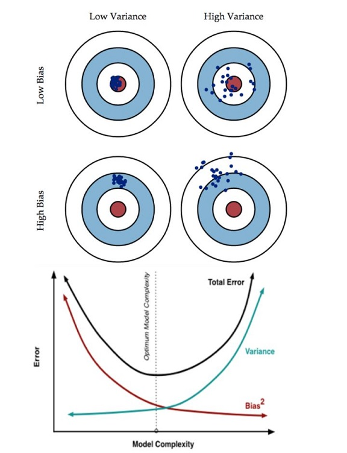

# 深度神经网络调参和优化

这个章节介绍神经网络的超参数 (Hyper-parameters) 调优，如何构建数据，以及算法优化。

<!-- TOC depthFrom:1 depthTo:6 withLinks:1 updateOnSave:1 orderedList:0 -->

- [深度神经网络调参和优化](#深度神经网络调参和优化)
	- [1. 深度学习的实践层面](#1-深度学习的实践层面)
		- [训练集、验证集、测试集](#训练集验证集测试集)
			- [应用型机器学习是快速迭代的过程](#应用型机器学习是快速迭代的过程)
			- [训练集、验证集、测试集](#训练集验证集测试集)
			- [不一致的训练集和测试机分布](#不一致的训练集和测试机分布)
		- [偏差、方差 (Bias / Variance)](#偏差方差-bias-variance)
		- [机器学习基础](#机器学习基础)
		- [正则化（Regularization）](#正则化regularization)
			- [逻辑回归中的正则化](#逻辑回归中的正则化)
			- [神经网络中的正则化](#神经网络中的正则化)
		- [为什么正则化有利于预防过拟合？](#为什么正则化有利于预防过拟合)
		- [Dropout 正则化](#dropout-正则化)
		- [理解 Dropout](#理解-dropout)
		- [其他正则化方法](#其他正则化方法)
		- [归一化输入](#归一化输入)
		- [梯度消失/梯度爆炸](#梯度消失梯度爆炸)
		- [神经网络的权重初始化](#神经网络的权重初始化)
		- [梯度的数值逼近](#梯度的数值逼近)
		- [梯度检验](#梯度检验)
		- [梯度检验应用的注意事项](#梯度检验应用的注意事项)

<!-- /TOC -->
## 1. 深度学习的实践层面

### 训练集、验证集、测试集

#### 应用型机器学习是快速迭代的过程

在配置训练、验证和测试数据集的过程中做出正确决策会在很大程度上帮助大家创建高效的神经网络。训练神经网络时，我们需要做出很多决策，包括但不限于：

- 神经网络分多少层
- 每层含有多少个隐藏单元
- 学习速率是多少
- 各层采用哪些激活函数

创建开发过程中，我们不可能一开始就能准确地预测出这些信息和其他超级参数。实际上，应用型机器学习是一个高度迭代的过程，通常在项目启动时，我们会先有一个初步想法，比如构建一个含有特定层数，隐藏单元数或数据集个数等等的神经网络，然后编码，并尝试运行。通过运行和测试得到该神经网络运行结果，你可能会根据结果完善想法，改变策略，或者为了找到更好的神经网络不断迭代方案。

现如今，深度学习已经在自然语言处理(NLP)，计算机视觉(CV)，语音识别(Speech Recognition)以及结构化数据应用等众多领域取得巨大成功。结构化数据无所不包，从广告到网络搜索。其中网络搜索不仅包括网络搜索引擎，还包括购物网站，从所有根据搜索栏词条传输结果的网站。再到计算机安全，物流，比如判断司机去哪接送货，范围之广，不胜枚举。

我发现，可能有NLP方面的人才想踏足CV领域，或者经验丰富的语音识别专家想投身广告行业，又或者，有的人想从电脑安全领域跳到物流行业，在我看来，从一个领域或者应用领域得来的直觉经验，通常无法转移到其他应用领域，最佳决策取决于你所拥有的数据量，计算机配置中输入特征的数量，用GPU训练还是CPU，GPU和CPU的具体配置以及其他诸多因素。

目前为止，对于很多系统，即使是经验丰富的深度学习行家也不太可能一开始就预设出最匹配的超参数。所以说，应用深度学习是一个典型的迭代过程，需要多次循环往复，才能为应用程序找到一个称心的神经网络，因此循环该过程的效率是决定项目进展速度的一个关键因素，而创建高质量的**训练数据集 (Training set)**，**验证集 (Cross-validation set)**和**测试集 (Test set)**也有助于提高循环效率。

<p align="center">

</p>

#### 训练集、验证集、测试集

假设这是训练数据，我用一个长方形表示（如下图），通常会将这些数据划分成三部分：

* 训练集
* 交叉验证集（又称开发集 Development set/Dev set）
* 测试集

<p align="center">

</p>

接下来，我们开始对训练集执行算法，通过验证集或简单交叉验证集选择最好的模型，经过充分验证，我们选定了最终模型，然后就可以在测试集上进行评估了，这样可以在评估算法性能时不映入偏差。

在机器学习发展的小数据量时代，常见做法是将所有数据三七分，就是人们常说的70%训练集，30%测试集。如果明确设置验证集，也可以按照60%训练集，20%验证集和20%测试集来划分。这是前几年机器学习领域普遍认可的最好的实践方法。

但是在大数据时代，数据量可能是百万级别，那么验证集和测试集占数据总量的比例会趋向变得更小。因为验证集的目的就是验证不同的算法，检验哪种算法更有效。因此，验证集只要足够大到能评估不同的算法，比如2个甚至10个不同算法，并判断出哪种算法更有效就可以。因此验证集不用特别大，我们可能不需要拿出20%的数据作为验证集。

>  比如我们有100万条数据，那么取1万条数据便足以进行评估不同的算法，找出其中表现最好的1-2种。同样地，根据最终选择的分类器，测试集的主要目的是评估分类器的性能，所以如果拥有百万数据，只需要1000条数据，便足以评估单个分类器，并且准确评估该分类器的性能。假设有100万条数据，其中1万条作为验证集，1万条作为测试集，100万里取1万，比例是1%，即：训练集占98%，验证集和测试集各占1%。对于数据量过百万的应用，训练集可以占到99.5%，验证和测试集各占0.25%，或者验证集占0.4%，测试集占0.1%。

**总结一下**：在深度学习中，通常将样本分成训练集，验证集和测试集三部分。数据集规模相对较小，适用传统的划分比例，数据集规模较大的，验证集和测试集要小于数据总量的20%或10%。

#### 不一致的训练集和测试机分布

现代深度学习的另一个趋势是越来越多的人在训练和测试集分布不一致的情况下进行训练。假设你要构建一个用户可以上传大量图片的应用程序，目的是找出并呈现所有猫咪图片，可能你的用户都是爱猫人士，训练集可能是从网上下载的猫咪图片，而验证集和测试集是用户在这个应用上上传的猫的图片，就是说，训练集可能是从网络上抓下来的图片。而验证集和测试集是用户上传的图片。结果许多网页上的猫咪图片分辨率很高，很专业，后期制作精良，而用户上传的照片可能是用手机随意拍摄的，像素低，比较模糊，这两类数据有所不同。对这种情况，我建议**要确保验证集和测试集的数据来自同一分布**。因为你要用验证集来评估不同的模型，然后优化算法性能。

如果验证集和测试集来自同一个分布会很好，但由于深度学习算法需要大量的训练数据，为了获取更大规模的训练数据集，你可能会采用各种方法，例如，网页抓取。代价是训练集数据与验证集、测试集数据可能不是来自同一分布。但只要遵循这个经验法则，你就会发现机器学习算法会变得更快。

最后一点，就算**没有测试集也不要紧**，测试集的目的是对最终所选定的神经网络系统做出无偏估计，如果不需要无偏估计，也可以不设置测试集。所以如果只有验证集，没有测试集，我们要做的就是，在训练集上训练，尝试不同的模型框架，在验证集上评估这些模型，然后迭代并选出适用的模型。因为验证集中已经涵盖测试集数据，其不再提供无偏性能评估。当然，如果你不需要无偏估计，那就再好不过了。

在机器学习中，如果只有一个训练集和一个验证集，而没有独立的测试集，遇到这种情况，训练集还被人们称为训练集，而验证集则被称为测试集，不过在实际应用中，人们只是把测试集当成简单交叉验证集使用，并没有完全实现该术语的功能，因为他们把验证集数据过度拟合到了测试集中。如果某团队跟你说他们只设置了一个训练集和一个测试集，我会很谨慎，心想他们是不是真的有训练验证集，因为他们把验证集数据过度拟合到了测试集中，让这些团队改变叫法，改称其为“训练验证集”，而不是“训练测试集”，可能不太容易。即便我认为“训练验证集“在专业用词上更准确。实际上，如果你不需要无偏评估算法性能，那么这样是可以的。

所以说，搭建训练验证集和测试集能够加速神经网络的集成，也可以更有效地衡量算法地偏差和方差，从而帮助我们更高效地选择合适方法来优化算法。

### 偏差、方差 (Bias / Variance)

有经验的机器学习参与人员对偏差和方差都有深刻的理解。这两个概率很容易入门，但是却非常难精通。即自己认为已经理解了偏差和方差的基本概念，却总有一些出乎意料。关于深度学习的误差问题，另一个趋势是对偏差和方差的权衡研究甚浅，你可能听说过“偏差-方差困境”这个概念。在深度学习领域，我们会分别讨论偏差和方差，却很少谈及偏差和方差的权衡问题，下面来看一看。

<p align="center">

</p>

对于上图的数据集，如果给这个数据集拟合一条直线（下图左），可能得到一个逻辑回归拟合，但逻辑回归并不能很好拟合该数据，这是高偏差（**High bias**）的情况，我们称为“欠拟合”（**Underfitting**）。

相反的，如果拟合一个非常复杂的分类器，比如深度神经网络或含有隐藏单元的神经网络，可能就非常适用于这个数据集，但是这看起来也不是一种很好的拟合方式分类器方差较高（**High variance**），数据过度拟合（**Overfitting**）。

在两者之间，可能还有一些像图中这样的，复杂程度适中，数据拟合适度的分类器，这个数据拟合看起来更加合理，我们称之为“适度拟合”（**Just right**）是介于过度拟合和欠拟合中间的一类。

<p align="center">

</p>

对于Bias和Variance的解释，引用一张[知乎](https://www.zhihu.com/question/27068705)的解释图：

* 偏差Bias描述的是根据样本拟合出的模型的输出预测结果的期望与样本真实结果的差距
* 方差Variance描述的是样本上训练出来的模型在测试集上的表现

<p align="center">

</p>
在上面的例子中，只有 _x<sub>1</sub>_ 和 _x<sub>2</sub>_ 两个特征的二维数据集中，可以容易地绘制数据，将偏差和方差可视化。但在多维空间数据中，绘制数据和可视化分割边界无法实现，但我们可以通过几个指标，来研究偏差和方差。

<p align="center">

</p>

沿用猫狗图片分类这个例子，左边一张是猫咪图片，右边不是。理解偏差和方差的两个关键数据是训练集误差（**Train set error**）和验证集误差（**Dev set error**），为了方便论证，假设我们可以辨别图片中的猫咪，用肉眼识别几乎是不会出错的。

通过查看训练集误差和验证集误差，便可以诊断算法是否具有高方差。也就是说衡量训练集和验证集误差就可以得出不同结论。有下面几个例子：

<p align="center">

</p>

* 假定训练集误差是1%，为了方便论证，假定验证集误差是11%，可以看出训练集设置得非常好，而验证集设置相对较差，可能过拟合训练集，在某种程度上，验证集并没有充分利用交叉验证集的作用，像这种情况，我们称之为“高方差”。

* 假设训练集误差是15%，验证集误差是16%，假设该案例中人的错误率几乎为0%。算法并没有在训练集中得到很好训练，如果训练数据的拟合度不高，就是数据欠拟合，就可以说这种算法偏差比较高。相反，它对于验证集产生的结果却是合理的，验证集中的错误率只比训练集的多了1%，所以这种算法偏差高，因为它甚至不能拟合训练集。

* 训练集误差是15%，偏差相当高，但是，验证集的评估结果更糟糕，错误率达到30%，在这种情况下，会认为这种算法偏差高，因为它在训练集上结果不理想，而且方差也很高，这是方差偏差都很糟糕的情况。

* 训练集误差是0.5%，验证集误差是1%，用户看到这样的结果会很开心，猫咪分类器只有1%的错误率，偏差和方差都很低。

有一点先在这个简单提一下，这些分析都是基于假设预测的，假设人眼辨别的错误率接近0%。一般来说，最优误差也被称为贝叶斯误差。上面的例子中，最优误差接近0%，如果最优误差或贝叶斯误差非常高，比如15%。再看看这个分类器（训练误差15%，验证误差16%），15%的错误率对训练集来说也是非常合理的，偏差不高，方差也非常低。


当所有分类器都不适用时，如何分析偏差和方差呢？比如，图片很模糊，即使是人眼，或者没有系统可以准确无误地识别图片，在这种情况下，最优误差会更高，那么分析过程就要做些改变了，暂时先不讨论这些细微差别，重点是通过查看训练集误差，我们可以判断数据拟合情况，至少对于训练数据是这样，可以判断是否有偏差问题，然后查看错误率有多高。当完成训练集训练，开始使用验证集验证时，我们可以判断方差是否过高，从训练集到验证集的这个过程中，我们可以判断方差是否过高。


以上分析的前提都是假设基本误差很小，训练集和验证集数据来自相同分布，如果没有这些假设作为前提，分析过程更加复杂，将会在稍后讨论。

上面讲了高偏差和高方差的情况，大家应该对优质分类器有了一定的认识，偏差和方差都高是什么样子呢？这种情况对于两个衡量标准来说都是非常糟糕的（下图第三列）。

<p align="center">

</p>

我们之前讲过，下图这样的分类器，会产生高偏差，因为它的数据拟合度低，像这种接近线性的分类器，数据拟合度低。

<p align="center">

</p>

但是如果我们稍微改变一下分类器，我用紫色笔画出，它会过度拟合部分数据，用紫色线画出的分类器具有高偏差和高方差，偏差高是因为它几乎是一条线性分类器，并未拟合数据。

<p align="center">

</p>

这种二次曲线能够很好地拟合数据（下图虚线）。

<p align="center">

</p>

紫色曲线中间部分灵活性非常高，却过度拟合了这两个样本。蓝色直线分类器偏差很高，因为它几乎是线性的。

<p align="center">

</p>

总结一下，我们讲了如何通过分析在训练集上训练算法产生的误差和验证集上验证算法产生的误差来诊断算法是否存在高偏差和高方差，是否两个值都高，或者两个值都不高，根据算法偏差和方差的具体情况决定接下来你要做的工作。

### 机器学习基础

下面是在训练神经网络时用到地基本方法。初始模型训练完成后，

1. 首先检查算法的偏差（Bias）：
   * **如果偏差较高，那么需要选择一个新的网络**，比如含有更多隐藏层或者隐藏单元的网络，或者尝试更先进的优化算法，或其他方法。
     * 以后我们会看到许多不同的神经网络架构，或许你能找到一个更合适的网络架构。可能有用，也可能没用，不过采用规模更大的网络通常都会有所帮助。
     * 不断尝试新方法，直到解决掉偏差问题。这是最低标准，直到可以拟合数据为止，至少能够拟合训练集。
2. 一旦偏差降低到可以接受的数值，检查方差有没有问题。
   * 为了评估方差，要查看验证集性能，我们能从一个性能理想的训练集推断出验证集的性能是否也理想。
   * **如果方差高，最好的办法是采用更多数据**。如果你能做到，会有一定的帮助.
   * 有时候，我们无法获得更多数据，**也可以尝试通过正则化来减少过拟合**。
   * 需要反复尝试，**如果能找到更合适的神经网络框架，有时可能会同时减少方差和偏差**。如何实现呢？想系统地说出做法很难，总之就是不断重复尝试，直到找到一个低偏差，低方差的框架，这时你就成功了。

<p align="center">

</p>

有需要注意两点：

1. 高偏差和高方差是不同的情况，后续要尝试的方法也可能完全不同，我通常会用训练验证集来诊断算法是否存在偏差或方差问题，然后根据结果选择尝试部分方法。

   * 举个例子，如果算法存在高偏差问题，准备更多训练数据其实也没什么用处，至少这不是更有效的方法，所以大家要清楚存在的问题是偏差还是方差，还是两者都有问题，明确这一点有助于我们选择出最有效的方法。

2. 在机器学习的初期阶段，关于所谓的偏差方差权衡的讨论屡见不鲜，原因是我们能尝试的方法有很多。可以增加偏差，减少方差，也可以减少偏差，增加方差。

   * 在深度学习的早期阶段，我们没有太多工具可以做到只减少偏差或方差却不影响到另一方。

   * 但在当前的深度学习和大数据时代，只要持续训练一个更大的网络，只要准备了更多数据，那么也并非只有这两种情况。我们假定是这样，**只要正则适度，通常构建一个更大的网络便可以在不影响方差的同时减少偏差，而采用更多数据通常可以在不过多影响偏差的同时减少方差**。

     这两步实际要做的工作是：训练网络，选择网络或者准备更多数据，现在我们有工具可以做到在减少偏差或方差的同时，不对另一方产生过多不良影响。我觉得这就是深度学习对监督式学习大有裨益的一个重要原因，也是我们不用太过关注如何平衡偏差和方差的一个重要原因，但有时我们有很多选择，减少偏差或方差而不增加另一方。最终，我们会得到一个非常规范化的网络。从下节开始，将讲解正则化，训练一个更大的网络几乎没有任何负面影响，而训练一个大型神经网络的主要代价也只是计算时间，前提是网络是比较规范化的。

### 正则化（Regularization）

深度学习可能存在过拟合问题——高方差，通常有两个解决方法：

1. 准备更多的数据
   * 更多的数据是非常可靠的方法，但你可能无法准备足够的训练数据，或者获取数据的成本很高
2. 正则化
   * 正则化有助于避免过度拟合，或者减少网络误差，下面来讲讲正则化的作用原理

#### 逻辑回归中的正则化

我们用逻辑回归来讲解，求成本函数 _J_ 的最小值，_J_定义的是成本函数。参数包含一些训练数据和不同数据中个体预测的损失， _w_ 和 _b_ 是逻辑回归的两个参数， _w ∈ R<sup>n<sub>x</sub></sup>_ 是一个多维度参数矢量， _b ∈ R_ 是一个实数。

在逻辑回归函数中加入正则化，只需添加参数λ，也就是正则化参数。 _(<sup>λ</sup>/<sub>2m</sub>)_ 乘以 _w_ 的L2范数的平方， _||w||<sup>2</sup><sub>2</sub>_ 是欧几里德范数的平方，等于 _w<sub>j</sub>_ （ _j_ 值从1到 _n<sub>x</sub>_ ）平方的和，也可表示为 _w<sup>T</sup>w_ ，也就是向量参数 _w_ 的欧几里德范数（L2范数）的平方，此方法称为 **_L2_ 正则化**，因为这里用了向量参数 _w_ 的 _L2_ 范数。（如下图）

<p align="center">

</p>
为什么只正则化参数 _w_ ？而没考虑参数 _b_ 呢？

* 可以这么做，只是习惯省略掉了，因为 _w_ 通常是一个高维参数矢量，已经可以表达高偏差问题， _w_ 可能包含有很多参数，我们不可能拟合所有参数，而 _b_ 只是单个数字。所以绝大多数的参数在 _w_ 中，而不是在 _b_ 中。如果加了参数 _b_ ，其实也没太大影响，因为 _b_ 只是众多参数中的一个，所以通常省略不计，如果你想加上这个参数，也没问题。

<p align="center">

</p>
_L2_ 正则化是最常见的正则化类型。你可能也知道 _L1_ 正则化：

* _L1_ 正则化加的不是 _L2_ 范数，而是正则项 _(<sup>λ</sup>/<sub>m</sub>)_ 乘以 _Σ<sub>j=1</sub><sup>n<sub>x</sub></sup>|w|_ ， _Σ<sub>j=1</sub><sup>n<sub>x</sub></sup>|w|_ 也被称为参数 _w_ 向量的 _L1_ 范数，无论分母是 _m_ 还是 _2m_ ，它都是一个比例常量。

> 如果用的是 _L1_ 正则化， _w_ 最终会是稀疏的，也就是说 _w_ 向量中有很多0，有人说这样有利于压缩模型，因为集合中参数均为0，存储模型所占用的内存更少。实际上，虽然 _L1_ 正则化使模型变得稀疏，却没有降低太多存储内存，所以我认为这并不是使用 _L1_ 正则化的目的，至少不是为了压缩模型，人们在训练网络时，越来越倾向于使用 _L2_ 正则化。

_λ_ 是正则化参数，我们通常使用验证集或交叉验证集来配置这个参数，尝试各种各样的数据，寻找最好的参数，我们要考虑训练集之间的权衡，把参数设置为较小值，这样可以避免过拟合，所以λ是另外一个需要调整的超级参数。

> 顺便说一下，为了方便写代码，在Python编程语言中， _λ_ 是一个保留字段，编写代码时，我们删掉 _a_ ，写成 _lambd_ ，以免与Python中的保留字段冲突

#### 神经网络中的正则化

上面讲了在逻辑回归函数中实现 _L2_ 正则化的过程，那么在神经网络中如何实现 _L2_ 正则化？

神经网络含有一个成本函数，该函数包含 _W<sup>[1]</sup>_ ， _b<sup>[1]</sup>_ 到 _W<sup>[l]</sup>_ ， _b<sup>[l]</sup>_ 所有参数，字母 _L_ 是神经网络所含的层数，因此成本函数等于 _m_ 个训练样本损失函数的总和乘以 _(<sup>λ</sup>/<sub>m</sub>)_ ，正则项为 _(<sup>λ</sup>/<sub>2m</sub>)Σ<sub>1</sub><sup>L</sup>||W<sup>[l]</sup>||<sup>2</sup>_ ，我们称 _||W<sup>[l]</sup>||<sup>2</sup>_ 为范数平方，这个矩阵范数 _||W<sup>[l]</sup>||<sup>2</sup>_ （即平方范数），被定义为矩阵中所有元素的平方求和。

<p align="center">

</p>

上述公式中有两个求和公式，第一个求和符号其值 _i_ 从1到 _n<sup>[l-1]</sup>_ ，第二个其 _J_ 值从1到 _n<sup>[l]</sup>_ ，因为 _W_ 是一个 _(n<sup>[l]</sup>×n<sup>[l-1]</sup>)_ 的多维矩阵， _n<sup>[l]</sup>_ 表示 _l_ 层单元的数量， _n<sup>[l-1]</sup>_ 表示第 _l-1_ 层隐藏单元的数量。

该矩阵范数被称作“弗罗贝尼乌斯范数 (Frobenius Norm)”，用下标 _F_ 标注，鉴于线性代数中一些原因，我们不称之为“矩阵 _L2_ 范数”，而称它为“弗罗贝尼乌斯范数”。矩阵 _L2_ 范数听起来更自然，按照惯例，我们称之为“弗罗贝尼乌斯范数”，**它表示一个矩阵中所有元素的平方和。**

**该如何使用该范数实现梯度下降呢？**

用Backprop计算出 _dW_ 的值，backprop会给出 _J_ 对 _W_ 的偏导数，实际上是 _W<sup>[l]</sup>_ ，把 _W<sup>[l]</sup>_ 替换为 _W<sup>[l]</sup>_ 减去学习率_α_乘以 _dW_ 。回顾一下此前的Backprop的公式：

* _dw<sup>[l]</sup> = (from backprop)_
* _w<sup>[l]</sup> = w<sup>[l]</sup> - α dw<sup>[l]</sup>_

在之前公式额外增加的正则化项

*  _dw<sup>[l]</sup> = (from backprop) + (<sup> λ </sup>/<sub> m </sub>)w<sup>[l]</sup>_

现在我们要做的就是给 _dW_ 加上这一项 _(<sup>λ</sup>/<sub>m</sub>)W<sup>[l]</sup>_ ，然后计算这个更新项，使用新定义的 _dW<sup>[l]</sup>_ ，它的定义含有相关参数代价函数导数和，以及最后添加的额外正则项，这也是 _L2_ 正则化有时被称为“权重衰减”的原因。

我们用 _dW<sup>[l]</sup>_ 的定义替换此处的 _dW<sup>[l]</sup>_ ，可以看到， _W<sup>[l]</sup>_ 的定义被更新为 _W<sup>[l]</sup>_ 减去学习率 _α_ 乘以backprop再加上 _(<sup> λ </sup>/<sub> m </sub>)W<sup>[l]</sup>_ 。

* _w<sup>[l]</sup> = w<sup>[l]</sup> - α [(from backprop) + (<sup> λ </sup>/<sub> m </sub>)w<sup>[l]</sup>]_
* _w<sup>[l]</sup> = w<sup>[l]</sup> - (<sup> α λ </sup>/<sub> m </sub>)w<sup>[l]</sup> - α(from backprop)_

该正则项说明，不论 _W<sup>[l]</sup>_ 是什么，我们都试图让它变得更小，实际上，相当于我们给矩阵W乘以 _(1  -  α(<sup> λ </sup>/<sub> m </sub>))_ 倍的权重，矩阵 _W_ 减去 _α(<sup> λ </sup>/<sub> m </sub>)_ 倍的它，也就是用这个系数 _(1 - α(<sup> λ </sup>/<sub> m </sub>))_ 乘以矩阵 _W_ ，该系数小于1，因此 _L2_ 范数正则化也被称为“权重衰减”，因为它就像一般的梯度下降， _W_ 被更新为少了 _α_ 乘以backprop输出的最初梯度值，同时 _W_ 也乘以了这个系数，这个系数_(1 - <sup> α λ </sup>/<sub> m </sub>)_小于1，因此 _L2_ 正则化也被称为“权重衰减”。

* w<sup>[l]</sup> = (1 - <sup> α λ </sup>/<sub> m </sub>)w<sup>[l]</sup> - α(from backprop)


之所以叫它“权重衰减”是因为这两项相等，权重指标乘以了一个小于1的系数。

以上就是在神经网络中应用 _L2_ 正则化的过程，你可能会问，为什么正则化可以预防过拟合，会在下节讲，同时直观感受一下正则化是如何预防过拟合的。

### 为什么正则化有利于预防过拟合？

为什么正则化有利于预防过拟合呢？为什么它可以减少方差问题？我们通过两个例子来直观体会一下。

<p align="center">

</p>

<p align="center">

</p>

左图是高偏差，右图是高方差，中间是**刚刚好（Just Right）**，这几张图我们在前面中看到过。

<p align="center">

</p>


现在我们来看下这个庞大的深度拟合神经网络。我知道这张图不够大，深度也不够，但你可以想象这是一个过拟合的神经网络。它的代价函数为 _J_ ，有参数 _W_ ， _b_ 。我们给它添加正则项，它可以避免数据权值矩阵过大，这就是弗罗贝尼乌斯范数，为什么压缩 _L2_ 范数，或者弗罗贝尼乌斯范数或者参数可以减少过拟合？

直观上理解就是如果正则化 _λ_ 设置得足够大，就相当于把权重矩阵 _W_ 被设置为接近于0的值。直观理解就是把多隐藏单元的权重设为0，于是基本上消除了这些隐藏单元的影响（如下图上图）。这种情况下，这个被大大简化了的神经网络会变成一个很小的网络，小到如同一个逻辑回归单元，可是深度却很大，它会使这个网络从过度拟合的状态更接近左图的高偏差状态。

但是 _λ_ 会存在一个中间值，于是会有一个接近“Just Right”的中间状态。

直观理解就是 _λ_ 增加到足够大， _W_ 会接近于0，实际上是不会发生这种情况的，我们尝试消除或至少减少许多隐藏单元的影响，最终这个网络会变得更简单，这个神经网络越来越接近逻辑回归，我们直觉上认为大量隐藏单元被完全消除了，其实不然，实际上是该神经网络的所有隐藏单元依然存在，但是它们的影响变得更小了。神经网络变得更简单了，貌似这样更不容易发生过拟合，因此我不确定这个直觉经验是否有用，不过在编程中执行正则化时，你实际看到一些方差减少的结果。

<p align="center">

</p>
---

再来直观感受一下，正则化为什么可以预防过拟合，假设我们用的是这样的双曲线激活函数。

<p align="center">

</p>

所以_g(z)_ = _tanh(z)_ 。我们发现，如果 _z_ 非常小，比如 _z_ 只涉及很小范围的参数（如下图中原点附近的红色区域），那其实是在利用tanh函数的线性部分，只有 _z_ 扩展为更大的值或者更小的值，激活函数开始变得非线性。

<p align="center">

</p>


直觉就是，如果正则化参数λ很大，激活函数的参数 _z_ 会相对较小，因为 _z<sup>[l]</sup> = W<sup>[l]</sup>a<sup>[l - 1]</sup>  +  b<sup>[l]</sup>_，如果 _W_ 很小，_z_ 也会很小。_z_ 的值最终在原点附近的小范围内，都是相对小的值， _g(z)_ 大致呈线性，每层几乎都是线性的，和线性回归函数一样。如果每层都是线性的，那么整个网络就是一个线性网络，即使是一个非常深的深层网络，因具有线性激活函数的特征，最终我们只能计算线性函数，因此，它不适用于非常复杂的决策，以及过度拟合数据集的非线性决策边界，如同我们在幻灯片中看到的过度拟合高方差的情况。

<p align="center">

</p>
**总结一下**：如果正则化参数变得很大，参数 _W_ 很小， _z_ 也会相对变小，此时忽略 _b_ 的影响， _z_ 会相对变小，实际上， _z_ 的取值范围很小，这个激活函数，也就是曲线函数 _tanh_ 会相对呈线性，整个神经网络会计算离线性函数近的值，这个线性函数非常简单，并不是一个极复杂的高度非线性函数，不会发生过拟合。

<p align="center">

</p>

总结正则化之前，需要说一下，我们再之前定义的代价函数 _J_ 做了修改，增加了正则化项，目的是预防权重过大。如果你使用的是梯度下降函数，在调试梯度下降时，其中一步就是把代价函数 _J_ 设计成上图的函数，在调试梯度下降时，它代表梯度下降的调幅数量。可以看到，代价函数对于梯度下降的每个调幅都单调递减。如果你实施的是正则化函数，请牢记， _J_ 已经有一个全新的定义。如果你用的是原函数 _J_ （没考虑正则化项的部分），你可能看不到单调递减现象，为了调试梯度下降，请务必使用新定义的 _J_ 函数，它包含第二个正则化项，否则函数 _J_ 可能不会在所有调幅范围内都单调递减。

### Dropout 正则化

除了 _L2_ 正则化，还有一个非常实用的正则化方法——“Dropout（随机失活）”。

假设有下图的神经网络，它存在过拟合，我们复制这个神经网络，并应用Dropout。

<p align="center">

</p>

Dropout过程如下：

* Dropout会遍历网络的每一层，并设置消除神经网络中节点的概率。假设网络中的每一层，每个节点都以抛硬币的方式设置概率，每个节点得以保留和消除的概率都是0.5。（下图）

<p align="center">

</p>

* 设置完节点概率，我们会消除一些节点，然后删除掉从该节点进出的连线。（下图）
<p align="center">

</p>

* 最后得到一个节点更少，规模更小的网络，然后用**backprop**方法进行训练。

这是网络节点精简后的一个样本，对于其它样本，我们照旧以抛硬币的方式设置概率，保留一类节点集合，删除其它类型的节点集合。对于每个训练样本，我们都将采用一个精简后神经网络来训练它，这种方法似乎有点怪，单纯遍历节点，编码也是随机的，可它真的有效。不过可想而知，我们针对每个训练样本训练规模小得多的网络，最后你可能会认识到为什么要正则化网络，因为我们在训练一些小得多的网络。

#### 实现Dropout


如何实施Dropout呢？方法有几种，接下来我要讲的是最常用的方法，即**inverted dropout**（反向随机失活），出于完整性考虑，我们用一个三层（ _l = 3_ ）网络来举例说明。我只举例说明如何在某一层中实施Dropout。

* 首先要定义向量 _d_ ， _d<sup>[3]</sup>_ 表示第三层的Dropout向量。_d<sup>[3]</sup>_ 是一个随机的数组，它的shape和_a<sup>[3]</sup>_ 一样。
* 然后看_d<sup>[3]</sup>_ 中元素是否小于某个阈值，这个阈值称为**keep_prob**。它表示保留某个隐藏单元的概率，此处**keep_prob**等于0.8，它意味着消除任意一个隐藏单元的概率是0.2。它的作用就是生成一个随机矩阵，如果对 _a<sup>[3]</sup>_ 进行因子分解，效果也是一样的。 _d<sup>[3]</sup>_ 是一个矩阵，对于每个样本和每个隐藏单元，其中 _d<sup>[3]</sup>_ 中的对应值为1的概率是0.8，对应为0的概率是0.2。Python代码如下：

``` python
d3 = np.random.rand(a3.shape[0], a3.shape[1]) < keep_prob
```

* 最后，从第三层中获取激活函数 _a<sup>[3]</sup>_ ， _a<sup>[3]</sup>_ 含有要计算的激活函数， _a<sup>[3]</sup>_ 等于上面的 _a<sup>[3]</sup>_ 乘以 _d<sup>[3]</sup>_ ，这里是元素相乘，也可写为 _a3 *= d3_ ，它的作用就是让 _d<sup>[3]</sup>_ 中所有等于0的元素（输出），而各个元素等于0的概率只有20%，乘法运算最终把 _d<sup>[3 ]</sup>_ 中相应元素输出，即让 _d<sup>[3]</sup>_ 中0元素与 _a<sup>[3]</sup>_ 中相对元素归零。

``` python
a3 = np.multiply(a3, d3)
```

如果用Python实现该算法的话， _d<sup>[3]</sup>_ 则是一个布尔型数组，值为True和False，而不是1和0，乘法运算依然有效，Python会把True和False翻译为1和0。

最后，我们向外扩展 _a<sup>[3]</sup>_ ，用它除以0.8，或者除以keep_prob参数。

``` python
a3 /= keep_prob
```

解释一下为什么要除以keep_prob。假设第三隐藏层上有50个单元或50个神经元，在一维上 _a<sup>[3]</sup>_ 是50，通过因子分解将它拆分成 _50×m_ 维的，保留和删除它们的概率分别为80%和20%，这意味着最后被删除或归零的单元平均有10（50×20% = 10）个，现在我们看下 _z<sup>[4]</sup>_ ， _z<sup>[4]</sup>  =  w<sup>[4]</sup> a<sup>[3]</sup>  +  b<sup>[4]</sup>_ ，预期是 _a<sup>[3]</sup>_ 减少20%，也就是说 _a<sup>[3]</sup>_ 中有20%的元素被归零，为了不影响 _z<sup>[4]</sup>_ 的期望值，我们需要用 _w<sup>[4]</sup> a<sup>[3]</sup> / 0.8_ ，它将会弥补所需的那20%， _a<sup>[3]</sup>_ 的期望值不会变，划线部分就是所谓的Dropout方法。


它的功能是，不论keep_prob的值是多少0.8，0.9甚至是1，如果keep_prob设置为1，那么就不存在Dropout，因为它会保留所有节点。反向随机失活（**inverted dropout**）方法通过除以keep_prob，确保 _a<sup>[3]</sup>_ 的期望值不变。

事实证明，在测试阶段，当我们评估一个神经网络时，也就是用反向随机失活方法，它简化了神经网络的测试部分，因为它减少了可能引入的数据扩展问题。

据我了解，目前实施Dropout最常用的方法就是Inverted dropout，建议大家动手实践一下。Dropout早期的迭代版本都没有除以keep_prob，所以在测试阶段，平均值会变得越来越复杂，不过那些版本已经不再使用了。

现在你使用的是 _d_ 向量，你会发现，不同的训练样本，你清除了不同的隐藏单元。实际上，如果你对相同训练集多次迭代，在每次迭代中，清除的隐藏单元不同。每次训练数据的梯度不同，则随机对不同隐藏单元归零，有时却并非如此。比如，第一次迭代梯度下降时，把一些隐藏单元归零，第二次迭代梯度下降时，也就是第二次遍历训练集时，对不同类型的隐藏层单元归零。向量 _d_ 或 _d<sup>[3]</sup>_ 用来决定第三层中哪些单元归零，无论用foreprop还是backprop。

#### 对于测试集，该如何预测

在测试阶段，我们已经给出了想预测的变量 _x_ 。我用 _a<sup>[0]</sup>_ ，第0层的激活函数标注为测试样本 _x_ ，我们在测试阶段不使用Dropout函数，尤其是像下列情况：

* _z<sup>[1]</sup>  =  w<sup>[1]</sup> a<sup>[0]</sup>  +  b<sup>[1]</sup>_
* _a<sup>[1]</sup>  =  g<sup>[1]</sup>(z<sup>[1]</sup>)_
*  _z<sup>[2]</sup>  =   w<sup>[2]</sup> a<sup>[1]</sup>  +  b<sup>[2]</sup>_
*  _a<sup>[2]</sup>  =  ..._

以此类推直到最后一层，预测值为 _ŷ_ 。


显然在测试阶段，我们并未使用Dropout，自然就不用决定失活概率以及要消除哪些隐藏单元了，因为在测试阶段进行预测时，我们不期望输出结果是随机的，如果测试阶段应用Dropout函数，预测会受到干扰。理论上，你只需要多次运行预测处理过程，每一次，不同的隐藏单元会被随机归零，预测处理遍历它们，但计算效率低，得出的结果也几乎相同，与这个不同程序产生的结果极为相似。

**Inverted dropout**函数在除以**keep_prob**时可以记住上一步的操作，目的是确保即使在测试阶段不执行Dropout来调整数值范围，激活函数的预期结果也不会发生变化，所以没必要在测试阶段额外添加尺度参数，这与训练阶段不同。

### 理解 Dropout

Dropout可以随机删除网络中的神经单元，他为什么可以通过正则化发挥如此大的作用呢？

1. 首先，我们讲过Dropout会随机的删除一些隐藏的单元，相当于网络变小了。更小的网络相当于有正则化的作用。

<p align="center">

</p>
2. 以一个单个神经元为例，如上图，这个单元的工作就是输入并生成一些有意义的输出。通过Dropout，该单元的输入几乎被消除，有时这两个单元会被删除，有时会删除其它单元，就是说，用紫色圈起来的这个单元，**它不能依靠任何特征，因为特征都有可能被随机清除，或者说该单元的输入也都可能被随机清除**。我不愿意把所有赌注都放在一个节点上，不愿意给任何一个输入加上太多权重，因为它可能会被删除，因此该单元将通过这种方式积极地传播开，并为单元的四个输入增加一点权重，通过传播所有权重，Dropout将产生收缩权重的平方范数的效果，和我们之前讲过的 _L2_ 正则化类似，实施Dropout的结果是它会压缩权重，并完成一些预防过拟合的外层正则化。

事实证明，Dropout被正式地作为一种正则化的替代形式， _L2_ 对不同权重的衰减是不同的，它取决于倍增的激活函数的大小。

总结一下，Dropout的功能类似于 _L2_ 正则化，与 _L2_ 正则化不同的是，被应用的方式不同。

<p align="center">

</p>
实施Dropout的另一个细节是，如上图一个拥有三个输入特征的网络，其中一个要选择的参数是keep_prob，它代表每一层上保留单元的概率。不同层的keep_prob也可以变化。第一层，矩阵 _W<sup>[1]</sup>_ 是7×3，第二个权重矩阵 _W<sup>[2]</sup>_ 是7×7，第三个权重矩阵 _W<sup>[3]</sup>_ 是3×7，以此类推。

*  _W<sup>[2]</sup>_ 是最大的权重矩阵，因为 _W<sup>[2]</sup>_ 拥有最大参数集，即7×7，为了预防矩阵的过拟合，对于第二层，它的keep_prob值应该相对较低，假设是0.5。
* 对于其它层，过拟合的程度可能没那么严重，keep_prob值可能高一些，可能是0.7。
* 如果在某一层，我们不必担心其过拟合的问题，那么keep_prob可以为1，每层keep_prob的值可能不同。

<p align="center">

</p>

注意keep_prob的值是1，意味着保留所有单元，并且不在这一层使用Dropout，对于有可能出现过拟合，且含有诸多参数的层，我们可以把keep_prob设置成比较小的值，以便应用更强大的Dropout。keep_prob有点类似在处理 _L2_ 正则化的参数 _λ_ 。我们尝试对某些层施行更多正则化。从技术上讲，我们也可以对输入层应用Dropout，我们有机会删除一个或多个输入特征，虽然现实中我们通常不这么做，keep_prob的值为1，是非常常用的输入值，也可以用更大的值，或许是0.9。但是消除一半的输入特征是不太可能的，如果我们遵守这个准则，keep_prob会接近于1，即使你对输入层应用Dropout。

总结一下，如果你担心某些层比其它层更容易发生过拟合，可以把某些层的keep_prob值设置得比其它层更低，缺点是为了使用交叉验证，你要搜索更多的超级参数，另一种方案是在一些层上应用Dropout，而有些层不用Dropout，应用Dropout的层只含有一个超级参数，就是keep_prob。

再讲几个实际使用Dropout时需要留意的。最早使用Dropout技术的成功应用是在计算机视觉(CV)领域。CV中的输入量非常大，输入太多像素，以至于没有足够的数据，所以Dropout在CV中应用得比较频繁，几乎成了默认的选择，但要牢记一点，**Dropout是一种正则化方法，它有助于预防过拟合，因此除非算法过拟合，不然不建议用Dropout**。所以在其它领域应用Dropout相对少一些，它主要存在于CV领域，因为在解决CV问题时我们通常没有足够的数据，所以一直存在过拟合，这就是有些CV研究人员如此钟情于Dropout函数的原因。直观上我认为不能概括其它学科。

**Dropout一大缺点**：是代价函数 _J_ 不再被明确定义，每次迭代，都会随机移除一些节点，如果再三检查梯度下降的性能，实际上是很难进行复查的。定义明确的代价函数 _J_ 每次迭代后都会下降，因为我们所优化的代价函数 _J_ 实际上并没有明确定义，或者说在某种程度上很难计算，所以就不能用绘图的方法调试错误了。我通常会先关闭Dropout，将keep_prob的值设为1，运行代码，确保J函数单调递减。然后打开Dropout函数，希望在Dropout过程中，代码并未引入别的Bug。

### 其他正则化方法

除了 _L2_ 正则化和随机失活（Dropout）正则化，还有几种方法可以减少神经网络中的过拟合:

<p align="center">

</p>
#### 数据扩增

假设你正在拟合猫咪图片分类器，如果你想通过增加训练数据来解决过拟合，但增加数据代价高，而且有时候我们无法增加数据，但我们可以通过添加这类图片来增加训练集。例如，水平翻转图片，并把它添加到训练集。所以现在训练集中有原图，还有翻转后的这张图片，所以通过水平翻转图片，训练集则可以增大一倍，因为训练集有冗余，这虽然不如我们额外收集一组新图片那么好，但这样做节省了获取更多猫咪图片的花费。


还可以随意裁剪图片。如把原图旋转并随意放大后裁剪的，仍能辨别出图片中的猫咪。

通过随意翻转和裁剪图片，可以增大数据集，额外生成假训练数据。和全新的，独立的猫咪图片数据相比，这些额外的假的数据无法包含像全新数据那么多的信息，但我们这么做代价几乎为零，除了一些对抗性代价。以这种方式扩增算法数据，进而正则化数据集，减少过拟合比较廉价。

像这样人工合成数据的话，我们要通过算法验证，图片中的猫经过水平翻转之后依然是猫。大家注意，我并没有垂直翻转，因为我们不想倒置的猫咪。随机放大后的部分图片，猫可能还在上面。

<p align="center">

</p>

对于光学字符识别，我们还可以通过添加数字，随意旋转或扭曲数字来扩增数据，把这些数字添加到训练集，它们仍然是数字。为了方便说明，我对字符做了强变形处理，所以数字4看起来是波形的，其实不用对数字4做这么夸张的扭曲，只要轻微的变形就好，我做成这样是为了让大家看的更清楚。实际操作的时候，我们通常对字符做更轻微的变形处理。因为这几个4看起来有点扭曲。所以，数据扩增可作为正则化方法使用，实际功能上也与正则化相似。

#### **早终止法（Early Stopping）**

还有另外一种常用的方法叫作**Early stopping**，运行梯度下降时，我们可以绘制训练集的0-1误差，或只绘制代价函数 _J_ ，应该呈单调下降趋势，如下图。

<p align="center">

</p>

因为在训练过程中，我们希望训练误差，代价函数 _J_ 都在下降，通过early stopping，我们不但可以绘制上面这些内容，还可以绘制验证集误差，它可以是验证集上的分类误差，或验证集上的代价函数，逻辑损失和对数损失等，你会发现，验证集误差通常会先呈下降趋势，然后在某个节点处开始上升，early stopping 的作用是，你会说，神经网络已经在这个迭代过程中表现得很好了，我们在此停止训练吧，得到验证集误差，它是怎么发挥作用的？


当你还未在神经网络上运行太多迭代过程的时候，参数 _w_ 接近0，因为随机初始化 _w_ 值时，它的值可能都是较小的随机值，所以在你长期训练神经网络之前 _w_ 依然很小，在迭代过程和训练过程中 _w_ 的值会变得越来越大，比如在这儿，神经网络中参数 _w_ 的值已经非常大了，所以early stopping要做就是在中间点停止迭代过程，我们得到一个 _w_ 值中等大小的弗罗贝尼乌斯范数，与 _L2_ 正则化相似，选择参数w范数较小的神经网络，但愿你的神经网络过度拟合不严重。

<p align="center">

</p>

术语Early stopping代表提早停止训练神经网络，训练神经网络时，我有时会用到early stopping，但是它也有一个缺点，我们来了解一下。

我认为机器学习过程包括几个步骤，其中一步是选择一个算法来优化代价函数 _J_ ，我们有很多种工具来解决这个问题，如梯度下降，后面我会介绍其它算法，例如Momentum，RMSprop 和 Adam 等等，但是优化代价函数 _J_ 之后，我也不想发生过拟合，也有一些工具可以解决该问题，比如正则化，扩增数据等等。

<p align="center">

</p>

在机器学习中，超级参数激增，选出可行的算法也变得越来越复杂。我发现，如果我们用一组工具优化代价函数 _J_ ，机器学习就会变得更简单，在重点优化代价函数 _J_ 时，你只需要留意 _w_ 和 _b_ ， _J(w,b)_ 的值越小越好，你只需要想办法减小这个值，其它的不用关注。然后，预防过拟合还有其他任务，换句话说就是减少方差，这一步我们用另外一套工具来实现，这个原理有时被称为“正交化”。思路就是在一个时间做一个任务。

但early stopping的主要缺点是你不能独立地处理这两个问题，因为提早停止梯度下降，也就是停止了优化代价函数 _J_ ，因为现在你不再尝试降低代价函数 _J_ ，所以代价函数 _J_ 的值可能不够小，同时你又希望不出现过拟合，你没有采取不同的方式来解决这两个问题，而是用一种方法同时解决两个问题，这样做的结果是我要考虑的东西变得更复杂。

如果不用early stopping，另一种方法就是 _L2_ 正则化，训练神经网络的时间就可能很长。我发现，这导致超级参数搜索空间更容易分解，也更容易搜索，但是缺点在于，你必须尝试很多正则化参数 _λ_ 的值，这也导致搜索大量 _λ_ 值的计算代价太高。

Early stopping 的优点是，只运行一次梯度下降，你可以找出 _w_ 的较小值，中间值和较大值，而无需尝试 _L2_ 正则化超级参数 _λ_ 的很多值。

虽然 _L2_ 正则化有缺点，可还是有很多人愿意用它。我更倾向于使用 _L2_ 正则化，尝试许多不同的 _λ_ 值，假设你可以负担大量计算的代价。而使用early stopping也能得到相似结果，还不用尝试这么多 _λ_ 值。

### 归一化输入

训练神经网络，其中一个加速训练的方法就是归一化输入。假设一个训练集有两个特征，输入特征为2维，归一化需要两个步骤：

1. 零均值

2. 归一化方差；

   我们希望无论是训练集和测试集都是通过相同的 _μ_ 和 _σ<sup>2</sup>_ 定义的数据转换，这两个是由训练集得出来的。

<p align="center">

</p>

第一步是零均值化， _μ  =  (<sup> 1 </sup>/<sub> m </sub>)Σ<sub>i  = 1</sub><sup>m</sup>x<sup>(i)</sup>_ ，它是一个向量， _x_ 等于每个训练数据  _x_ 减去 _μ_ ，意思是移动训练集，直到它完成零均值化。

<p align="center">

</p>

第二步是归一化方差，注意特征 _x<sub>1</sub>_ 的方差比特征 _x<sub>2</sub>_ 的方差要大得多，我们要做的是给 _σ_ 赋值， _σ<sup>2</sup> =  (<sup> 1 </sup>/<sub> m </sub>)Σ<sub>i  = 1</sub><sup>m</sup>(x<sup>(i)</sup>)<sup>2</sup>_ ，这是节点 _y_  的平方， _σ<sup>2</sup>_ 是一个向量，它的每个特征都有方差，注意，我们已经完成零值均化， _(x<sup>(i)</sup>)<sup>2</sup>_ 元素 _y<sup>2</sup>_ 就是方差，我们把所有数据除以向量 _σ<sup>2</sup>_ ，最后变成上图形式。

 _x<sub>1</sub>_ 和 _x<sub>2</sub>_ 的方差都等于1。提示一下，如果你用它来调整训练数据，那么用相同的  _μ_  和  _σ<sup>2</sup>_ 来归一化测试集。尤其是，你不希望训练集和测试集的归一化有所不同，不论 _μ_ 的值是什么，也不论 _σ<sup>2</sup>_ 的值是什么，这两个公式中都会用到它们。所以你要用同样的方法调整测试集，而不是在训练集和测试集上分别预估 _μ_  和  _σ<sup>2</sup>_ 。因为我们希望不论是训练数据还是测试数据，都是通过相同μ和 _σ<sup>2</sup>_ 定义的相同数据转换，其中 _μ_ 和 _σ<sup>2</sup>_ 是由训练集数据计算得来的。

我们为什么要这么做呢？为什么我们想要归一化输入特征，回想一下右上角所定义的代价函数。

 _J(w,b) = (<sup> 1 </sup>/<sub> m </sub>)Σlim <sub>i = 1</sub><sup>m</sup>L(ŷ<sup>(i)</sup>,y<sup>(i)</sup>)_

如果你使用非归一化的输入特征，代价函数会像这样：

<p align="center">

</p>

这是一个非常细长狭窄的代价函数，你要找的最小值应该在这里。但如果特征值在不同范围，假如 _x<sub>1</sub>_ 取值范围从1到1000，特征 _x<sub>2</sub>_ 的取值范围从0到1，结果是参数 _w<sub>1</sub>_ 和 _w<sub>2</sub>_ 值的范围或比率将会非常不同，这些数据轴应该是 _w<sub>1</sub>_ 和 _w<sub>2</sub>_ ，但直观理解，我标记为 _w_ 和 _b_ ，代价函数就有点像狭长的碗一样，如果你能画出该函数的部分轮廓，它会是这样一个狭长的函数。

然而如果你归一化特征，代价函数平均起来看更对称，如果你在上图这样的代价函数上运行梯度下降法，你必须使用一个非常小的学习率。因为如果是在这个位置，梯度下降法可能需要多次迭代过程，直到最后找到最小值。但如果函数是一个更圆的球形轮廓，那么不论从哪个位置开始，梯度下降法都能够更直接地找到最小值，你可以在梯度下降法中使用较大步长，而不需要像在左图中那样反复执行。

当然，实际上 _w_ 是一个高维向量，因此用二维绘制 _w_ 并不能正确地传达并直观理解，但总地直观理解是代价函数会更圆一些，而且更容易优化，前提是特征都在相似范围内，而不是从1到1000，0到1的范围，而是在 - 1到1范围内或相似偏差，这使得代价函数 _J_ 优化起来更简单快速。

<p align="center">

</p>

实际上如果假设特征 _x<sub>1</sub>_ 范围在0 - 1之间， _x<sub>2</sub>_ 的范围在 - 1到1之间， _x<sub>3</sub>_ 范围在1 - 2之间，它们是相似范围，所以会表现得很好。

当它们在非常不同的取值范围内，如其中一个从1到1000，另一个从0到1，这对优化算法非常不利。但是仅将它们设置为均化零值，假设方差为1，就像上一张幻灯片里设定的那样，确保所有特征都在相似范围内，通常可以帮助学习算法运行得更快。

所以如果输入特征处于不同范围内，可能有些特征值从0到1，有些从1到1000，那么归一化特征值就非常重要了。如果特征值处于相似范围内，那么归一化就不是很重要了。执行这类归一化并不会产生什么危害，我通常会做归一化处理，虽然我不确定它能否提高训练或算法速度。

这就是归一化特征输入，下节我们将继续讨论提升神经网络训练速度的方法。

### 梯度消失/梯度爆炸

训练神经网络，尤其是深度神经所面临的一个问题就是梯度消失或梯度爆炸，也就是你训练神经网络的时候，导数或坡度有时会变得非常大，或者非常小，甚至于以指数方式变小，这加大了训练的难度。

这节你将会了解梯度消失或梯度爆炸的真正含义，以及如何更明智地选择随机初始化权重，从而避免这个问题。 假设你正在训练这样一个极深的神经网络，为了节约幻灯片上的空间，我画的神经网络每层只有两个隐藏单元，但它可能含有更多，但这个神经网络会有参数 _W<sup>[1]</sup>_ ， _W<sup>[2]</sup>_ ， _W<sup>[3]</sup>_ 等等，直到 _W<sup>[l]</sup>_ ，为了简单起见，假设我们使用激活函数 _g(z) = z_ ，也就是线性激活函数，我们忽略 _b_ ，假设 _b<sup>[l]</sup>_  = 0，如果那样的话，输出 _ y = W<sup>[l]</sup>W<sup>[L  - 1]</sup>W<sup>[L  -  2]</sup> ...  W<sup>[3]</sup>W<sup>[2]</sup>W<sup>[1]</sup>x_ ，如果你想考验我的数学水平， _W<sup>[1]</sup> x  =  z<sup>[1]</sup>_ ，因为 _b = 0_ ，所以我想 _z<sup>[1]</sup>  = W<sup>[1]</sup> x_ ， _a<sup>[1]</sup>  =  g(z<sup>[1]</sup>)_ ，因为我们使用了一个线性激活函数，它等于 _z<sup>[1]</sup>_ ，所以第一项 _W<sup>[1]</sup> x  =  a<sup>[1]</sup>_ ，通过推理，你会得出 _W<sup>[2]</sup>W<sup>[1]</sup>x  = a<sup>[2]</sup>_ ，因为 _a<sup>[2]</sup>  =  g(z<sup>[2]</sup>)_ ，还等于 _g(W<sup>[2]</sup>a<sup>[1]</sup>)_ ，可以用 _W<sup>[1]</sup>x_ 替换 _a<sup>[1]</sup>_ ，所以这一项就等于 _a<sup>[2]</sup>_ ，这个就是 _a<sup>[3]</sup>_ ( _W<sup>[3]</sup>W<sup>[2]</sup>W<sup>[1]</sup>x_ )。

<p align="center">

</p>

所有这些矩阵数据传递的协议将给出 _hat y_ 而不是 _y_ 的值。

假设每个权重矩阵 _W<sup>[l]</sup>  =  beginbmatrix 1.5 & 0 0 & 1.5 endbmatrix_ ，从技术上来讲，最后一项有不同维度，可能它就是余下的权重矩阵， _y =  W<sup>[1]</sup>beginbmatrix 1.5 & 0  0 & 1.5 endbmatrix<sup>(L  - 1)</sup>x_ ，因为我们假设所有矩阵都等于它，它是1.5倍的单位矩阵，最后的计算结果就是 _ŷ_ ， _ŷ_ 也就是等于 _1.5<sup>(L - 1)</sup>x_ 。如果对于一个深度神经网络来说 _L_ 值较大，那么 _ŷ_ 的值也会非常大，实际上它呈指数级增长的，它增长的比率是 _1.5<sup>L</sup>_ ，因此对于一个深度神经网络， _y_ 的值将爆炸式增长。

相反的，如果权重是0.5， _W<sup>[l]</sup>  =  beginbmatrix 0.5& 0  0 & 0.5  endbmatrix_ ，它比1小，这项也就变成了 _0.5<sup>L</sup>_ ，矩阵 _y =  W<sup>[1]</sup>beginbmatrix 0.5 & 0  0 & 0.5 endbmatrix<sup>(L  -  1)</sup>x_ ，再次忽略 _W<sup>[L]</sup>_ ，因此每个矩阵都小于1，假设 _x<sub>1</sub>_ 和 _x<sub>2</sub>_ 都是1，激活函数将变成 _(<sup> 1 </sup>/<sub> 2 </sub>)_ ， _(<sup> 1 </sup>/<sub> 2 </sub>)_ ， _(<sup> 1 </sup>/<sub> 4 </sub>)_ ， _(<sup> 1 </sup>/<sub> 4 </sub>)_ ， _(<sup> 1 </sup>/<sub> 8 </sub>)_ ， _(<sup> 1 </sup>/<sub> 8 </sub>)_ 等，直到最后一项变成 _(<sup> 1 </sup>/<sub> 2<sup>L</sup> </sub>)_ ，所以作为自定义函数，激活函数的值将以指数级下降，它是与网络层数数量 _L_ 相关的函数，在深度网络中，激活函数以指数级递减。

我希望你得到的直观理解是，权重 _W_ 只比1略大一点，或者说只是比单位矩阵大一点，深度神经网络的激活函数将爆炸式增长，如果 _W_ 比1略小一点，可能是 _beginbmatrix0.9 & 0  0 & 0.9  endbmatrix_ 。

<p align="center">

</p>

在深度神经网络中，激活函数将以指数级递减，虽然我只是讨论了激活函数以与 _L_ 相关的指数级数增长或下降，它也适用于与层数 _L_ 相关的导数或梯度函数，也是呈指数级增长或呈指数递减。

对于当前的神经网络，假设 _L = 150_ ，最近**Microsoft**对152层神经网络的研究取得了很大进展，在这样一个深度神经网络中，如果激活函数或梯度函数以与 _L_ 相关的指数增长或递减，它们的值将会变得极大或极小，从而导致训练难度上升，尤其是梯度指数小于 _L_ 时，梯度下降算法的步长会非常非常小，梯度下降算法将花费很长时间来学习。

总结一下，我们讲了深度神经网络是如何产生梯度消失或爆炸问题的，实际上，在很长一段时间内，它曾是训练深度神经网络的阻力，虽然有一个不能彻底解决此问题的解决方案，但是已在如何选择初始化权重问题上提供了很多帮助。

### 神经网络的权重初始化

上节我们学习了深度神经网络如何产生梯度消失和梯度爆炸问题，最终针对该问题，我们想出了一个不完整的解决方案，虽然不能彻底解决问题，却很有用，有助于我们为神经网络更谨慎地选择随机初始化参数，为了更好地理解它，我们先举一个神经单元初始化地例子，然后再演变到整个深度网络。

<p align="center">

</p>

我们来看看只有一个神经元的情况，然后才是深度网络。

单个神经元可能有4个输入特征，从 _x<sub>1</sub>_ 到 _x<sub>4</sub>_ ，经过 _a = g(z)_ 处理，最终得到 _ŷ_ ，稍后讲深度网络时，这些输入表示为 _a<sup>[l]</sup>_ ，暂时我们用 _x_ 表示。

 _z  =  w<sub>1</sub>x<sub>1</sub>  +  w<sub>2</sub>x<sub>2</sub>  +   ...   + w<sub>n</sub>x<sub>n</sub>_ ， _b = 0_ ，暂时忽略 _b_ ，为了预防 _z_ 值过大或过小，你可以看到 _n_ 越大，你希望 _w<sub>i</sub>_ 越小，因为 _z_ 是 _w<sub>i</sub>x<sub>i</sub>_ 的和，如果你把很多此类项相加，希望每项值更小，最合理的方法就是设置 _w<sub>i</sub> = (<sup> 1 </sup>/<sub> n </sub>)_ ， _n_ 表示神经元的输入特征数量，实际上，你要做的就是设置某层权重矩阵 _w<sup>[l]</sup>  =  np.random.randn( shape)*np.sqrt((<sup> 1 </sup>/<sub> n<sup>[l - 1]</sup> </sub>))_ ， _n<sup>[l  -  1]</sup>_ 就是我喂给第 _l_ 层神经单元的数量（即第 _l - 1_ 层神经元数量）。

<p align="center">

</p>

结果，如果你是用的是**Relu**激活函数，而不是 _(<sup> 1 </sup>/<sub> n </sub>)_ ，方差设置为 _(<sup> 2 </sup>/<sub> n </sub>)_ ，效果会更好。你常常发现，初始化时，尤其是使用**Relu**激活函数时， _g<sup>[l]</sup>(z)  = Relu(z)_ ,它取决于你对随机变量的熟悉程度，这是高斯随机变量，然后乘以它的平方根，也就是引用这个方差 _(<sup> 2 </sup>/<sub> n </sub>)_ 。这里，我用的是 _n<sup>[l  -  1]</sup>_ ，因为本例中，逻辑回归的特征是不变的。但一般情况下 _l_ 层上的每个神经元都有 _n<sup>[l  -  1]</sup>_ 个输入。如果激活函数的输入特征被零均值和标准方差化，方差是1， _z_ 也会调整到相似范围，这就没解决问题（梯度消失和爆炸问题）。但它确实降低了梯度消失和爆炸问题，因为它给权重矩阵 _w_ 设置了合理值，你也知道，它不能比1大很多，也不能比1小很多，所以梯度没有爆炸或消失过快。

<p align="center">

</p>

我提到了其它变体函数，刚刚提到的函数是**Relu**激活函数，一篇由**Herd**等人撰写的论文曾介绍过。对于几个其它变体函数，如**tanh**激活函数，有篇论文提到，常量1比常量2的效率更高，对于**tanh**函数来说，它是 _sqrt(<sup> 1 </sup>/<sub> n<sup>[l - 1]</sup> </sub>)_ ，这里平方根的作用与这个公式作用相同( _np.sqrt((<sup> 1 </sup>/<sub> n<sup>[l - 1]</sup> </sub>))_ )，它适用于**tanh**激活函数，被称为**Xavier**初始化。**Yoshua Bengio** 和他的同事还提出另一种方法，你可能在一些论文中看到过，它们使用的是公式 _sqrt(<sup> 2 </sup>/<sub> n<sup>[l - 1]</sup>  +  n<sup>[l]</sup> </sub>)_ 。其它理论已对此证明，但如果你想用**Relu**激活函数，也就是最常用的激活函数，我会用这个公式 _np.sqrt((<sup> 2 </sup>/<sub> n<sup>[l - 1]</sup> </sub>))_ ，如果使用**tanh**函数，可以用公式 _sqrt(<sup> 1 </sup>/<sub> n<sup>[l - 1]</sup> </sub>)_ ，有些作者也会使用这个函数。

实际上，我认为所有这些公式只是给你一个起点，它们给出初始化权重矩阵的方差的默认值，如果你想添加方差，方差参数则是另一个你需要调整的超级参数，可以给公式 _np.sqrt((<sup> 2 </sup>/<sub> n<sup>[l - 1]</sup> </sub>))_ 添加一个乘数参数，调优作为超级参数激增一份子的乘子参数。有时调优该超级参数效果一般，这并不是我想调优的首要超级参数，但我发现调优过程中产生的问题，虽然调优该参数能起到一定作用，但考虑到相比调优，其它超级参数的重要性，我通常把它的优先级放得比较低。

希望你现在对梯度消失或爆炸问题以及如何为权重初始化合理值已经有了一个直观认识，希望你设置的权重矩阵既不会增长过快，也不会太快下降到0，从而训练出一个权重或梯度不会增长或消失过快的深度网络。我们在训练深度网络时，这也是一个加快训练速度的技巧。

### 梯度的数值逼近

在实施**backprop**时，有一个测试叫做梯度检验，它的作用是确保**backprop**正确实施。因为有时候，你虽然写下了这些方程式，却不能100%确定，执行**backprop**的所有细节都是正确的。为了逐渐实现梯度检验，我们首先说说如何计算梯度的数值逼近，下节我们将讨论如何在**backprop**中执行梯度检验，以确保**backprop**正确实施。

<p align="center">

</p>

我们先画出函数 _f_ ，标记为 _f( θ )_ ， _f( θ ) = θ<sup>3</sup>_ ，先看一下 _θ_ 的值，假设 _θ = 1_ ，不增大 _θ_ 的值，而是在 _θ_  右侧，设置一个 _θ  + ϵ_ ，在 _θ_ 左侧，设置 _θ  - ϵ_ 。因此 _θ = 1_ ， _θ  + ϵ  = 1.01,θ  - ϵ  = 0.99_ ,，跟以前一样， _ϵ_ 的值为0.01，看下这个小三角形，计算高和宽的比值，就是更准确的梯度预估，选择 _f_ 函数在 _θ  - ϵ_ 上的这个点，用这个较大三角形的高比上宽，技术上的原因我就不详细解释了，较大三角形的高宽比值更接近于 _θ_ 的导数，把右上角的三角形下移，好像有了两个三角形，右上角有一个，左下角有一个，我们通过这个绿色大三角形同时考虑了这两个小三角形。所以我们得到的不是一个单边公差而是一个双边公差。

<p align="center">

</p>

我们写一下数据算式，图中绿色三角形上边的点的值是 _f( θ  + ϵ )_ ，下边的点是 _f( θ - ϵ)_ ，这个三角形的高度是 _f( θ  + ϵ) - f(θ  - ϵ)_ ，这两个宽度都是ε，所以三角形的宽度是 _2ϵ_ ，高宽比值为 _(<sup> f(θ  +  ϵ )  -  (θ  - ϵ) </sup>/<sub> 2ϵ </sub>)_ ，它的期望值接近 _g( θ)_ ， _f( θ) = θ<sup>3</sup>_ 传入参数值， _( f( θ  +  ϵ )  -  f(θ  - ϵ)2ϵ  =  (<sup> (1.01)<sup>3</sup>  -  (0.99)<sup>3</sup> </sup>/<sub> 2 ×0.01 </sub>)_ ，大家可以用计算器算算结果，结果应该是3.0001，而前面一张幻灯片上面是，当 _θ  = 1_ 时， _g( θ) = 3θ<sup>2</sup>  = 3_ ，所以这两个 _g(θ)_ 值非常接近，逼近误差为0.0001，前一张幻灯片，我们只考虑了单边公差，即从  _θ_  到  _θ  + ϵ_ 之间的误差， _g( θ)_ 的值为3.0301，逼近误差是0.03，不是0.0001，所以使用双边误差的方法更逼近导数，其结果接近于3，现在我们更加确信， _g( θ)_ 可能是 _f_ 导数的正确实现，在梯度检验和反向传播中使用该方法时，最终，它与运行两次单边公差的速度一样，实际上，我认为这种方法还是非常值得使用的，因为它的结果更准确。

<p align="center">

</p>

这是一些你可能比较熟悉的微积分的理论，如果你不太明白我讲的这些理论也没关系，导数的官方定义是针对值很小的 _ϵ_ ，导数的官方定义是 _f<sup>'</sup>θ)  =  (<sup> f( θ  +  ϵ)  - f(θ  - ϵ) </sup>/<sub> 2ϵ </sub>)_ 。

对于一个非零的 _ϵ_ ，它的逼近误差可以写成 _O(ϵ<sup>2</sup>)_ ，ε值非常小，如果 _ϵ = 0.01_ ， _ϵ<sup>2</sup> = 0.0001_ ，大写符号 _O_ 的含义是指逼近误差其实是一些常量乘以 _ϵ<sup>2</sup>_ ，但它的确是很准确的逼近误差，所以大写 _O_ 的常量有时是1。然而，如果我们用另外一个公式逼近误差就是 _O(ϵ)_ ，当 _ϵ_ 小于1时，实际上 _ϵ_ 比 _ϵ<sup>2</sup>_ 大很多，所以这个公式近似值远没有左边公式的准确，所以在执行梯度检验时，我们使用双边误差，即 _(<sup> f(θ  +  ϵ )  -  f(θ  - ϵ) </sup>/<sub> 2ϵ </sub>)_ ，而不使用单边公差，因为它不够准确。

<p align="center">

</p>

如果你不理解上面两条结论，所有公式都在这儿，不用担心，如果你对微积分和数值逼近有所了解，这些信息已经足够多了，重点是要记住，双边误差公式的结果更准确，下节我们做梯度检验时就会用到这个方法。

今天我们讲了如何使用双边误差来判断别人给你的函数 _g( θ)_ ，是否正确实现了函数 _f_ 的偏导，现在我们可以使用这个方法来检验反向传播是否得以正确实施，如果不正确，它可能有bug需要你来解决。

### 梯度检验

梯度检验帮我们节省了很多时间，也多次帮我发现**backprop**实施过程中的bug，接下来，我们看看如何利用它来调试或检验**backprop**的实施是否正确。

假设你的网络中含有下列参数， _W<sup>[1]</sup>_ 和 _b<sup>[1]</sup>_ …… _W<sup>[l]</sup>_ 和 _b<sup>[l]</sup>_ ，为了执行梯度检验，首先要做的就是，把所有参数转换成一个巨大的向量数据，你要做的就是把矩阵 _W_ 转换成一个向量，把所有 _W_ 矩阵转换成向量之后，做连接运算，得到一个巨型向量 _θ_ ，该向量表示为参数 _θ_ ，代价函数 _J_ 是所有 _W_ 和 _b_ 的函数，现在你得到了一个 _θ_ 的代价函数 _J_ （即 _J(θ)_ ）。接着，你得到与 _W_ 和 _b_ 顺序相同的数据，你同样可以把 _dW<sup>[1]</sup>_ 和 _db<sup>[1]</sup>_ …… _dW<sup>[l]</sup>_ 和 _db<sup>[l]</sup>_ 转换成一个新的向量，用它们来初始化大向量 _dθ_ ，它与 _θ_ 具有相同维度。

同样的，把 _dW<sup>[1]</sup>_ 转换成矩阵， _db<sup>[1]</sup>_ 已经是一个向量了，直到把 _dW<sup>[l]</sup>_ 转换成矩阵，这样所有的 _dW_ 都已经是矩阵，注意 _dW<sup>[1]</sup>_ 与 _W<sup>[1]</sup>_ 具有相同维度， _db<sup>[1]</sup>_ 与 _b<sup>[1]</sup>_ 具有相同维度。经过相同的转换和连接运算操作之后，你可以把所有导数转换成一个大向量 _dθ_ ，它与 _θ_ 具有相同维度，现在的问题是 _dθ_ 和代价函数 _J_ 的梯度或坡度有什么关系？

<p align="center">

</p>

这就是实施梯度检验的过程，英语里通常简称为“**grad check**”，首先，我们要清楚 _J_ 是超参数 _θ_ 的一个函数，你也可以将J函数展开为 _J(θ<sub>1</sub>,θ<sub>2</sub>,θ<sub>3</sub>, ...  ... )_ ，不论超级参数向量 _θ_ 的维度是多少，为了实施梯度检验，你要做的就是循环执行，从而对每个 _i_ 也就是对每个 _θ_ 组成元素计算 _dθ<sub>approx</sub>[i]_ 的值，我使用双边误差，也就是

* _dθ<sub>approx</sub>[i ]  =  (<sup> J( θ<sub>1</sub>,θ<sub>2</sub>, ... θ<sub>i</sub>  +  ϵ, ...  )  -  J( θ<sub>1</sub>,θ<sub>2</sub>, ... θ<sub>i</sub>  -  ϵ, ...  ) </sup>/<sub> 2ϵ </sub>)_

只对 _θ<sub>i</sub>_ 增加 _ϵ_ ，其它项保持不变，因为我们使用的是双边误差，对另一边做同样的操作，只不过是减去 _ϵ_ ， _θ_ 其它项全都保持不变。

<p align="center">

</p>

从上节中我们了解到这个值（ _dθ<sub>approx</sub>[i ]_ ）应该逼近 _dθ[i ]_  =  _(<sup> ∂ J </sup>/<sub> ∂θ<sub>i</sub> </sub>)_ ， _dθ[i ]_ 是代价函数的偏导数，然后你需要对i的每个值都执行这个运算，最后得到两个向量，得到 _dθ_ 的逼近值 _dθ<sub>approx</sub>_ ，它与 _dθ_ 具有相同维度，它们两个与 _θ_ 具有相同维度，你要做的就是验证这些向量是否彼此接近。

<p align="center">

</p>

具体来说，如何定义两个向量是否真的接近彼此？我一般做下列运算，计算这两个向量的距离， _dθ<sub>approx</sub>[i ]  -  dθ[i]_ 的欧几里得范数，注意这里（ _||dθ<sub>approx</sub>  - dθ||<sub>2</sub>_ ）没有平方，它是误差平方之和，然后求平方根，得到欧式距离，然后用向量长度归一化，使用向量长度的欧几里得范数。分母只是用于预防这些向量太小或太大，分母使得这个方程式变成比率，我们实际执行这个方程式， _ϵ_ 可能为 _10<sup> - 7</sup>_ ，使用这个取值范围内的 _ϵ_ ，如果你发现计算方程式得到的值为 _10<sup> - 7</sup>_ 或更小，这就很好，这就意味着导数逼近很有可能是正确的，它的值非常小。

<p align="center">

</p>
如果它的值在 _10<sup> - 5</sup>_ 范围内，我就要小心了，也许这个值没问题，但我会再次检查这个向量的所有项，确保没有一项误差过大，可能这里有**bug**。

如果左边这个方程式结果是 _10<sup> - 3</sup>_ ，我就会担心是否存在**bug**，计算结果应该比 _10<sup> -  3</sup>_ 小很多，如果比 _10<sup> - 3</sup>_ 大很多，我就会很担心，担心是否存在**bug**。这时应该仔细检查所有 _θ_ 项，看是否有一个具体的 _i_ 值，使得 _dθ<sub>approx</sub>[i ]_ 与  _dθ[i]_ 大不相同，并用它来追踪一些求导计算是否正确，经过一些调试，最终结果会是这种非常小的值（ _10<sup> - 7</sup>_ ），那么，你的实施可能是正确的。

<p align="center">

</p>

在实施神经网络时，我经常需要执行**foreprop**和**backprop**，然后我可能发现这个梯度检验有一个相对较大的值，我会怀疑存在**bug**，然后开始调试，调试，调试，调试一段时间后，我得到一个很小的梯度检验值，现在我可以很自信的说，神经网络实施是正确的。

现在你已经了解了梯度检验的工作原理，它帮助我在神经网络实施中发现了很多**bug**，希望它对你也有所帮助。

### 梯度检验应用的注意事项

这节总结一些关于如何在神经网络实施梯度检验的实用技巧和注意事项。

**首先，不要在训练中使用梯度检验，它只用于调试**。我的意思是，计算所有 _i_ 值的 _dθ<sub>approx</sub>[i]_ 是一个非常漫长的计算过程，为了实施梯度下降，你必须使用 _W_ 和 _b_  **backprop** 来计算 _dθ_ ，并使用**backprop** 来计算导数，只要调试的时候，你才会计算它，来确认数值是否接近 _dθ_ 。完成后，你会关闭梯度检验，梯度检验的每一个迭代过程都不执行它，因为它太慢了。

**第二点，如果算法的梯度检验失败，要检查所有项，检查每一项，并试着找出bug**。也就是说，如果 _dθ<sub>approx</sub>[i]_ 与dθ[i]的值相差很大，我们要做的就是查找不同的i值，看看是哪个导致 _dθ<sub>approx</sub>[i]_ 与 _dθ[i]_ 的值相差这么多。举个例子，如果你发现，相对某些层或某层的 _θ_ 或 _dθ_ 的值相差很大，但是 _dw<sup>[l]</sup>_ 的各项非常接近，注意 _θ_ 的各项与 _b_ 和 _w_ 的各项都是一一对应的，这时，你可能会发现，在计算参数 _b_ 的导数 _db_ 的过程中存在**bug**。反过来也是一样，如果你发现它们的值相差很大， _dθ<sub>approx</sub>[i]_ 的值与 _dθ[i]_ 的值相差很大，你会发现所有这些项目都来自于 _dw_ 或某层的 _dw_ ，可能帮你定位bug的位置，虽然未必能够帮你准确定位bug的位置，但它可以帮助你估测需要在哪些地方追踪**bug**。

**第三点，在实施梯度检验时，如果使用正则化，请注意正则项。**如果代价函数 _J(θ)  =  (<sup> 1 </sup>/<sub> m </sub>)Σ L(hat y<sup>(i)</sup>,y<sup>(i)</sup>)  +  (<sup> λ </sup>/<sub> 2m </sub>)Σ ||W<sup>[l]</sup>||<sup>2</sup>_ ，这就是代价函数 _J_ 的定义， _dθ_ 等于与 _θ_ 相关的 _J_ 函数的梯度，包括这个正则项，记住一定要包括这个正则项。

**第四点，梯度检验不能与dropout同时使用**。因为每次迭代过程中，Dropout 会随机消除隐藏层单元的不同子集，难以计算Dropout在梯度下降上的代价函数 _J_ 。因此Dropout 可作为优化代价函数 _J_ 的一种方法，但是代价函数J被定义为对所有指数极大的节点子集求和。而在任何迭代过程中，这些节点都有可能被消除，所以很难计算代价函数 _J_ 。你只是对成本函数做抽样，用Dropout，每次随机消除不同的子集，所以很难用梯度检验来双重检验Dropout的计算，所以我一般不同时使用梯度检验和Dropout。如果你想这样做，可以把Dropout中的**keepprob**设置为1.0，然后打开Dropout，并寄希望于Dropout的实施是正确的，你还可以做点别的，比如修改节点丢失模式确定梯度检验是正确的。实际上，我一般不这么做，我建议关闭Dropout，用梯度检验进行双重检查，在没有Dropout的情况下，你的算法至少是正确的，然后打开Dropout。

最后一点，也是比较微妙的一点，现实中几乎不会出现这种情况。当 _w_ 和 _b_ 接近0时，梯度下降的实施是正确的，在随机初始化过程中，但是在运行梯度下降时， _w_ 和 _b_ 变得更大。可能只有在 _w_ 和 _b_ 接近0时，**backprop** 的实施才是正确的。但是当 _W_ 和 _b_ 变大时，它会变得越来越不准确。你需要做一件事，我不经常这么做，就是在随机初始化过程中，运行梯度检验，然后再训练网络， _w_ 和 _b_ 会有一段时间远离0，如果随机初始化值比较小，反复训练网络之后，再重新运行梯度检验。

回顾这一章，我们讲了如何配置训练集，验证集和测试集，如何分析偏差和方差，如何处理高偏差或高方差以及高偏差和高方差并存的问题，如何在神经网络中应用不同形式的正则化，如 _L2_ 正则化和Dropout，还有加快神经网络训练速度的技巧，最后是梯度检验。

[回到首页](#深度神经网络调参和优化)