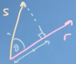
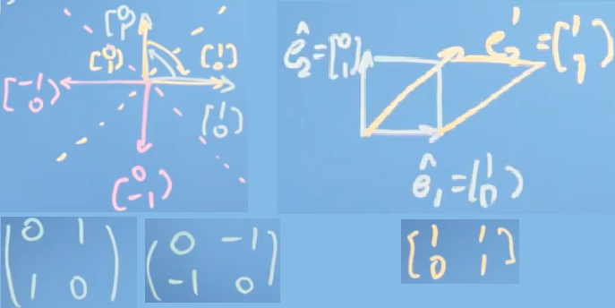
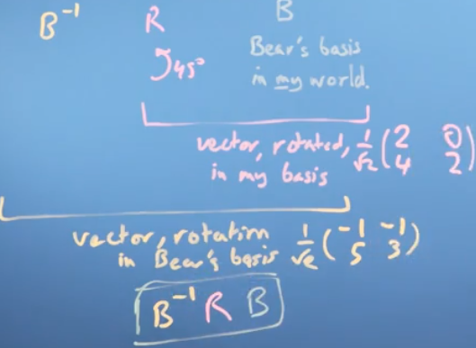
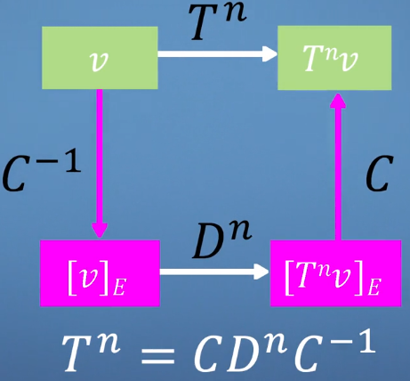

# Linear Algebra 线性代数
这一章节总结了线性代数的一些基础知识，包括向量、矩阵及其属性和计算方法。

<!-- TOC depthFrom:1 depthTo:6 withLinks:1 updateOnSave:1 orderedList:0 -->

- [Linear Algebra 线性代数](#linear-algebra-线性代数)
	- [Vectors 向量](#vectors-向量)
		- [Basic rules 性质](#basic-rules-性质)
			- [Cosine rule 向量点积](#cosine-rule-向量点积)
			- [Projection 投影](#projection-投影)
				- [Scalar projection 标量投影](#scalar-projection-标量投影)
				- [Vector projection 向量投影](#vector-projection-向量投影)
		- [Changing the reference frame](#changing-the-reference-frame)
			- [Vector change basis 向量基变更](#vector-change-basis-向量基变更)
				- [Python code to calculate r](#python-code-to-calculate-r)
		- [Linear independent 线性无关](#linear-independent-线性无关)
	- [Matrices 矩阵](#matrices-矩阵)
		- [Transformation 矩阵变换](#transformation-矩阵变换)
			- [Relationship between the matrix and rotaion angle θ](#relationship-between-the-matrix-and-rotaion-angle-theta)
		- [Matrix Rank 矩阵秩](#matrix-rank-矩阵秩)
		- [Matrix inverse 逆矩阵](#matrix-inverse-逆矩阵)
			- [Going from Gaussian elimination to finding the inverse matrix](#going-from-gaussian-elimination-to-finding-the-inverse-matrix)
		- [Determinant 行列式](#determinant-行列式)
		- [Matrix multiplication 矩阵乘法](#matrix-multiplication-矩阵乘法)
		- [Matrices changing basis 矩阵基变更](#matrices-changing-basis-矩阵基变更)
		- [Orthogonal matrices 正交矩阵](#orthogonal-matrices-正交矩阵)
		- [The Gram–Schmidt process 格拉姆-施密特正交化](#the-gramschmidt-process-格拉姆-施密特正交化)
		- [Reflecting in a plane](#reflecting-in-a-plane)
		- [Eigenvectors and Eigenvalues 特征向量和特征值](#eigenvectors-and-eigenvalues-特征向量和特征值)
			- [Changing the Eigenbasis](#changing-the-eigenbasis)
	- [One more thing](#one-more-thing)

<!-- /TOC -->

## Vectors 向量
### Basic rules 性质
<p align="center"></p>
<p align="center"></p>
<p align="center"></p>

#### Cosine rule 向量点积
<p align="center"></p>

#### Projection 投影
##### Scalar projection 标量投影
<p align="center"></p>
<p align="center"></p>

> <p align="center"> </p>

> 可以通过向量点乘的原理的来理解这一点，假设是在坐标系上的向量（）。那么 ，其中 ，所以 

##### Vector projection 向量投影
往上的投影向量如下，同样可以用上图来解释
<p align="center"></p>

### Changing the reference frame
#### Vector change basis 向量基变更
for vector  in the axis ，project its cordinates to ，the new value is of  is
<p align="center"></p>

> <p align="center"></p>

> In the aboeve example, .

##### Python code to calculate 
``` python
import numpy as np;
def change_basis(v, b1, b2):
    return [np.dot(v, b1)/np.inner(b1,b1), (np.dot(v, b2)/np.inner(b2,b2))]

v, b1, b2 = np.array([1,  1]), np.array([1,  0]), np.array([0,  2])

change_basis(v, b1, b2)
```

### Linear independent 线性无关
if  is indenpdent to s, , for any 

## Matrices 矩阵
### Transformation 矩阵变换
矩阵  和一个向量相乘可以理解为把在的坐标系上重新投影
<p align="center"></p>

> <p align="center"></p>

#### Relationship between the matrix and rotaion angle 
The transformation matrix 

### Matrix Rank 矩阵秩
矩阵 _A_ 的列秩是 _A_ 的线性无关的纵列的极大数目。行秩是 _A_ 的线性无关的横行的极大数目。其列秩和行秩总是相等的，称作矩阵 _A_ 的秩。通常表示为 r(_A_)或rank(_A_)。

### Matrix inverse 逆矩阵
#### Going from Gaussian elimination to finding the inverse matrix
<p align="center"></p>

### Determinant 行列式
Matrix 's determinant is denoted as  or .
For matrix , 

> <p align="center"></p>

>一个矩阵的行列式就是一个平行多面体的（定向的）体积，这个多面体的每条边对应着对应矩阵的列。 ------ 俄国数学家阿诺尔德（Vladimir Arnold）《论数学教育》

If , then the invert matrix cannot be calculated.

### Matrix multiplication 矩阵乘法
<p align="center"></p>
<p align="center"></p>

### Matrices changing basis 矩阵基变更
For matrix  and ,  can be treated as changing 's basis to that as .

Transform (rotate)  in 's coordinates: 
> <p align="center"></p>


### Orthogonal matrices 正交矩阵
If  is an orthogonal matrix, then , so 

### The Gram–Schmidt process 格拉姆-施密特正交化
如果内积空间上的一组向量能够组成一个子空间，那么这一组向量就称为这个子空间的一个基。Gram－Schmidt正交化提供了一种方法，能够通过这一子空间上的一个基得出子空间的一个正交基，并可进一步求出对应的标准正交基。
<p align="center"></p>

After above process, , for any .

### Reflecting in a plane
<p align="center"></p>

Where  is calculated via the gram-schmidt process,  is the transformation matrix in the basic plane.  stands for coverting  to 's plane,  stands for doing  transformation in 's plane. Finally,  goes back to the original plane.

<p align="center"></p>

### Eigenvectors and Eigenvalues 特征向量和特征值
For matrix , 's eigenvector  should satisfies , where  is a  and it's the eigenvalue.
> <p align="center"></p>
> In this shear mapping the red arrow changes direction but the blue arrow does not. The blue arrow is an eigenvector of this shear mapping because it does not change direction, and since its length is unchanged, its eigenvalue is 1.

According to the definition of eigenvector, we can have , e.g., , then , then  , we get  and use it to calculate the eigenvector.

#### Changing the Eigenbasis
, , 


> <p align="center"></p>

其中， 是**特征向量**(eigenvectors)，由**特征值**(eigenvalues)构成.

>一个例子：
>
> , ,  , .
> 

#### 特征值的属性
如 _λ_ 为 _A_ 的特征值， _x_ 是 _A_ 的属于 _λ_ 的特征向量：
* _λ_ 也是 _A<sup>T</sup>_ 的特征值；
* _λ<sup>m</sup>_ 也是 _A<sup>m</sup>_ 的特征值（m是任意常数）；
* _A_ 可逆时，_λ<sup>-1</sup>_ 是 _A<sup>-1</sup>_ 的特征值；

## 推荐阅读
1. [Mathematics for Machine Learning: Linear Algebra](https://www.coursera.org/learn/linear-algebra-machine-learning/)。
2. [矩阵的特征：特征值，特征向量，行列式，trace](https://zhuanlan.zhihu.com/p/25955676)
3. [理解矩阵](https://blog.csdn.net/myan/article/details/647511)

[回到顶部](#linear-algebra-线性代数)
