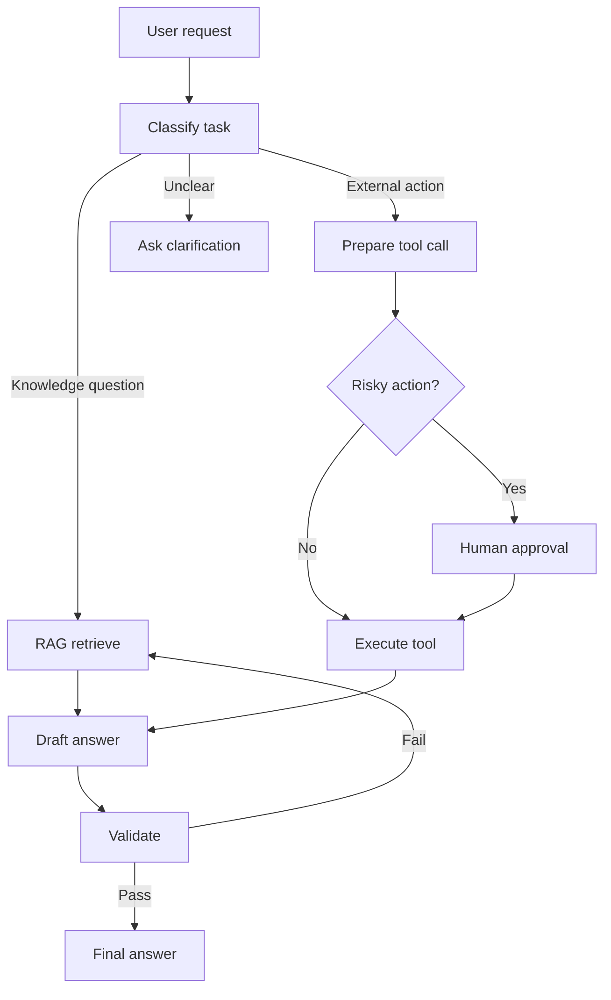

# Agent 工作流模式

Agent 工程的重点是控制任务如何推进。不要把所有事情交给一个无限循环的 Agent。更可靠的做法是把任务拆成明确的状态、工具、检查点和退出条件。

## 从 Chatbot 到 Workflow

Chatbot：

```text
user -> model -> answer
```

带工具的 Agent：

```text
user -> model -> tool -> observation -> model -> answer
```

可生产化 workflow：

```text
user
  -> route
  -> retrieve / plan / act
  -> validate
  -> human approval if needed
  -> final answer
  -> trace and eval
```

## 常见模式

### 1. Router

先判断任务类型，再走不同链路。

```text
question
  -> classify intent
  -> FAQ answer / RAG / tool call / human handoff
```

适合：

- 客服。
- 内部助手。
- 多知识源问答。

关键点：

- 分类要可评估。
- 低置信度要转人工或走保守路径。

### 2. ReAct

模型交替进行思考、行动和观察。

```text
Thought -> Action -> Observation -> Thought -> Final
```

适合：

- 需要搜索、计算、查询的任务。
- 步骤数不多且工具风险低。

风险：

- 循环失控。
- 工具选择不稳定。
- 中间推理不一定可靠。

工程约束：

- 最大步数。
- 工具白名单。
- 每步超时。
- 重复动作检测。

### 3. Plan and Execute

先生成计划，再逐步执行。

```text
goal -> plan -> execute step 1 -> execute step 2 -> validate -> final
```

适合：

- 多步骤研究。
- 代码修改。
- 数据分析。

关键点：

- 计划不应过长。
- 每步执行后允许修正计划。
- 计划和执行可用不同模型。

### 4. Evaluator-Optimizer

一个模型生成结果，另一个模型或规则评估并要求修改。

```text
draft -> evaluate -> revise -> evaluate -> final
```

适合：

- 写作。
- 代码生成。
- 信息抽取。
- RAG 答案引用检查。

注意：

- 评估标准必须明确。
- 迭代次数要有限制。
- 不能只让模型“觉得更好”。

### 5. Human-in-the-loop

高风险动作进入人工确认。

```text
agent proposes action -> human approves/rejects -> tool executes
```

适合：

- 发外部消息。
- 修改生产数据。
- 付款、退款、权限变更。
- 法律、医疗、财务相关建议。

### 6. Multi-agent

多个专门角色协作。

适合：

- 任务天然分工明确。
- 每个角色有不同工具或权限。
- 需要审查者和执行者分离。

不适合：

- 简单问答。
- 只是为了“看起来高级”。
- 缺少评估和成本控制。

## 状态设计

Agent workflow 要显式保存状态：

```json
{
  "task_id": "task-001",
  "user_goal": "整理本周会议纪要",
  "current_step": "retrieve_minutes",
  "messages": [],
  "tool_results": [],
  "approved_actions": [],
  "errors": [],
  "final_status": "running"
}
```

状态的作用：

- 支持失败恢复。
- 支持人工介入。
- 支持调试和审计。
- 支持评估每个阶段。

## 退出条件

每个 workflow 都要定义停止条件：

- 达到最大工具调用次数。
- 连续两次没有新信息。
- 关键工具失败且不可重试。
- 需要人工确认。
- 已满足验收标准。

没有退出条件的 Agent 很容易浪费成本或产生危险动作。

## Mermaid 示例



## 框架选择

| 需求 | 选择 |
| --- | --- |
| 学习工具调用 | 直接用模型 SDK |
| 简单 Agent demo | smolagents、LangChain Agent |
| 复杂状态和人工介入 | LangGraph、LlamaIndex Workflows |
| 企业观测和评估 | LangSmith、Langfuse、Arize Phoenix 等 |

框架不是前置条件。先把状态、工具和评估想清楚，再选框架。

## 常见错误

### 让 Agent 自由规划所有步骤

修复：把高层流程写成状态机，模型只在局部节点做判断。

### 没有记录中间状态

修复：保存每次模型输入输出、工具参数、工具结果、错误和成本。

### Multi-agent 过早

修复：先用单 workflow 跑通，再拆分角色。

### 没有评估每个节点

修复：分别评估路由、检索、工具参数、最终答案。

## 下一步

- 先补工具契约：[Agent 工具调用](agent-tools.md)
- 再看上线风险：[Agent 生产化](agent-production.md)

## 参考资料

- LangGraph Overview: https://docs.langchain.com/oss/python/langgraph/overview
- Hugging Face Agents Course: https://huggingface.co/learn/agents-course/en/unit0/introduction
- OpenAI Agents SDK: https://developers.openai.com/api/docs/guides/agents
