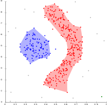

# 聚类算法

<!-- TOC depthFrom:1 depthTo:6 withLinks:1 updateOnSave:1 orderedList:0 -->

- [聚类算法](#聚类算法)
	- [K-Means](#k-means)
		- [优化目标](#优化目标)
		- [随机初始化](#随机初始化)
		- [选择聚类数](#选择聚类数)
	- [DBScan](#dbscan)
		- [复杂度](#复杂度)
		- [优点](#优点)
	- [距离计算](#距离计算)

<!-- /TOC -->

在机器学习绪论中讲过，聚类算法属于无监督算法。
聚类算法在工作中比较常见。其中比较基础的算法包括K-Means，DBScan等等。

## K-Means

K-Means（K-均值）是很普及的一种的聚类算法，算法接受一个未标记的数据集，然后将数据聚类成多个不同的组。

K-Means是一个迭代算法，假设我们想要将数据聚类成 _n_ 个组，其方法为：
1. 首先选择 _K_ 个随机的点，称为聚类中心（Cluster centroids）；
2. 对于数据集中的每一个数据，分别计算其与 _K_ 个中心点的距离，选择距离最近的中心点。将该数据与此中心点关联起来。所有与同一个中心点关联的所有点聚成一类。
3. 计算每一组的平均值，将该组所关联的中心点移动到平均值的位置。

重复上述步骤2-3直到中心点不再变化。

下面几幅图是一个示例。

第一步，随机选择三个初始点（蓝色叉的位置），并依次计算每个数据点距离哪个初始点的位置最近。其实被聚类的数据分别标识红色绿色和蓝色：
<p align="center">

</p>

重新计算了一次中心点，并且重新对每个数据划分类之后，再次计算了中心点。结果如下图：
<p align="center">

</p>

之后，再次对每个数据计算其所属分类，并重新计算中心点，重复这个过程两次后就得到下图的结果。可以看到分类效果还是不错的。
<p align="center">

</p>

下面，将算法用代码表示：
用 _μ<sup>1</sup>_ , _μ<sup>2</sup>_ ,..., _μ<sup>k</sup>_ 来表示聚类中心，用 _c<sup>(1)</sup>_ , _c<sup>(2)</sup>_ ,..., _c<sup>(m)</sup>_ 来存储与第 _i_ 个实例数据最近的聚类中心的索引，K-均值算法的伪代码如下：

```
Repeat {
  for i = 1 to m
    c(i) := index (from 1 to K) of cluster centroid closest to x(i)

  for k = 1 to K
    mu_k := average (mean) of points assigned to cluster k
}
```

算法分为两个步骤
1. 第一个`for`循环是赋值步骤，即：
   * 对于每一个样例 _i_ ，计算其应该属于的类
2. 第二个for循环是聚类中心的移动，即：
   * 对于每一个类 _K_ ，重新计算该类的质心


### 优化目标
K-Means优化目标是最小化所有的数据点与其关联的聚类中心点之间的距离之和，因此K-Means的代价函数（又称畸变函数 Distortion function）为：

<p align="center">

</p>

其中 _μ<sub>c<sup>(i)</sup></sub>_ 代表与 _x<sup>(i)</sup>_ 最近的聚类中心点。

优化目标是找出使得代价函数最小的 _c<sup>(1)</sup>_ , _c<sup>(2)</sup>_ ,..., _c<sup>(m)</sup>_ 和 _μ<sup>1</sup>_ , _μ<sup>2</sup>_ ,..., _μ<sup>k</sup>_。

K-Means算法，第一个循环是用于减小 _c<sup>(i)</sup>_ 引起的代价，而第二个循环则是用于减小 _μ<sub>i</sub>_ 引起的代价。迭代的过程一定会是每一次迭代都在减小代价函数，不然便是出现了错误。

### 随机初始化

在运行K-Means算法之前，首先要随机初始化所有的聚类中心：
1. 我们应该选择 _K < m_ ，即聚类中心点的个数要小于所有训练集实例的数量
2. 随机选择 _K_ 个训练实例，然后令 _K_ 个聚类中心分别与这 _K_ 个训练实例相等

K-Means的一个问题在于，它有可能会停留在一个局部最小值处，而这取决于初始化的情况。例如下图的情况：
<p align="center">

</p>

为了解决 局部最小化 的问题，通常需要多次运行K-K-Means算法，每次都重新进行随机初始化，最后再比较多次运行K-Means的结果，选择代价函数最小的结果。
这种方法在 _K_ 较小的时候（2-10）还是可行的，但是**如果 _K_ 较大，这么做也可能不会有明显地改善**。

### 选择聚类数

没有最好的选择聚类数的方法，通常是需要根据不同的问题，人工进行选择。

选择的时候思考运用K-Means算法聚类的动机是什么，然后选择能最好服务于该目的标聚类数。

一个可能的方法叫作“肘部法则（Elbow method）”：
主要过程是改变 _K_ 值。运行 _K_ 个聚类的方法。

意味着，所有的数据都会分到一个聚类里，然后计算成本函数或者计算畸变函数 _J_ 。
 _K_ 代表聚类数字。

<p align="center">

</p>

应用这种方法，可能会得到一条类似于左上图这样的曲线。像一个人的肘部。
这种模式，它的畸变值会迅速下降，从1到2，从2到3之后，你会在3的时候达到一个肘点。
在此之后，畸变值下降的非常慢，看起来使用3个cluster来聚类是正确的，因为那个点是曲线的肘点，畸变值下降得很快， _K=3_ 之后就下降得很慢。

当应用“肘部法则”时，如果得到了一个像上图左图，那是一种用来选择聚类个数的合理方法。

更多的时候划分为多少个Clusters，取决于实际的应用场景：
> 制造T-恤的例子中，要将用户按照身材聚类，可以分成3个尺寸: _S,M,L_ ，也可以分成5个尺寸 _XS,S,M,L,XL_ ，这样的选择是建立在“聚类后制造的T-恤是否能较好地适合客户”这个问题的基础上。

## DBScan
> DBScan部分内容主要来源于 https://zh.wikipedia.org/wiki/DBSCAN

如K-Means不同的是，DBScan算法以密度分析为基础：
* 给定某空间里的一个点集合，DBScan能把附近的点分成一组（有很多相邻点的点），并标记出位于低密度区域的局外点（最接近它的点也十分远）。
* DBSCAN 是最常用的聚类分析算法之一，也是科学文章中最常引用的聚类分析算法之一。

考虑在某空间里将被聚类的点集合，为了进行 DBSCAN 聚类，所有的点被分为 _核心点_，_(密度)可达点_ 及 _局外点_ ，详请如下：

如果一个点 _p_ 在距离 _ε_ 范围内有至少 _minPts_ 个点(包括自己)，则这个点被称为**核心点**，那些 _ε_ 范围内的则被称为由 p 直接可达的。
同时定义，没有任何点是由非核心点直接可达的。
如果存在一条道路 _p1, ..., pn_ ，有 _p1 = p_和_pn = q_， 且每个 _pi+1_ 都是由 _pi_ 直接可达的(道路上除了 _q_ 以外所有点都一定是核心点)，则称 _q_ 是由 _p_ 可达的。
所有不由任何点可达的点都被称为**局外点**。
如果 _p_ 是核心点，则它与所有由它可达的点(包括核心点和非核心点)形成一个聚类，每个聚类拥有最少一个核心点，非核心点也可以是聚类的一部分，但它是在聚类的“边缘”位置，因为它不能达至更多的点。

<p align="center">

</p>
在上面的图中，minPts = 4，点 A 和其他红色点是核心点，因为它们的 ε-邻域（图中红色圆圈）里包含最少 4 个点（包括自己），由于它们之间相互相可达，它们形成了一个聚类。点 B 和点 C 不是核心点，但它们可由 A 经其他核心点可达，所以也属于同一个聚类。点 N 是局外点，它既不是核心点，又不由其他点可达。

伪代码如下
```
DBSCAN(DB, distFunc, eps, minPts) {
   C = 0                                                  /* 类别计数 */
   for each point P in database DB {
      if label(P) ≠ undefined then continue               /* 此前已经标记过 */
      Neighbors N = RangeQuery(DB, distFunc, P, eps)      /* 计算可达点集合 */
      if |N| < minPts then {                              /* 检查密度 */
         label(P) = Noise                                 /* 标记为 局外点 */
         continue
      }
      C = C + 1                                           /* 下一个聚类标签 */
      label(P) = C                                        /* 标记起始点 */
      Seed set S = N \ {P}                                /* 扩展可达点 */
      for each point Q in S {                             /* 处理每个可达点 */
         if label(Q) = Noise then label(Q) = C            /* 把局外点归为此类 */
         if label(Q) ≠ undefined then continue            /* 此前已经标记过 */
         label(Q) = C                                     /* 标记可达点 */
         Neighbors N = RangeQuery(DB, distFunc, Q, eps)   /* 计算可达点集合 */
         if |N| ≥ minPts then {                           /* 检查密度 */
            S = S ∪ N                                     /* 扩展可达点 */
         }
      }
   }
}
```
### 复杂度
DBScan的时间复杂度主要受RegionQuery 的调用次数影响，DBSCAN 对每点都进行刚好一次调用，且如果使用了特别的编号结构，则总平均时间复杂度为 O(n log n) ，最差时间复杂度则为 O(n^2) 。可以使用 O(n^2) 空间复杂度的距离矩阵以避免重复计算距离，但若不使用距离矩阵，DBSCAN 的空间复杂度为 O(n)。

### 优点
1. 相比 K-平均算法，DBSCAN 不需要预先声明聚类数量。
2. DBSCAN 可以找出任何形状的聚类，甚至能找出一个聚类，它包围但不连接另一个聚类，另外，由于 MinPts 参数，single-link effect （不同聚类以一点或极幼的线相连而被当成一个聚类）能有效地被避免。
3. DBSCAN 能分辨噪音（局外点）。
4. DBSCAN 只需两个参数，且对数据库内的点的次序几乎不敏感（两个聚类之间边缘的点有机会受次序的影响被分到不同的聚类，另外聚类的次序会受点的次序的影响）。
5. DBSCAN 被设计成能配合可加速范围访问的数据库结构，例如 R*树。
6. 如果对资料有足够的了解，可以选择适当的参数以获得最佳的分类。

下图展示 DBSCAN 分辨非线性可分聚类的能力，上图所示的资料点不能被 K-平均算法 或 Gaussian Mixture EM clustering 正确或足够好地分类。
<p align="center">

</p>


## 距离计算

(1). 闵可夫斯基距离Minkowski/（其中欧式距离：_p = 2_)
<p align="center">

</p>

(2). 杰卡德相似系数(Jaccard)：

<p align="center">

</p>

(3). 余弦相似度(cosine similarity)：
 _n_ 维向量 _x_ 和 _y_ 的夹角记做 _θ_ ，根据余弦定理，其余弦值为：

<p align="center">

</p>

(4). Pearson皮尔逊相关系数：

<p align="center">

</p>

Pearson相关系数即将 _x_ 、 _y_ 坐标向量各自平移到原点后的夹角余弦。

## Jupyter Notebook编程练习

- 推荐访问Google Drive的共享，直接在Google Colab在线运行ipynb文件：
  - [Google Drive: 7.kmeans_and_PCA](https://drive.google.com/drive/folders/1VNdwdcxeRGViyg9lsz8TyOVq39VhjiYg?usp=sharing)
- 不能翻墙的朋友，可以访问GitHub下载：
  - [GitHub: 7.kmeans_and_PCA](https://github.com/loveunk/ml-ipynb/tree/master/7.kmeans_and_PCA)

## 更多阅读
* [Three Popular Clustering Methods and When to Use Each](https://medium.com/predict/three-popular-clustering-methods-and-when-to-use-each-4227c80ba2b6)

[回到顶部](#聚类算法)