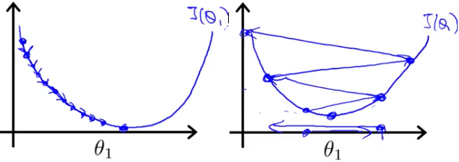

# Machine Learning

<!-- TOC depthFrom:1 depthTo:6 withLinks:1 updateOnSave:1 orderedList:0 -->

- [Machine Learning](#machine-learning)
	- [介绍](#介绍)
	- [线性回归](#线性回归)
		- [单变量线性回归](#单变量线性回归)
			- [模型表示](#模型表示)
			- [代价函数](#代价函数)
		- [梯度下降](#梯度下降)
			- [梯度下降的直观理解](#梯度下降的直观理解)
	- [逻辑回归](#逻辑回归)
	- [神经网络](#神经网络)
	- [SVM](#svm)
	- [无监督学习](#无监督学习)
	- [推荐系统](#推荐系统)

<!-- /TOC -->

本章节将主要基于Coursera Andrew Ng的Machine Learning课程整理传统机器学习算法的内容。

## 介绍
其中关于机器学习基本介绍的内容，这里就省掉了。

Andrew有一句话是关于学习方法的，给我很深印象：“给你讲授学习算法 就好像给你一套工具，相比于提供工具，可能更重要的是教你如何使用这些工具。”

## 线性回归
### 单变量线性回归
#### 模型表示
**例子**：预测住房价格

**数据集**：已知一个数据集，包含某个城市的住房价格。每个样本包括房屋尺寸、售价。<br/>
**问题**：根据不同房屋尺寸所售出的价格，画出数据集。如果房子是1250平方尺，你要告诉他们这房子能卖多少钱。

首先，你可以构建一个模型（假设是条直线，如下图）。根据数据模型，你可以告诉你的朋友，他的房子大约值220000美元。
<p align="center">

</p>

上述例子是个**监督学习**的例子，同时是一个**回归问题**。**回归**指根据之前的数据预测出一个准确的输出值，对于这个例子预测的值是价格。

这个数据集可以表示为
| 房屋大小 (_x_) | 价格 (_y_) |
|:--------------:|:----------:|
| 2104 | 460 |
| 1416 | 232 |
| 1534 | 315 |
| 852  | 178 |
| ...  | ... |

我们用如下的符号来描述这个问题：
* _m_： 代表训练集中样本的数量（下文也将用 _m_ 表示训练样本数量）
* _x_： 代表特征/输入变量
* _y_： 代表目标变量/输出变量
* (_x, y_)： 代表训练集中的一个样本
* (_x<sup>(i)</sup>, y<sup>(i)</sup>_)：代表第 _i_ 个观察样本
* _h_：代表学习算法的解决方案或函数也称为假设（hypothesis）

这个监督学习的工作方式如下：
```
训练集 → 学习算法
            ↓
房屋大小  →  h  → 预测价格
```

上述步骤总结为：
1. 把训练集（房屋大小和价格）输入到学习算法；
2. 学习算法计算出函数 _h_。函数输入是房屋大小 (_x_)，输出 _y_ 值对应房子的价格，因此 _h_ 是一个从 _x_ 到 _y_ 的函数映射；
3. 对于新要预测的样本 _x_，往 _h_ 输入 _x_ 值可得对应的 _y_ 值。

那么，对于我们的房价预测问题， _h_ 可能的表述如下：
* ，因为只含有一个特征/输入变量，因此这样的问题叫作单变量线性回归问题。

下一步是如何确定参数 _θ<sub>0</sub>_ 和 _θ<sub>1</sub>_。在预测房价这个例子， _θ<sub>1</sub>_ 是直线的斜率，  _θ<sub>0</sub>_ 是在 _y_ 轴上的截距。

选择的参数决定了 _h_ 相对与训练集的准确程度。

定义**建模误差**（modeling error）为模型所预测的值与训练集中实际值之间的差距（下图中蓝线所指）。
<p align="center">

</p>

#### 代价函数
为衡量 _h_ 的性能，回归任务中常见的方法是定义代价函数（Cost Function）：
* 均方误差（MES: Mean Squared Error）
  <p align="center">
  
  </p>
* 选取参数以最小化 _J_，从而优化 _h_

我们绘制一个等高线图，三个坐标分别为 _θ<sub>0</sub>_ 和 _θ<sub>1</sub>_、_J(θ<sub>0</sub>, θ<sub>1</sub>)_，可以看到在三维空间中存在一个使得 _J(θ<sub>0</sub>, θ<sub>1</sub>)_ 最小的点：
<p align="center">

</p>

下右图是把代价函数呈现为等高线图（Contour Plot），以便我们观察 _θ<sub>0</sub>_ 和 _θ<sub>1</sub>_ 对 _J(θ<sub>0</sub>, θ<sub>1</sub>)_ 的影响。
<p align="center">

</p>

根据上图，人工的方法很容易找到 代价函数最小值时对应的 _θ<sub>0</sub>_ 和 _θ<sub>1</sub>_，但我们真正需要的是一种有效的算法，能够自动地找出这些使代价函数 _J_ 取最小值的参数  _θ<sub>0</sub>_ 和 _θ<sub>1</sub>_。也就是下面要降到的[梯度下降](#梯度下降)。

### 梯度下降
**梯度下降**是一种用来求函数最小值的算法，我们将使用梯度下降算法来求出代价函数 _J(θ<sub>0</sub>, θ<sub>1</sub>)_ 的最小值。

**梯度下降的思想**：开始时随机选择一个参数的组合 _(θ<sub>0</sub>, θ<sub>1</sub>, ..., θ<sub>n</sub>)_ ，计算代价函数；然后寻找下一个能让代价函数值下降最多的参数组合。持续这么做直到找到一个**局部最小值**（Local minimum），因为我们并没有尝试完所有的参数组合，所以不能确定我们得到的局部最小值是否便是**全局最小值**（Global minimum），选择不同的初始参数组合，可能会找到不同的局部最小值。

如下图所示，不同的起始参数导致了不同的局部最小值。
<p align="center">

</p>

为了理解梯度下降，可以想象一下你正站立在山的一点上（上图中的红色起始点），并且希望用最短的时间下山。在梯度下降算法中，要做的就是旋转360度，看看周围，并问自己要在某个方向上，用小碎步尽快下山。这些小碎步需要朝什么方向？如果我们站在山坡上的这一点，看一下周围，你会发现最佳的下山方向，按照自己的判断迈出一步；重复上面的步骤，从新的位置，环顾四周，并决定从什么方向将会最快下山，然后又迈进了一小步，并依此类推，直到你接近局部最低点的位置。

批量梯度下降（batch gradient descent）算法可以抽象为公式：

<p align="center">

</p>

其中 _α_ 是**学习率**（Learning rate），它决定了沿着能让代价函数下降程度最大的方向向下迈出的步子有多大；在批量梯度下降中，每一次都同时让所有的参数减去学习速率乘以代价函数的导数。

上面的公式展开如下：
<p align="center">

</p>

**重点**：更新上述式子需要同时更新一组参数 _(θ<sub>0</sub>, θ<sub>1</sub>, ..., θ<sub>n</sub>)_ ，之后再开始下一轮迭代。 这里先不解释为什么需要同时更新。但请记住，同时更新是梯度下降中常用方法。之后会讲到，同步更新也是更自然的实现方法。人们谈到梯度下降时，意思就是同步更新。

#### 梯度下降的直观理解
考虑上图中关于梯度下降的公式，其中求导，是取红点的切线，就是下图中红色的直线，其与函数相切于红色的点。红色直线的斜率，正好是下图红色三角形的高度除以这个水平长度，这条线有一个正斜率，也就是说它有正导数，因此，为了得到更新的 _J_，_θ<sub>1</sub>_ 更新后等于 _θ<sub>1</sub>_ 减去一个正数乘以 _α_。

<p align="center">

</p>

 _α_ 的取值有怎么的影响？
* 如果 _α_ 太小，即学习速率太小，结果是红点一点点挪动，努力去接近最低点，需要很多步才能到达最低点。同样会需要很多步才能到达全局最低点。（如下图-左图）
* 如果 _α_ 太大，梯度下降法可能会越过最低点，甚至可能无法收敛，下一次迭代又移动了一大步，一次次越过最低点，直到你发现实际上离最低点越来越远，所以如果 _α_ 太大，它会导致无法收敛，甚至发散。（如下图-右图）

<p align="center">

</p>

现在，还有一个问题，需要思考，如果我们预先把 _θ<sub>1</sub>_ 放在一个局部的最低点，下一步梯度下降法会怎样工作？

假设你将 _θ<sub>1</sub>_ 初始化在局部最低点，它已经在一个局部的最优处或局部最低点。结果是局部最优点的导数将等于零，因为它是那条切线的斜率。使得 _θ<sub>1</sub>_ 不再改变，也就是新的 _θ<sub>1</sub>_ 等于原来的 _θ<sub>1</sub>_ ，因此，如果参数已经处于局部最低点，那么梯度下降法更新其实什么都没做，它不会改变参数的值。这也解释了为什么即使学习速率 _α_ 保持不变时，梯度下降也可以收敛到局部最低点。

我们来看一个例子，这是代价函数 _J(θ)_ 。

## 逻辑回归

## 神经网络

## SVM

## 无监督学习

## 推荐系统
