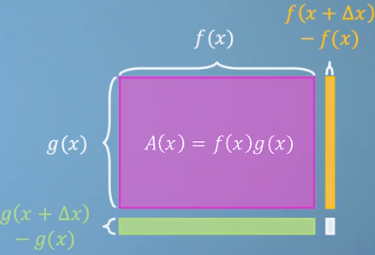
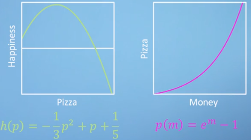

# 微积分 Calculus
这篇笔记总结了微积分的一些基础知识，包括导数、偏导数、泰勒展开式、拉格朗日乘数等等的基础知识。
内容部分参考[Mathematics for Machine Learning: Multivariate Calculus](https://www.coursera.org/learn/multivariate-calculus-machine-learning/)。

<!-- TOC depthFrom:1 depthTo:6 withLinks:1 updateOnSave:1 orderedList:0 -->

- [微积分 Calculus](#微积分-calculus)
	- [Derivative 导数](#derivative-导数)
		- [基本规则](#基本规则)
			- [线性法则 (Sum / Subtraction rule)](#线性法则-sum-subtraction-rule)
			- [指数法则 (Power rule)](#指数法则-power-rule)
			- [其他规则](#其他规则)
		- [乘积法则 (Product rule)](#乘积法则-product-rule)
		- [链式法则 (Chain rule)](#链式法则-chain-rule)
	- [偏导数 (Partial Derivative)](#偏导数-partial-derivative)
		- [定义](#定义)
	- [Jacobians - vectors of derivatives](#jacobians-vectors-of-derivatives)
	- [Hessian](#hessian)
- [Neural Networks](#neural-networks)
	- [Simple neural networks](#simple-neural-networks)
	- [Backpropagation](#backpropagation)
- [泰勒级数 (Taylor series)](#泰勒级数-taylor-series)
	- [多变量泰勒级数 Multivariable Taylor Series](#多变量泰勒级数-multivariable-taylor-series)
- [约束最大最小值的优化方法](#约束最大最小值的优化方法)
	- [牛顿-拉弗森方法 Newton-Raphson](#牛顿-拉弗森方法-newton-raphson)
	- [Gradient Descent](#gradient-descent)
	- [拉格朗日乘数 Lagrange multipliers](#拉格朗日乘数-lagrange-multipliers)
- [线性回归Linear Regression](#线性回归linear-regression)
- [非线性回归 Non-linear Regression](#非线性回归-non-linear-regression)
	- [快速下降法 Steepest Descent](#快速下降法-steepest-descent)

<!-- /TOC -->

## Derivative 导数
导数的定义:

### 导数基本规则
#### 线性法则 (Sum / Subtraction rule)

#### 指数法则 (Power rule)

函数为

<i>
f(x) = a xb
</i>

则

<i>
f'(x) = ab x(b-1)
</i>

#### 其他规则

| 函数                                     | 导数                                                     |
| ---------------------------------------- | -------------------------------------------------------- |
| _f(x) = ( 1 / x )_ | _f'(x) =  - ( 1 / x2 )_ |
| _f(x) = ex_                   | _f'(x) = ex_                                  |
| _f(x) = loga(x)_              | _f'(x) = ( 1 / xln(a) )_           |
| _f(x) = sin(x)_                          | _f'(x) = cos(x)_                                         |
| _f(x) = cos(x)_                          | _f'(x) = -sin(x)_                                        |

### 乘积法则 (Product Rule)
函数为 _f(x) · g(x) = f(x) g'(x) + f'(x) g(x)_，则：

需要说明上面的等式忽略了 _(f(x+Δx) - f(x)) (g(x+Δx) - g(x))_ ，结合下图就可以更好理解，被忽略的部分是右下角白色的小框，随着  _limΔx→0_ ，这部分可以忽略不计了。

 

### 链式法则 (Chain rule)
对于函数 _f(g), g(x)_，有：

<i>f(g(x))' = f'(g(x)) g'(x)</i>

可以想象成两个函数分别求导，再求乘积，例子如下图 

 

## 偏导数 (Partial Derivative)
### 定义
一个多变量的函数的偏导数是它关于其中一个变量的导数，而保持其他变量恒定。

表示为：

## 雅可比矩阵(Jacobians Matrix)

雅克比矩阵是一阶偏导数的排列成的矩阵。其行列式称为雅克比行列式。

假设一个函数由 _m_ 个实函数组成：_y1(x1, x2, ..., xn), ..., yn(x1, x2, ..., xn)_，这些函数的偏导数可以组成 _m_ 行 _n_ 列的矩阵，矩阵就是雅克比矩阵 (Jacobians Matrix)：

矩阵符号写作：

_JF(x1, x2, ..., xn)_，或者 ( ∂ (y1,  ... , yn) / ∂ (x1,  ... , xn) )

### 例子

函数如下：

* u(x, y) = x - 2y
* v(x, y) = 3y - 2x

则Jacobians Matrix为：

另一个例子：

* _x(r, θ) = r cos(θ)_
* _y(r, θ) = r sin(θ)_

则Jacobians Matrix为：

Jacobians Det为

<i>
 |J|  =  r(cos2(θ)  +  sin2(θ))  =  r
 </i>

## Hessian

# Neural Networks
## Simple neural networks
## Backpropagation

# 泰勒级数 (Taylor series)
当 x = 0, 可得
$$\sum ^{\infty }_{n=0}\dfrac {f^{\left( n\right) }\left( 0\right) }{n!}x^{n}$$

其中

## 多变量泰勒级数 Multivariable Taylor Series

# 约束最大最小值的优化方法
## 牛顿-拉弗森方法 Newton-Raphson
## Gradient Descent
## 拉格朗日乘数 Lagrange multipliers

# 线性回归Linear Regression

# 非线性回归 Non-linear Regression
## 快速下降法 Steepest Descent

[回到顶部](#微积分-calculus)
