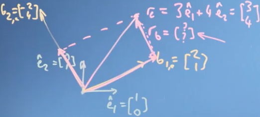
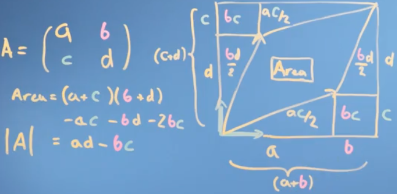
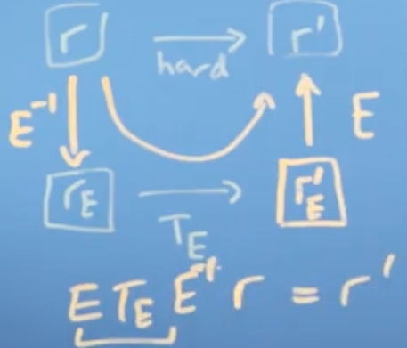

# 线性代数 Linear Algebra
这一章节总结了线性代数的一些基础知识，包括向量、矩阵及其属性和计算方法。

<!-- TOC depthFrom:1 depthTo:6 withLinks:1 updateOnSave:1 orderedList:0 -->

- [线性代数 Linear Algebra](#线性代数-linear-algebra)
	- [向量 Vectors](#向量-vectors)
		- [性质 Basic rules](#性质-basic-rules)
			- [向量点积 Cosine rule](#向量点积-cosine-rule)
			- [投影 Projection](#投影-projection)
				- [标量投影 Scalar projection](#标量投影-scalar-projection)
				- [向量投影 Vector projection](#向量投影-vector-projection)
		- [转换参考系](#转换参考系)
			- [向量基变更 Vector change basis](#向量基变更-vector-change-basis)
				- [计算 _r_ 的Python 代码](#计算-r-的python-代码)
		- [Linear independent 线性无关](#linear-independent-线性无关)
	- [Matrices 矩阵](#matrices-矩阵)
		- [Transformation 矩阵变换](#transformation-矩阵变换)
			- [矩阵与旋转角度 _θ_ 之间的关系](#矩阵与旋转角度-之间的关系)
		- [矩阵秩 Matrix Rank](#矩阵秩-matrix-rank)
		- [逆矩阵 Matrix inverse](#逆矩阵-matrix-inverse)
			- [高斯消元法到找到逆矩阵](#高斯消元法到找到逆矩阵)
		- [行列式 Determinant](#行列式-determinant)
		- [矩阵乘法 Matrix multiplication](#矩阵乘法-matrix-multiplication)
		- [矩阵基变更 Matrices changing basis](#矩阵基变更-matrices-changing-basis)
		- [正交矩阵 Orthogonal matrices](#正交矩阵-orthogonal-matrices)
		- [格拉姆-施密特正交化 The Gram–Schmidt process](#格拉姆-施密特正交化-the-gramschmidt-process)
		- [Reflecting in a plane](#reflecting-in-a-plane)
		- [特征向量和特征值 Eigenvectors and Eigenvalues](#特征向量和特征值-eigenvectors-and-eigenvalues)
			- [改变特征 Changing the Eigenbasis](#改变特征-changing-the-eigenbasis)
			- [特征值的属性](#特征值的属性)
	- [推荐阅读](#推荐阅读)

<!-- /TOC -->

## 向量 Vectors
### 性质 Basic rules
* _r + s = s + r_
* _r · s = s · r_
* _r · (s + t)=r · s + r · t_

#### 向量点积 Cosine rule
_(r - s)<sup>2</sup> = r<sup>2</sup> + s<sup>2</sup> - 2r · s · cosθ_

#### 投影 Projection
##### 标量投影 Scalar projection
_r · s =|r| × |s| × cosθ_


> <p align="center"> </p>

> 可以通过向量点乘的原理的来理解这一点，假设 _r_ 是在坐标系 _i_ 上的向量（ _r<sub>j</sub>=0_ ）。那么 _r · s = r<sub>i</sub>s<sub>i</sub> + r<sub>j</sub>s<sub>j</sub> = r<sub>i</sub>s<sub>i</sub> = |r|s<sub>i</sub>_ ，其中 _s<sub>i</sub> = |s| · cosθ_ ，所以 _r · s =|r| · |s| · cosθ_

##### 向量投影 Vector projection
 _s_ 往 _r_ 上的投影向量如下，同样可以用上图来0解释

<p align="center">

</p>

### 转换参考系
#### 向量基变更 Vector change basis
对于在坐标系 _(e<sub>1</sub>, e<sub>2</sub>)_ 上的向量 _r_，把它的坐标点映射到 _(b<sub>1</sub>,b<sub>2</sub>)_ ，_r_ 在新的坐标系中的坐标点是

<p align="center">

</p>

> <p align="center"></p>

> 在上面的例子中，$r = \begin{bmatrix} 2 \\ 0.5 \end{bmatrix}$.

##### 计算 _r_ 的Python 代码
``` python
import numpy as np;
def change_basis(v, b1, b2):
    return [np.dot(v, b1)/np.inner(b1,b1), (np.dot(v, b2)/np.inner(b2,b2))]

v, b1, b2 = np.array([1,  1]), np.array([1,  0]), np.array([0,  2])

change_basis(v, b1, b2)
```

### Linear independent 线性无关
如果 _r_ 和 _s_ 是线性无关的，对于任何 _α_， _r ≠ α · s_。

## Matrices 矩阵
### Transformation 矩阵变换
矩阵 _E=[e<sub>1</sub> e<sub>2</sub>]_ 和一个向量 _v_ 相乘可以理解为把 _v_ 在 _e<sub>1</sub>, e<sub>2</sub>_ 的坐标系上重新投影

<p align="center">

</p>

> <p align="center"></p>

#### 矩阵与旋转角度 _θ_ 之间的关系
转换矩阵为
<p align="center">

</p>

### 矩阵秩 Matrix Rank
矩阵 _A_ 的列秩是 _A_ 的线性无关的纵列的极大数目。行秩是 _A_ 的线性无关的横行的极大数目。其列秩和行秩总是相等的，称作矩阵 _A_ 的秩。通常表示为 r(_A_)或rank(_A_)。

### 逆矩阵 Matrix inverse
#### 高斯消元法到找到逆矩阵
$$A^{-1}A = I$$

### 行列式 Determinant
矩阵 _A_ 的行列式表示为 _det(A)_ 或 _|A|_ .

对于矩阵   _|A|=a d-c d_

> <p align="center"></p>

>一个矩阵的行列式就是一个平行多面体的（定向的）体积，这个多面体的每条边对应着对应矩阵的列。 ------ 俄国数学家阿诺尔德（Vladimir Arnold）《论数学教育》

行列式 _det(A) = 0_ 的方阵一定是不可逆的。

### 矩阵乘法 Matrix multiplication
<p align="center">

</p>

<p align="center">

</p>

### 矩阵基变更 Matrices changing basis
对于矩阵 _A_ 和 _B_ , _A · B_ 可以认为是把 _B_ 的坐标系变换到 _A_ 中。

Transform (rotate) _R_ in _B_'s coordinates:  _B<sup>-1</sup>RB_
> <p align="center"></p>

### 正交矩阵 Orthogonal matrices
**正交矩阵**是一个方块矩阵 _A_，其元素为实数，而且行向量与列向量皆为正交的单位向量，使得该矩阵的转置矩阵为其逆矩阵。

如果 _A_ 是正交矩阵，那么 _AA<sup>T</sup>=I_ ， _A<sup>T</sup>=A<sup>-1</sup>_ 。

### 格拉姆-施密特正交化 The Gram–Schmidt process
如果内积空间上的一组向量能够组成一个子空间，那么这一组向量就称为这个子空间的一个基。Gram－Schmidt正交化提供了一种方法，能够通过这一子空间上的一个基得出子空间的一个正交基，并可进一步求出对应的标准正交基。

<p align="center">

</p>

经过上述过程后，对于任何 _i, j_ ， _β<sub>i</sub> β<sub>j</sub> = 0_ 。

### Reflecting in a plane
<p align="center">

</p>

Where $E$ is calculated via the gram-schmidt process, $T_E$ is the transformation matrix in the basic plane. $E^{-1} \cdot r$ stands for coverting $r$ to $E$'s plane, $T_E \cdot E^{-1} \cdot r$ stands for doing $T_E$ transformation in $E$'s plane. Finally, $E$ goes back to the original plane.

<p align="center"></p>
### 特征向量和特征值 Eigenvectors and Eigenvalues
对于一个给定的方阵 _A_，它的特征向量（eigenvector）_v_ 经过这个线性变换之后，得到的新向量仍然与原来的 _v_ 保持在同一条直线上，但其长度或方向也许会改变。
它们满足： _**A**v = **λ**v_。

**λ** 为标量，即特征向量的长度在该线性变换下缩放的比例，称 **λ**  为其特征值。

> <p align="center"></p>
> 在上面这个图像变换的例子中，红色箭头改变方向，但蓝色箭头不改变方向。蓝色箭头是此剪切映射的特征向量，因为它不会改变方向，并且由于其长度不变，因此其特征值为1。

根据线性方程组理论，为了使这个方程有非零解，矩阵 _A_ 的行列式  _det(A - λI)=0_ 必须是零。

例如，矩阵 _A_ 为，那么
<p align="center">

</p>

_λ<sup>2</sup>-(a+d)λ+ad-bc=0_ ，得到 _λ_ 并计算特征向量。

#### 改变特征 Changing the Eigenbasis
<p align="center">

</p>

<p align="center"></p>
其中，_C_ 是**特征向量**(eigenvectors)，$D$由**特征值**(eigenvalues)构成.

一个例子：
<p align="center">

</p>

#### 特征值的属性
如 _λ_ 为 _A_ 的特征值， _x_ 是 _A_ 的属于 _λ_ 的特征向量：
* _λ_ 也是 _A<sup>T</sup>_ 的特征值；
* _λ<sup>m</sup>_ 也是 _A<sup>m</sup>_ 的特征值（m是任意常数）；
* _A_ 可逆时，_λ<sup>-1</sup>_ 是 _A<sup>-1</sup>_ 的特征值；

## 推荐阅读
1. [Mathematics for Machine Learning: Linear Algebra](https://www.coursera.org/learn/linear-algebra-machine-learning/)。

2. [矩阵的特征：特征值，特征向量，行列式，trace](https://zhuanlan.zhihu.com/p/25955676)

3. [理解矩阵](https://blog.csdn.net/myan/article/details/647511)

4. [强大的矩阵奇异值分解(SVD)及其应用](https://www.cnblogs.com/LeftNotEasy/archive/2011/01/19/svd-and-applications.html)

[回到顶部](#linear-algebra-线性代数)
