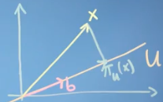

# 主成分分析 - PCA (Principal Component Analysis)

PCA是一种数据线性降维的方法，在学习PCA之前，先回顾一些基础知识。
内容部分参考[Mathematics for Machine Learning: Multivariate Calculus](https://www.coursera.org/learn/pca-machine-learning/)。

<!-- TOC depthFrom:1 depthTo:6 withLinks:1 updateOnSave:1 orderedList:0 -->

- [主成分分析 - PCA (Principal Component Analysis)](#主成分分析-pca-principal-component-analysis)
	- [方差和协方差 Varianes & Covariances](#方差和协方差-varianes-covariances)
		- [方差 Variance](#方差-variance)
		- [Covariance 协方差](#covariance-协方差)
		- [Rules 方差规则](#rules-方差规则)
	- [积 Product](#积-product)
		- [点积 Dot product](#点积-dot-product)
			- [代数定义 Algebraic definition](#代数定义-algebraic-definition)
			- [几何定义 Geometric definition](#几何定义-geometric-definition)
		- [内积 Inner product](#内积-inner-product)
			- [内积性质 Inner product properties](#内积性质-inner-product-properties)
			- [函数内积 Inner product of functions](#函数内积-inner-product-of-functions)
			- [随机变量内积 Inner product of random variables](#随机变量内积-inner-product-of-random-variables)
	- [投影 Projection](#投影-projection)
		- [投影到一维空间 Projection onto 1D subspaces](#投影到一维空间-projection-onto-1d-subspaces)
		- [投影到高维空间 Projections onto higher-dimentional subspaces](#投影到高维空间-projections-onto-higher-dimentional-subspaces)
	- [PCA](#pca)
		- [PCA推导](#pca推导)
		- [PCA算法](#pca算法)
			- [PCA步骤](#pca步骤)
			- [高维空间PCA High-dimentional PCA](#高维空间pca-high-dimentional-pca)
	- [推荐阅读](#推荐阅读)

<!-- /TOC -->

## 方差和协方差 Varianes & Covariances
### 方差 Variance

### Covariance 协方差

对于2D数据，协方差矩阵如下：

### Rules 方差规则
* _Var[D] = Var[D + a]_
* _Var[α D] = α2 Var[D]_

对于矩阵 _D = x1, x2, ..., xn, x ∈ Rp_
* _Var[AD + b] = A Var[D] AT_

## 积 Product
### 点积 Dot product
#### 代数定义 Algebraic definition
 _xTy = ΣDd=1 xd yd, x, y ∈ RD_

#### 几何定义 Geometric definition
 _xTy=||x|| · ||y||cos(θ)_

### 内积 Inner product
定义：对于 _x, y ∈ V_ ，内积 〈_x, y_〉的定义为 _x, y_ 到实数 _R_ 的映射: _V×V->R_ ，内积具有如下性质：
* Bilinear
	* _〈λx + z, y〉= λ〈x, y〉+〈z, y〉_
	* _〈x, λy + z〉= λ〈x, y〉+〈x, z〉_
* Positivedefinite
	* _〈x, x〉 ≥ 0,〈x, x〉= 0 ⇔ x = 0_
* Symmetric
	* _〈x, y〉=〈y, x〉_

如果定义 _〈x,y〉= xT A y_ ，当 _A = I_ ，则其和x，y的点积一致，否则不同。

#### 内积性质 Inner product properties
* _||λ x|| = |λ| · ||x||_
* _||x + y|| ≤ ||x|| + ||y||_
* _||〈x,y〉|| ≤ ||x|| · ||y||_

计算角度

#### 函数内积 Inner product of functions
例子：

其中， _u(x) = sin(x), v(x) = cos(x), f(x) = sin(x)cos(x)_

#### 随机变量内积 Inner product of random variables
例子；
 _〈x,y〉=cov[x,y]_

其中

## 投影 Projection
### 投影到一维空间 Projection onto 1D subspaces

  

投影后的向量 $\pi_u(x)$ 具有如下两点属性:
1. 存在 _λ ∈ R: πu(x) = λb_。(_πu(x) ∈ U_ )
2. 〈b,piu(x)-x〉= 0。 (正交)

得到

推导如下：

### 投影到高维空间 Projections onto higher-dimentional subspaces

  

投影后的向量 $\pi_u(x)$ 具有如下两点属性:
1. 
2. _〈πu(x) - x, bi〉= 0, i=1, ..., M_ (正交)

其中

推导如下：

## PCA
### PCA推导
**问题描述**：
对于点集合  _X = x1, ..., xN, xi ∈ RD_ ，定义是低维空间坐标系 _B = (b1, ..., bM)_ 。
其中 _M < D_ ， _bi_ 是正交基， _βi_ 是正交基系数。
希望找到一个映射集合

。
有如下 **公式(_A_)**：

假设使用的是点积， _βD(D ≠ i)_ 和 _bi_ 正交，那么得到**公式(_B_)**：

_zn = BTX ∈ RM_ 是 _X_ 在低维空间 _B_ 上的投影的坐标值，称为coordinates或code。可得

对于PCA问题，其**优化目标**为：样本点到新的超平面上的距离足够近，等于最小化下面的成本函数，**公式(_C_)**：

因此可得 **公式(_D_)**：

**公式(_E_)**：

由(D), (E)可得

由(A), (B)可得

**公式(_F_)**：

由(_C_), (_F_)可得

**公式(_G_)**：

上式等于将数据的协方差矩阵 _S_ 投影到子空间  _RD-M_  中，因此 _min(J)_ 等于投影到该子空间后的数据的方差最小化。

由(G)构造拉格朗日函数，其中

，得到**公式(_H_)**：

由(_G_), (_H_)可得

所以在忽略的子空间里要选那些比较小的特征值，在主子空间选那些大的特征值。

这与协方差矩阵的属性一致。由于对称性，协方差矩阵的特征向量彼此正交，并且属于具有最大方差的数据方向上的最大特征值点的特征向量和该方向上的方差由相应的特征值给出。

### PCA算法
#### PCA步骤
1. **数据预归一化** (normalization)
	1. **每列数据减该列平均值(mean)**, to avoid numerial problems
	2. **每列数据除该列标准差(std)**，使数据无单位（unit-free）且方差为1

2. 计算数据**协方差矩阵**（covariance matrix）和**该矩阵**对应的**特征值**、**特征向量**（eigenvalues, eigenvectors）
	* 
	* _B_ 是由特征向量作为列的矩阵，其中特征向量对应的是最大的特征值

#### 高维空间PCA High-dimentional PCA
对于 矩阵

如果 _N << D_ ，
那么 _X_ 的协方差矩阵 _S_ 的秩为 _N_。那么 _S_ 有 _D-N+1_ 个特征值为0，其非满秩矩阵。

下面考虑如何把 _S_ 转换为满秩矩阵 _E_：

其中 _ci=Xbi_ ，在变换后，_E_ 为满秩矩阵，由PCA的计算方法可以得到 _E_ 对应的特征向量 _ci_ ，但这里需要计算 _S_ 对应的特征向量。再次变换上式：

所以 _S_ 的特征向量为 _XTci_ 。

## 推荐阅读
1. [PCA chapter of "Mathematics for Machine Learning"](https://mml-book.github.io/book/chapter10.pdf)
